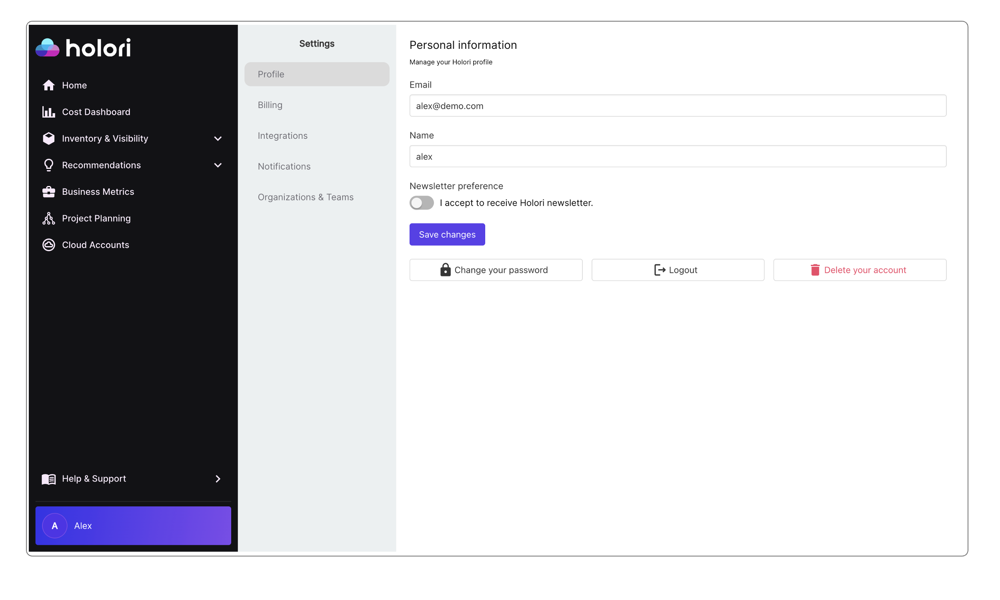
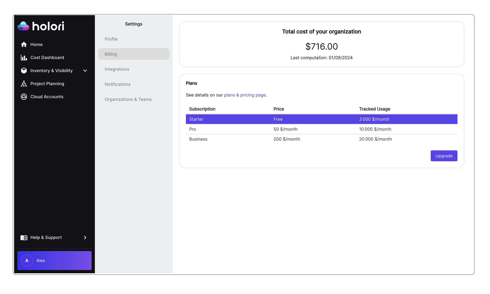
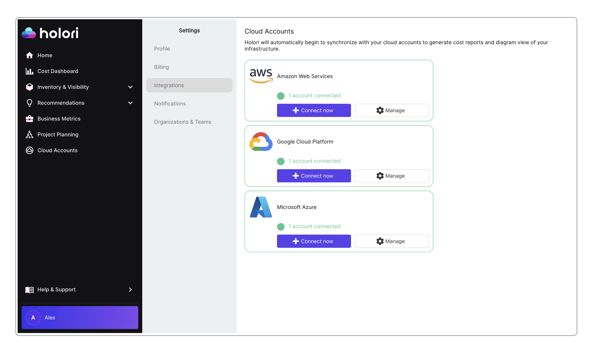
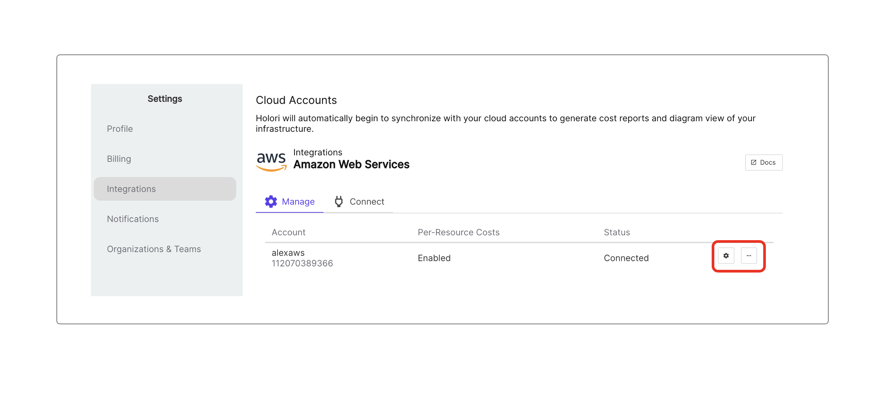

# Account Management

By clicking on your name at the bottom left of the screen, the account management page will open.

This page is divided in 5 tabs.

### Profile tab

There you are able to view and change your email, name and password. You can also logout or delete your account from this page.

### Billing tab

There you can see what is your current plan and manually upgrade if needed.
To manage your payment details or anyhting related to upgrading/cancelling your subscription you will be redirected to Stripe, our payment partner.

### Integration tab

:::info

To keep things simple the name ***Account*** will be used regardless of the provider and is similar to Azure Subscriptions or GCP Service Accounts.

:::

There you can see how many cloud accounts you have connected to Holori for each provider.

To connect a new account simply click on "Connect now" next to the chosen provider. Please visite the "Integrations" tab on the left menu of the documentation to have the step by step procedure for each provider.

If you already connected one or more accounts from a provider, a "Manage" button will be visible. By clicking on this button, you will be able to see more details about the connected accounts.

This is also where you can delete a connected account.

### Notifications tab

Soon available

### Organizations and Teams tab

There you can invite other people to your organization. To add people enter their email address, if there are multiple people, enter multiple addresses separated by comas.

When inviting people to your ogranization you can grant them one of three possible roles:
 - Owner: they have full access to billing, views and team management
 - Editor: they have full access to billing and views but can't manage teams
 - Viewer: they can see billing, recommendations but won't be able to modify elements or create views

On this tab you also find a list of your current team members, their role, last activity date and a possibility to resend and invite, edit or remove the user by clicking on the 3 dots.

