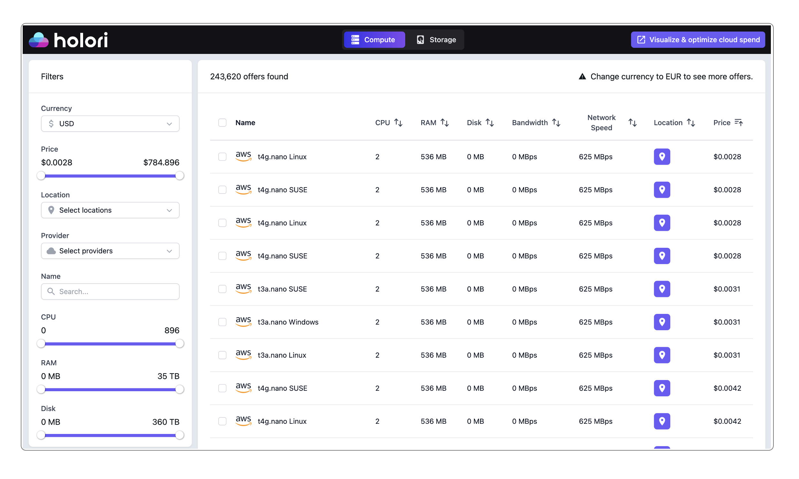
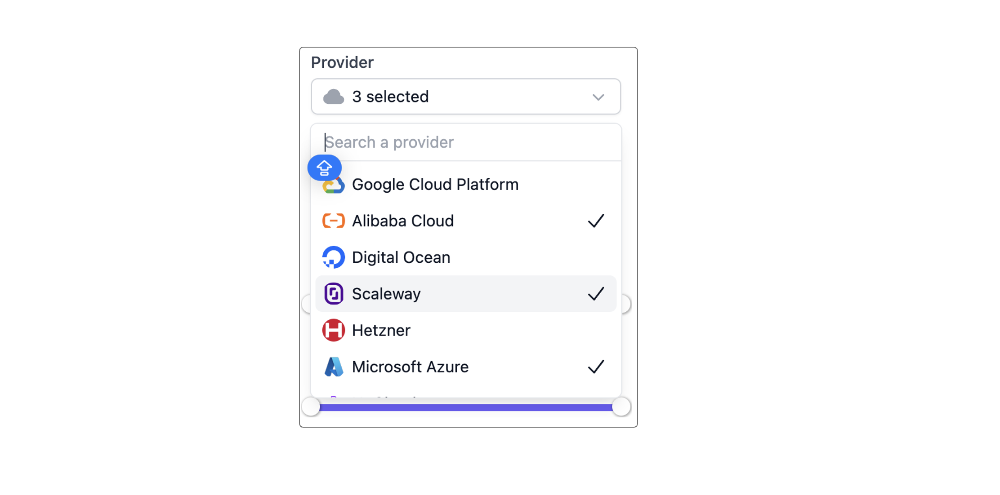
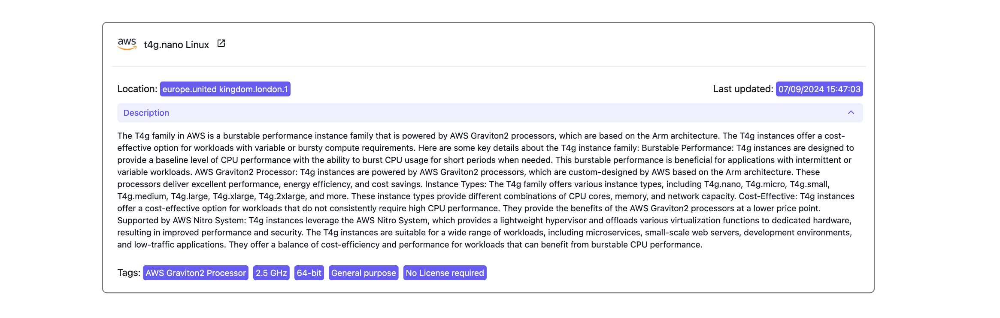
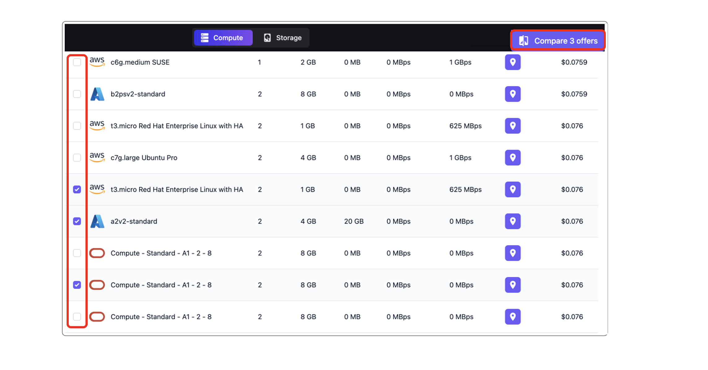
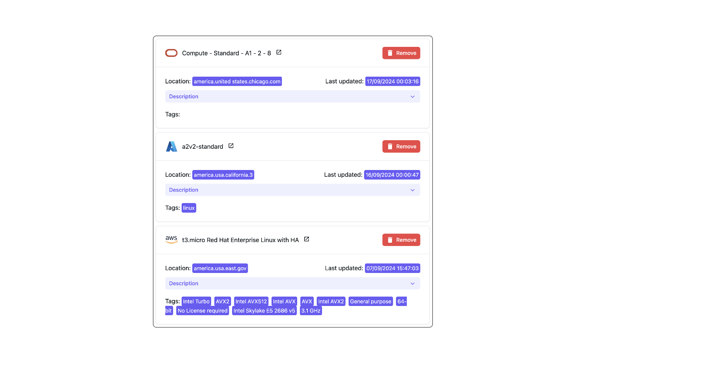
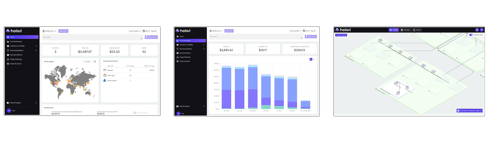

# Cloud Calculator

:::tip

Holori cloud calculator is open and free of charge, it does not require an Holori account.

:::

Holori cloud calculator is accessible at the following address: https://calculator.holori.com
It currently gathers around **250,000 prices from 12 providers** and allows you to compare products one to another.
The covered services are currently **compute and storage**.
To switch from compute to storage offers, use the toggle on top of the page in the middle. 

## Filter using the side bar

Somes filters are self explanatory and a sliding ruler can be used to select the minimum and maximum values. 
You can also click on the number next to each slider to manually type the value.

### For the compute category

Other filters offer different options:

- **Currency**: currently USD, EUR and CNY. Holori does not perform currency conversion, only the prices retrieved as such through the providers' API are available. This explains why the highest number or prices is available when selecting USD.

- **Location**: the drop down list allows you to select between numerous locations. A multi select is possible, simply click on multiple locations.

- **Provider**: the drop down list allows you to select between multiple providers. A multi select is possible, simply click on multiple providers.

- **Name**: if you a re looking for a specific instance and know its name or at least part of it, enter in in the "name" field. For example, type "T4g" and the corresponding instace family will be displayed.

### For the storage category

The filters available on the storage tab of the cloud price calculator are mostly similar to the ones from the compute category.

They differ regarding data such as the storage size, IO or Bandwith.

## Get more details about a specific product

To gain more insights on a specific product from Holori cloud calculator, simply click on it from the list.
A pop-up will open with extra details about it.

It includes a list of tags that can for example be the processor type and its frequecy, the architecture between 32 and 64 bits...
On the top right corner of the pop-up the date displayed is the date of last retrieval of the price from the provider's API.

## Compare products

On Holori's cloud cost calculator main page, there is a checkbox next to each listed product.
You can select multiple products, then click on the "compare offers" on the top right corner.

The selected product and details appear together on the right of your screen.

## Go further with Holori cloud cost and infra visibility

Congrats! You are now able to use one of the most advanced cloud comparison tools on the market.

To further improve the understanding of your cloud infra and costs, we warmly recommend you to create an account on https://app.holori.com

It is an infrastructure visibility and cost optimization platform that works with major cloud providers such as AWS, Azure, GCP, OCI… 
You can navigate between diagrams and intuitive dashboards, gaining a complete view of your costs and underlying infrastructure.

Get started for free to:
- Centralize your cloud cost from multiple providers
- Build comprehensive costs reports
- Understand your cloud environment with powerful infrastructure diagrams
- Design and estimate the cost of your future infrastructure

