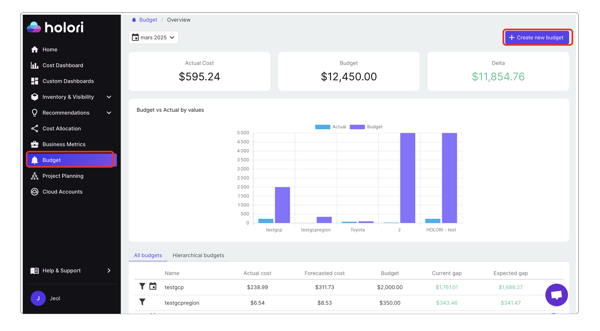
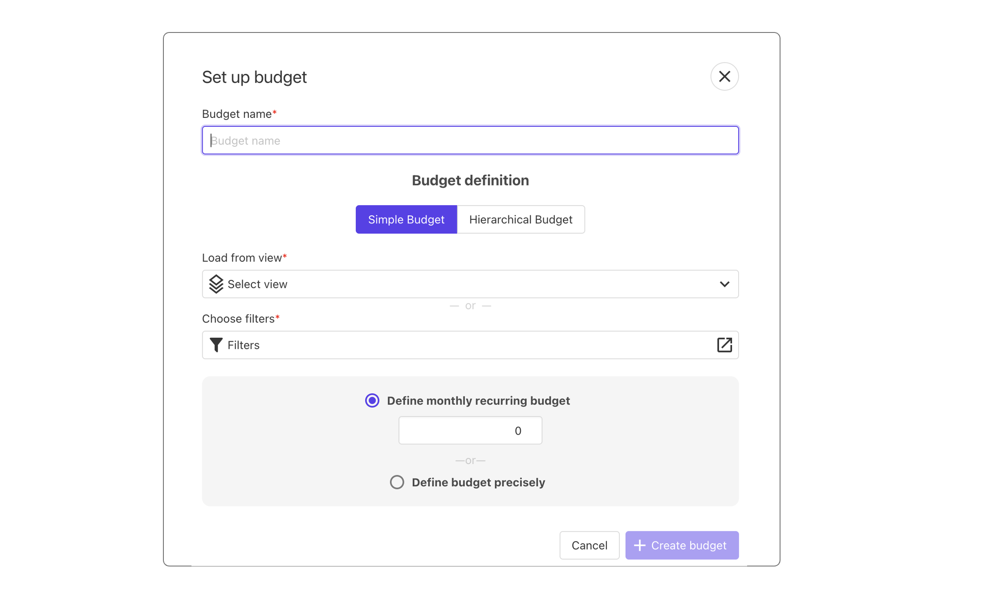
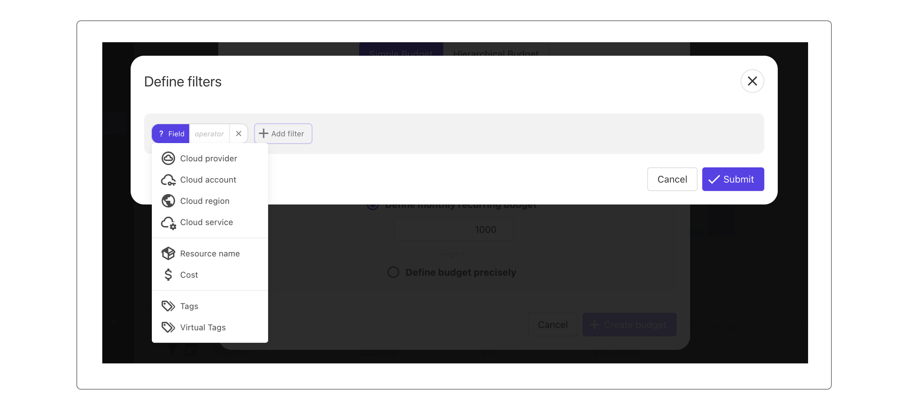
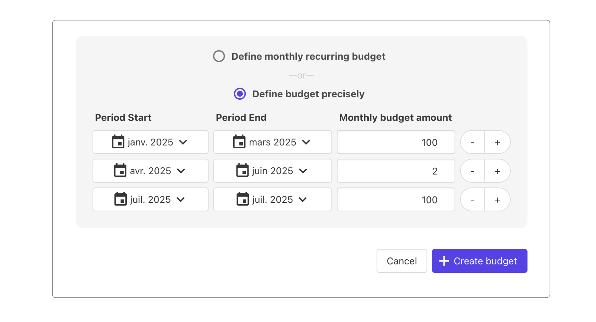
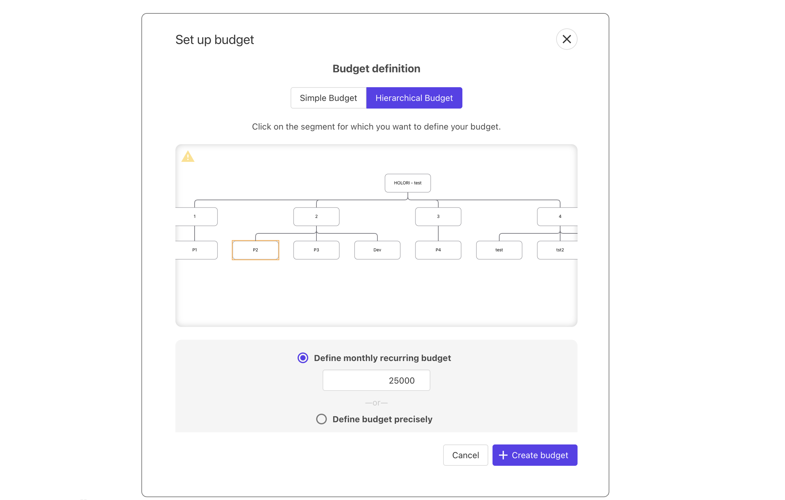
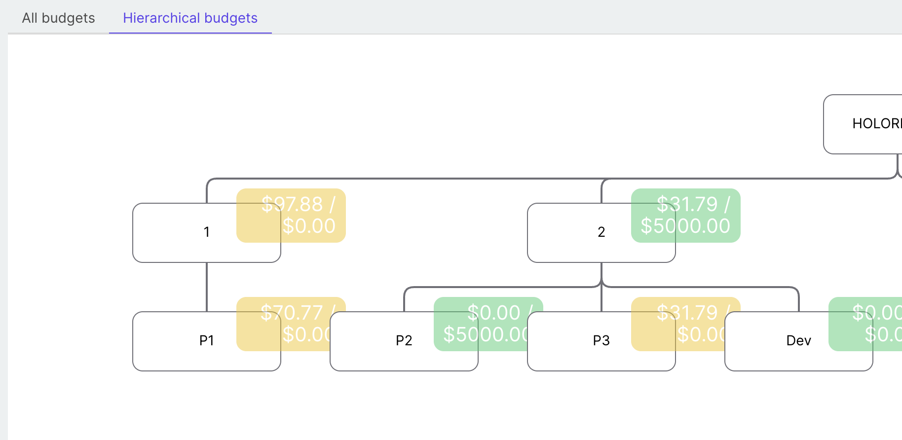

# Budgets

With Holori you can define your cloud budgets and receive alerts if you’re at risk of exceeding it.

From simple budgets, to advanced planification, this page will guide you through this feature.

<iframe width="560" height="315" src="https://www.youtube.com/embed/DjYLohn0Nsc?si=P31VVW91vbu4uSSl" title="YouTube video player" frameborder="0" allow="accelerometer; autoplay; clipboard-write; encrypted-media; gyroscope; picture-in-picture; web-share" referrerpolicy="strict-origin-when-cross-origin" allowfullscreen></iframe>

## Get started

To create or visualize your budgets, navigate to the "Budget" tab on the left menu.

The page is divided in three main areas:

- On top you can see your month's actual cloud costs, your monthly budget and the delta which is the difference between the two previous categories.

- In the center you can see a graph that shows on the X axis all the budgets you created, on the Y axis the value and a color code that shows the actual vs the budgeted amount.

- At the bottom, an area split between:
  -   a table that lists all your budgets, their actual cost, forecasted cost, budget, current gap and expected gap.
  -   an org chart for your hierarchical budgets, similar to the one used for your costs allocation.
 
**Navigate in time**

A monthly budget is, by definition, valid for one month only. 
You can navigate between months using the date selection tool at the top left corner of the page.
  

## Create a budget

Once you are on the Budget page, select "+ Create New Budget" on the top right corner.

On the panel that pops-up, give your budget a name and define if the budget is simple or hierarchical as explained hereafter.

### Create a simple budget

You can either load your budget from a view, or choose a filter.

**Load from view**
As defined [here](https://doc.holori.com/Cost%20Visibility/cost-reports#manage-filters-and-saved-views), a view is a combination of filters that you can create to get a unique approach on your cloud costs.
It can for example be: ‘’Provider is AWS, regions is US-EAST1, service is EC2, tag value is DEV’’. Which means that by using this view you created, you are now able to define a monthly budget for your resources that match the criteria. 

**Choose filter**

Pick a filter from those available such as cloud provider, service, tag...

:::tip
Make sure you are familiar with the concept of virtual tags (cf. dedicated page on the left) to fully benefit from the power of Holori budgeting feature.
:::

Using a filter, for example "Cloud Service is: GCP BigQuery", allows you to define your monthly budget for BigQuery.
Here, it is also possible to cumulate multiple filters, you are not limited to one.

Then you can specify your monthly budget. Here again, two options:

- **Define a monthly recurring budget:** you must enter an amount, for example 1000, which means that each month you'll be able to track that your BigQuery costs remain within your allowed budget. By definition, this monthly recurring budget will be used month after month. If you want to do differently, check the next item.

- **Define a budget precisely**: you can define your budget with a custom monthly amount for the coming months. If your planned usage is not linear, this takes your constraints into account. You can define multiple periods, for each with a period start date, end date and monthly budget amount.

Once your are done, click on "+Create budget" at the bottom.

### Create a hierarchical budget

With our hierachical budget feature, you can define a budget for each departement/entity of your organization.
**Prerequisite: ** You must have defined your organization's structure using the org chart creation feature on the [cost allocation page](https://doc.holori.com/Cost%20Visibility/cost-allocation).

The org chart represents your organization and its various cost centers (called **segments**). For each segment, you can define a monthly budget.
Here again, your budget can be simple or precise, as described above.

Once your are done, click on "**+Create budget**" at the bottom.

**Note about cost reverberation:** if a cost allocation report has the cost reverberation feature enabled, any budget specified on children segments will also be applied to their parent.
This is shown when creating a hierachical budget by a small yellow warning sign on the top left corner of the org chart.
For example, if you set a child segment budget to $400 and a parent budget to $500, the total budget for the parent will be $400 + $500 = $900

#### Visualize your hierarchical budget

To visualize your hierarchical budget, under the barchart, next to "All budgets", select "Hierarchical budgets" to open the org chart.
A color code helps you understand the status of the budgets.

## Edit or delete a budget

To edit or delete a budget, simply click on the three horizontal dots next to the budget in the table, you are then able to select between ‘’edit" and "delete".
For a hierarchical budget, double click on the segment to edit the data.

## Alerting & notifications

Notifications will soon be released in Holori software allowing you to be notified by email or other channels such as Slack when a certain threshold is reached.

## Various considerations

Budgeting differs from cost allocation.
Where cost allocation is made afterwards, once your invoices have been issued by the providers, budgets are defined in advance to make sure that your costs remain under control.

While the objective of cost allocation is to allocate 100% of your costs, and avoid at all costs to allocate the same resource cost twice, (simple) budgets are different.

It is totally possible to create a budget for your dev environments for example that takes into account all your resources that are tagged "dev".
It is also highly possible that one of your dev resources is a GCP BigQuery service for example. Which means that if another budget is "BigQuery", the same resource will appear in two different budgets.
This is not an issue and is perfectly normal. 

This also explains why the "Budget" value on top of the Budget page can greatly differ from your "Actual cost" as many resources are probably part of multiple budgets.

:::info
Holori budgeting feature allows you to keep track of your budget to avoid bad surprises at the end of the month. We however do not have the power to stop your resources to avoid exceeding your budgets, this is your responsibility.
:::

