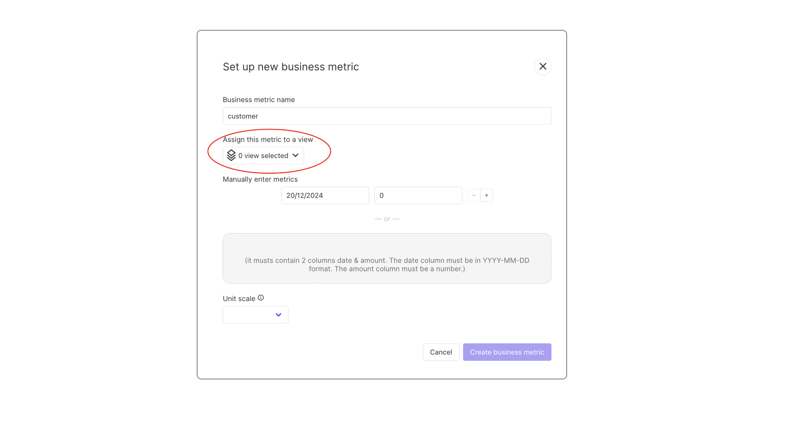
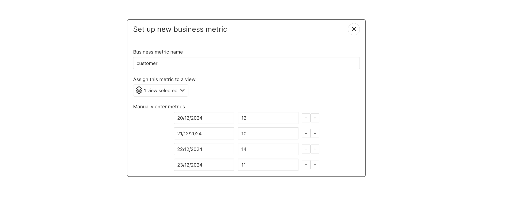
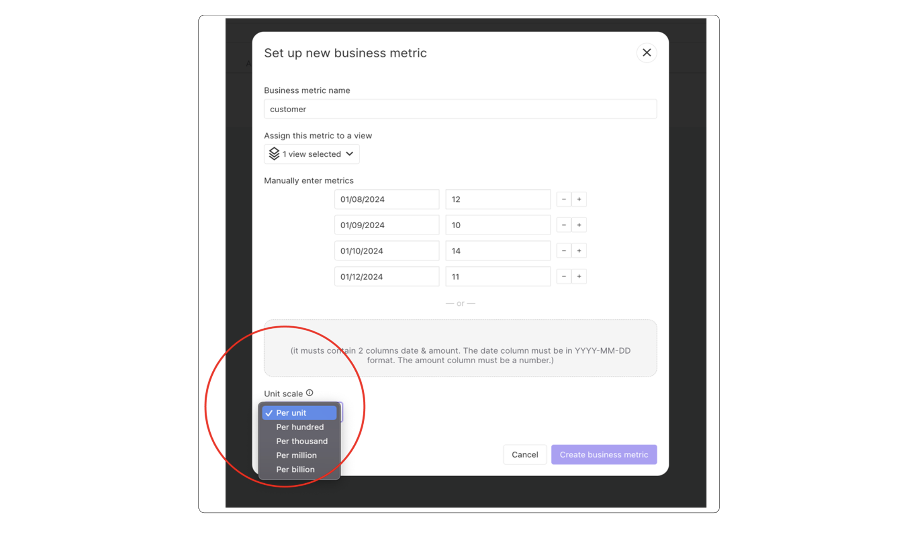
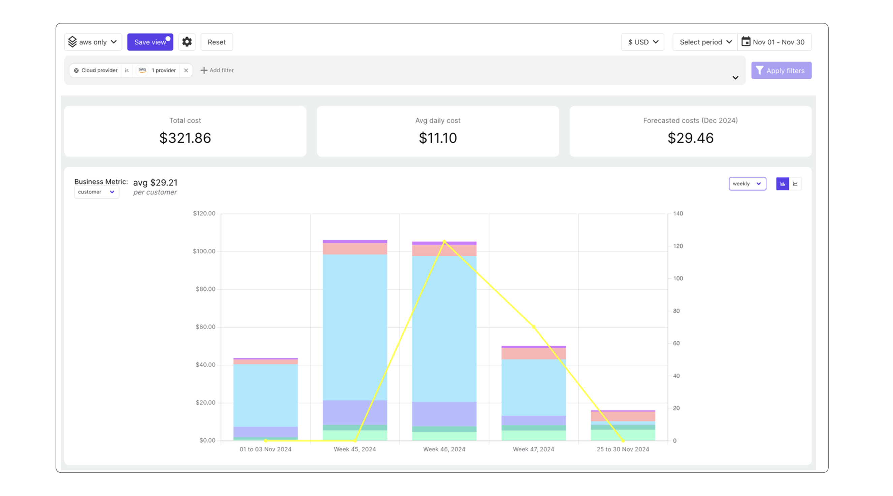

# Business Metrics

## Understanding Unit economics and Business Metrics:

Unit Economics connects an organization's cloud spending to the value it generates, providing essential insights into the efficiency of that investment. Without the ability to link costs to the benefits achieved, it's impossible to determine whether the spending is justified or optimized.
A unit represents any metric your business tracks, such as users, requests, transactions, customers, vendors, and more. Unit costs enable you to analyze the Cost of Goods Sold (COGS) effectively.

 By incorporating unit costs into Holori, you can visualize your cloud expenses on a per-unit basis such as:

- Cloud cost per customer
- Cloud cost per thousand purchase
- Cloud cost per million API requests
- Cloud Cost per thousand visitor

## Create Business metrics in Holori:

- Go to business metric on the left menu > click on create a new business metric
- The name of the business metric should be the name of the unit you want to track (customer, visitor, API requests, purchase…)
- Select the view for which this business metric will be associated: https://doc.holori.com/Cost%20Visibility/cost-reports

 :::tip 
 
 The view in most cases is a segment of your infrastructure cost for which your business metric makes sense.
 
 :::

 

## Enter Business metric manually

Manually enter the business metric. You can enter daily metrics or monthly. For monthly just enter one value for the month.

### Daily business metric

 

  
### Monthly business metric

 
 

 ### Import Business metric with CSV (recommended)

 :::info 
It must contain 2 columns: date and amount. The **date column** must be in YYYY-MM-DD format. The **amount column** must be a number.

 :::

You can upload a CSV file that uses two-columns format : date & amount. The date column must be in YYYY-MM-DD format and the amount column must be a number.

This will create multiple entries in Holori that you can then edit in the interface.

### Define the unit scale

Set up the unit scale (per unit, per thousand units, per million unit…)
The scale is used to divide the business metric before calculating the cost per unit.  When selecting “per unit”, no division occurs. When selecting “per hundred”, your business metric will be divided by 100. 

 

### Finally go to cost dashboard and select the view.

Here you will see a yellow line showing your business metric that you have imported. Play a bit with the filters and the granularity (daily, weekly, monthly) to adapt what you want to see.
What you see here is the average cost of cloud for the business metric you selected. So here for November in my example, I have 11 customers as business metrics spread across November and I have $321.86 cloud costs. The cost per customer is as follow:
Cloud costs / Business Metric = 321.86/11 = $29.21
I pay in average $29.21 per customer in cloud costs.

 
 
