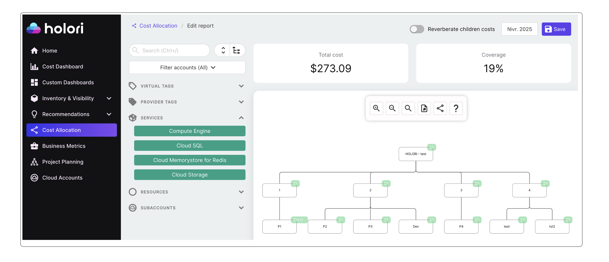
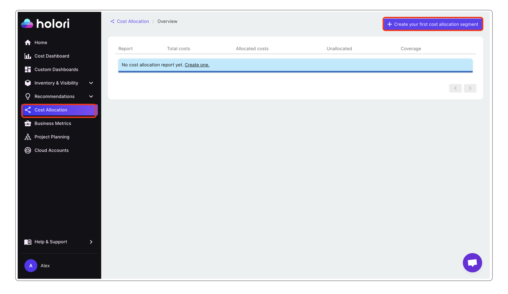
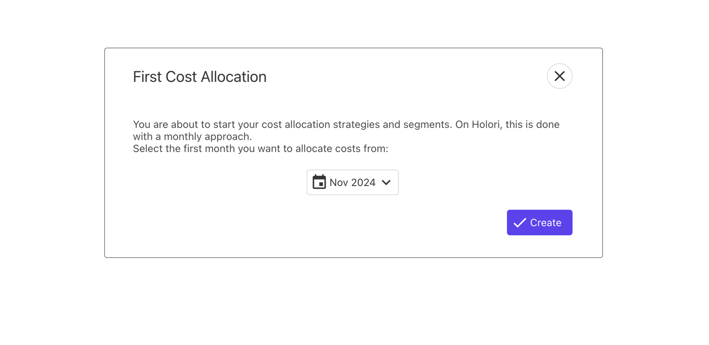
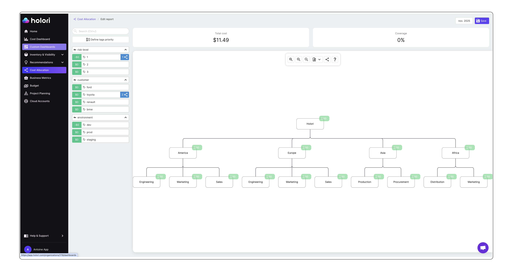
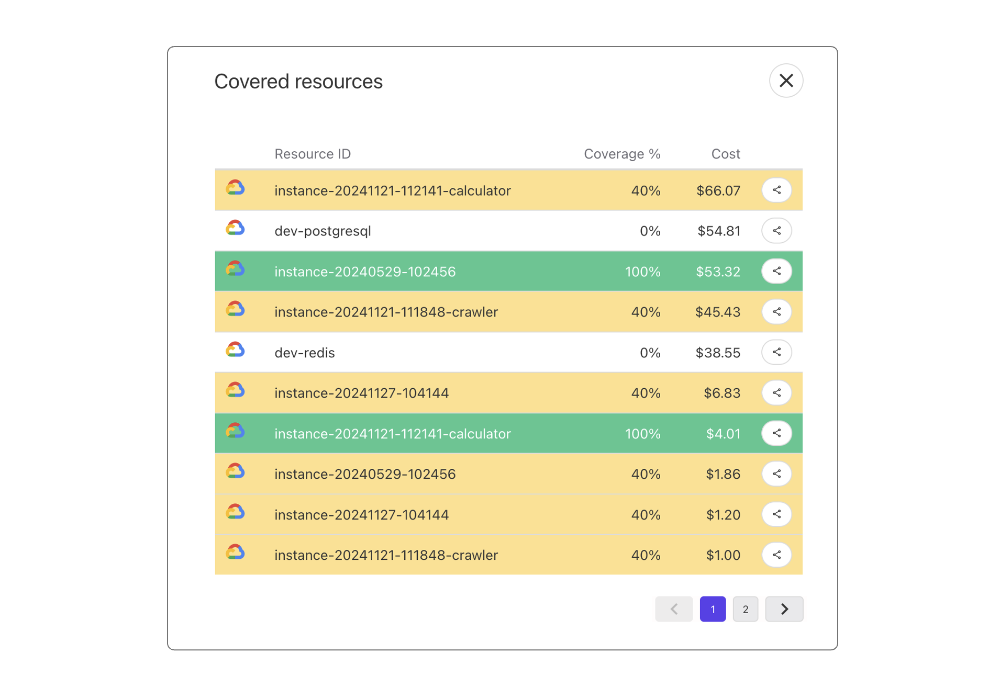

# Cost Allocation

With rising cloud bills and decentralized spending across teams, understanding who spends what and why has become essential for maintaining both financial control and accountability in the cloud.

<iframe width="560" height="315" src="https://www.youtube.com/embed/wI4dthrFjO8?si=6vWhCXaVK8cR8mc5" title="YouTube video player" frameborder="0" allow="accelerometer; autoplay; clipboard-write; encrypted-media; gyroscope; picture-in-picture; web-share" referrerpolicy="strict-origin-when-cross-origin" allowfullscreen></iframe>

## What is cost allocation and why does it matter? 

Cloud cost allocation is the process of distributing and attributing cloud computing expenses to the appropriate departments, projects, or cost centers within an organization. This helps in understanding and managing cloud spending by providing visibility into how resources are being used and by whom. Effective cost allocation enables better budgeting, cost control, and optimization of cloud services.

To allocate the costs to the right departments, you must define your company's costs structure.
To make it as simple as possible Holori's cost allocation is based around an org chart.

:::info 
With Holori, you can build your cost center structure to match your organization’s reality. Set up a hierarchy of cost centers, each representing a specific department, project, team, or any segment that matters to you. Create as many segments as you need and organize your cloud costs in a way that reflects how your business actually works.
:::

## Use Virtual Tags to make cost allocation easier

:::tip
Make sure that you are familiar with the Virtual Tag concept that is key to allocate your cloud costs. Have a look at the dedicated page on the left.
:::

Implementing virtual tags is crucial for an efficient cloud cost allocation strategy because they:

- **Ensure Consistency**: They provide uniform tagging practices across all cloud services, even if some providers lack native tagging support or have inconsistent tagging schemas.
- **Simplify Management:** Virtual tags enable financial analysts to standardize tagging without involving engineering teams.

For example, my company is working on a project called "Project Hawaii" that runs on numerous resources on GCP and OCI. Relying simply on the providers tags might quickly become limiting and there could be inconcistencies in the tagging implemented by the tech team.
A virtual tag allows you to tag all the resources used for this project regardless of the provider. You are then able to allocate allocate the "Project Hawaii" costs to the department that needs to be charged for the expenses. Using virtual tags saves you lots of time as you'll be able to simply allocate all the project's costs at once instead of doing it resource by resource.

:::tip
Grouping resources using Virtual Tags is not only useful for cost allocation. It can be used all across the software to create views, filters, budgets... 
:::

If you already have a solid tagging strategy within your cloud provider, we recommend using our Provider Tag to Virtual Tag converter. It allows you to convert selected provider tags into virtual tags automatically

## Get started 

On Holori App, on the left navbar, select "**Cost Allocation**".

Then, on the top right corner of the screen , select "**+Create your first cost allocation segment**".

Holori cost allocation strategies is done with a month by month approach.

At first, you must select the first month you want to allocate costs from. 
For example, we are in March 2025, I can decide to start allocating costs from November 2024.

By default, what is defined as true for November 2024 will be considered as true for the following months unless modifications are made.

### Start defining your cost structure 

The page is divided in 3 main parts.

**On top** you find your total cloud cost for the month the you are allocating costs for. Next to it, you see the coverage in percentage of the allocated costs compared to the total costs. The objective is of course to get as close as possible to the 100% allocation.

**On the left** you have your virtual tag organized by tags keys and values.
You can use the search box to identify the elements you want to allocate.

**In the center** of the screen is where you build your org chart.

By default, only one segment is already displayed, this is the highest level of your organization, from it, you are able to create children...

- To rename a segment, double click on it and edit its name.
- To add a child to a segment, click on it, then clik on the plus "+" sign.
- To create multiple children under a segment, repeat the above instructions.
- To delete a segment, click on it a select the minus "-" sign. 

### Allocate costs - Drag and Drop

To allocate a cost to a segment, select the element from the list on the left... and drag and drop it on the destination segment. 

By default 100% of this element's cost are allocated to this segment. Check the next paragraph if you need to split costs.

### Allocate costs - Split costs between segments

It is likely that a virtual tag (and its underlying resources) is shared between mutliple stakeholders within your organization. 
Holori makes it easy to split the costs when doing the allocation.

As mentionned previously, when you drag&drop an element on a segment, 100% of its cost are allocated to the destination segment. 

Imagine that a tag value with a cost of $100 is split evenly between a segment A and a segment B.

First, drag&drop the tag value on one of these segments, for example segment A. By default $100 are allocatd to this segment.
Now, by hovering over segment A, you see around the segment numbers popping up, click on it.
You are now presented with a list of the elements that are allocated to this segment. In this list you see the tag you just allocated, next to it is written 100%, which is coherent with the default allocation rule.

Now, click on the 100%, you have the possibility to "distribute" the cost with a specific percentage, in our example 50%. This means that 50% of my $100 cost are now allocated to my segment A.

To allocate the 50 remaining percent, I must select my tag from the list on the left again and drag&rop it to the other segment, segment B in our example.
By default, the 50 remaining percents are allocated to this segment. If you need to split your costs between even more segments, redo the steps mentionned previously.

### Check your covered resources

By clicking on the "coverage" figure on the top right corner, you can visualize a list of your tags and their coverage. An unallocated tag is white, a fully allocated one is green and a partially allocated ones are yellow.

### Various options and explanations

**Compute order**: 

When editing a report, the costs displayed on each segment are an approximation. The real calculated costs appear overnight.

The system computes one report per month. The result is available the first day of the following month.

The report for the current month is computed every day (based on the previous day data).

Priority rules are:

Segments are evaluated top-to-bottom, left-to-right.
Virtual tags are evaluated following the order you defined via the Define tags priority button.
Filters for a virtual tag are evaluated in the order they are defined.

**Reverberate**: When you toggle the "reverberate children costs" located on top of the screen, all children costs are also added to their parents. This is useful to understand what costs each division incurs based on all its sub-segments.

