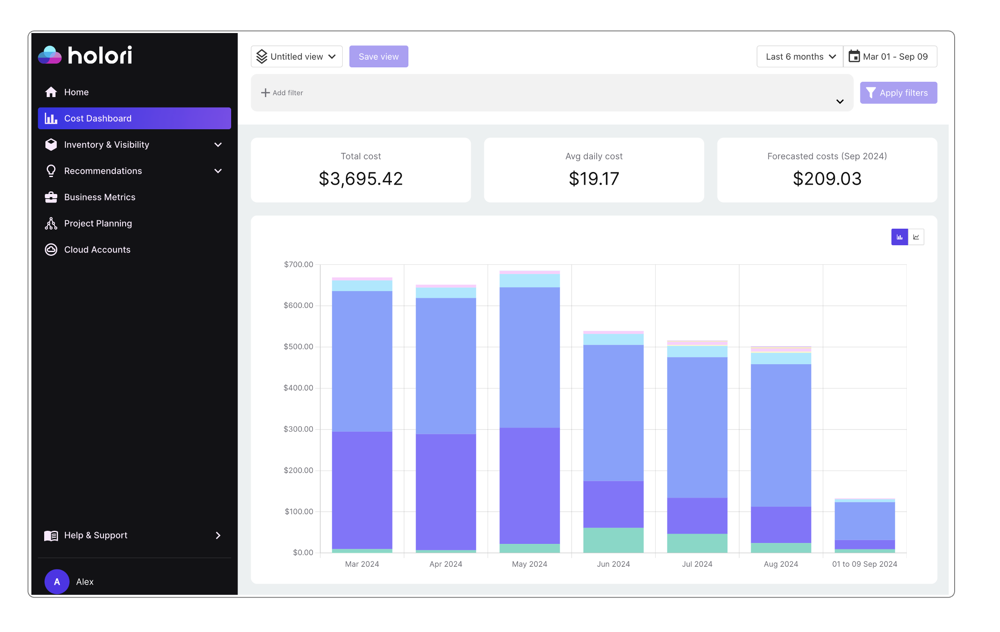
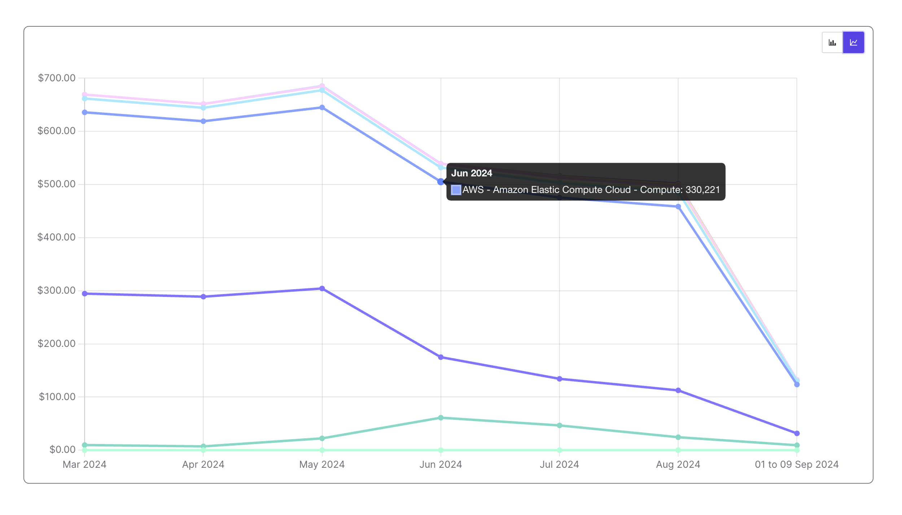
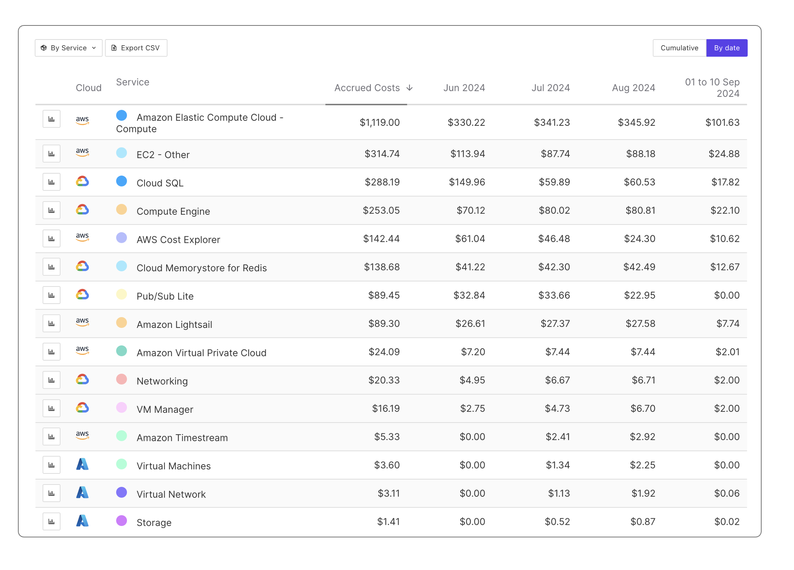

# Holori Cost Dashboard 

The goal of the Cost Dahsboard is to show you which services cost you the most, their evolution over time and an analysis per service.

The default view shows the main cost drivers accross all your connected providers and cloud accounts. A dedicated page for the custom views is available in the documentation. 

The Cost Dashboard uses the same layout as the homepage with the choice of the display period, and the quick overview of three key figures:
- Total cloud cost
- Average daily cost
- Forecasted costs

## Cloud cost graph

The central element of the Cost Dashboard is the graph that displays the evolution of your cloud costs over the selected period. See illustration above.

:::info

The graph can be displayed as a bar chart (default view) or using lines. 
Use the toggle at the top right corner of the grah to change the view.

:::

If you are using the bar chart view (default one) as displayed above, each bar represents a month and, for each month, the several colored parts represent the most expesive service. Simply hover on top of it to have its name displayed.

If you are uting the line view (see below), each line represents a service and you can cimply follow the line to track the service cost evolution accross the selected time period.

Using the graph is a simple way of identifying trends. As you can see on the illustration, some services remain relatively stable accross the selected period while other either grow lot while other shrink. 

## Cloud cost table

Under the graph you'll find a table summarizing your main cost drivers. By default, this table shows your cost by service accross all providers and accounts over the selected period.
The illustration below shows the table for selected period of "last 3 months".

:::tip

The small colored dot next to each element in the table matches the color of the category in the above graph making it much easier to spot what you are looking for.

:::

### Layout

Several layout options are possible:
- By service (default one)
- By region
- By resource
- By tag key

:::info

The table layout option also changes the graph layout to reflect your choice. 
You can easily switch from a graph showing your most expensive services to one showing your most expensive regions.

:::

To change the layout, use the menu located on the top left corner of the table as illustrated below.

### Exploring the table

On the above illustration of the table, you can notice that the selected period is 3 months and the default view remains unchanged with the cloud services displayed.

The services are ranked by cost from the most to the least expensive one. The first column after the service name is the **Accrued costs**, this represents the sum of the cost of the service over the selected period, over the last 3 months in my example.
After the Accrued costs column you'll find a column for each month.

Moreover, the displayed data can be by date or cumulative. Cumulative means that only the accrued costs of the period are displayed.

To switch between a **"cumulative" view** or a **"by date" view** use the toggle on the top right corner of the table.

### Focus on specific elements

On the left hand side of the table a small graph icon is available next to each item (service, resource, region...). 
When clicking on an icon it remains highlighted, multiple selections can be made. The above graph will automatically reflect you selection and focus on the selected elements only.

### Start exploring the inventory view

When hovering on top of a service (or region, or resource...) you notice that the element name contains a link. Clicking on the element opens a detailed inventory page about it.

For example, if my layout displays the most expensive services, selecting EC2 that is the most expensive one in my example opens the inventory list of my EC2 instances.

For further explanation about the detailed analysis of a service/resource, please go to the inventory page of the documentation.

