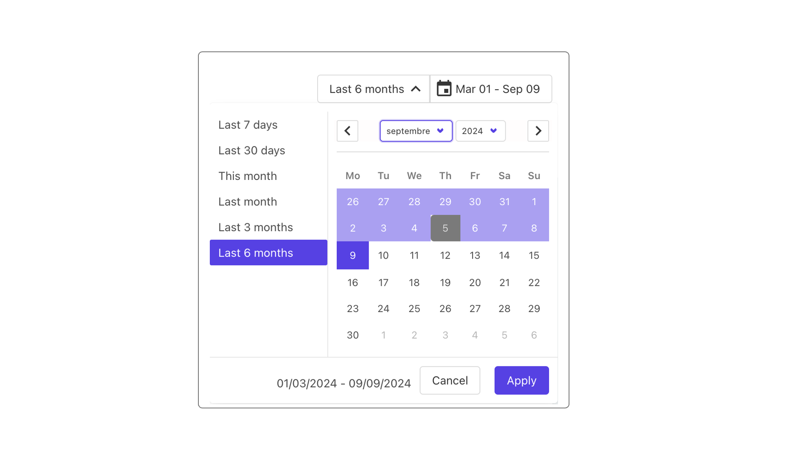
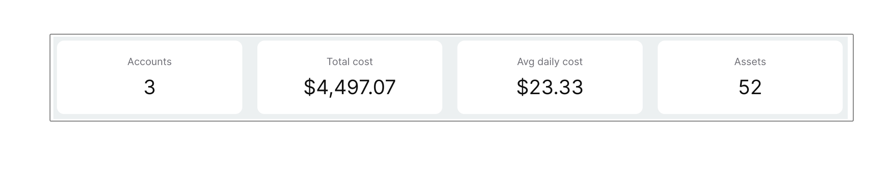
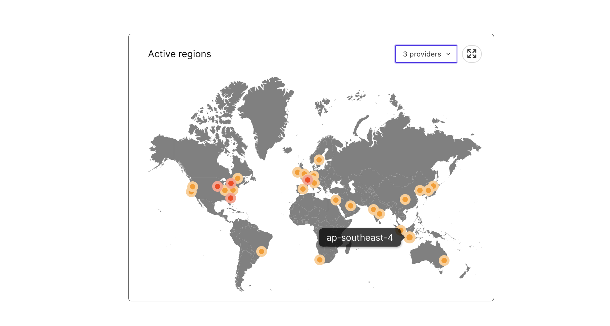
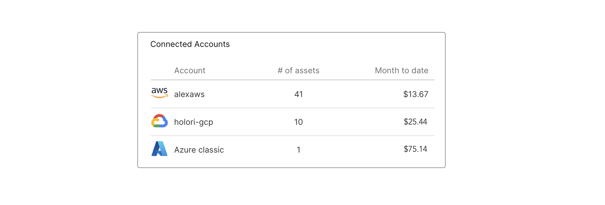
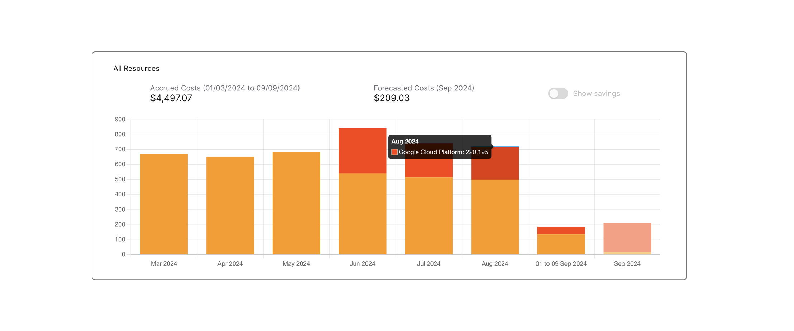
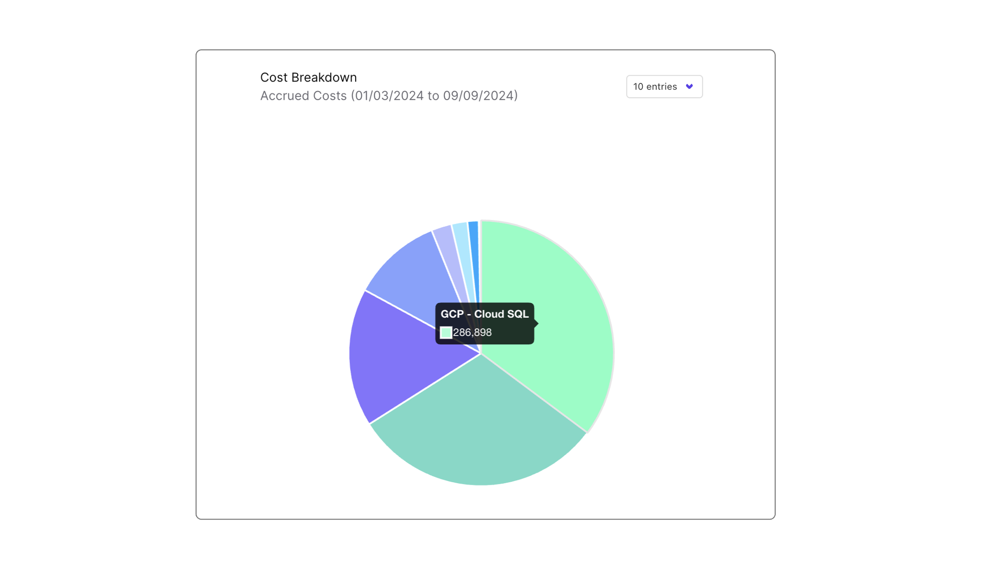
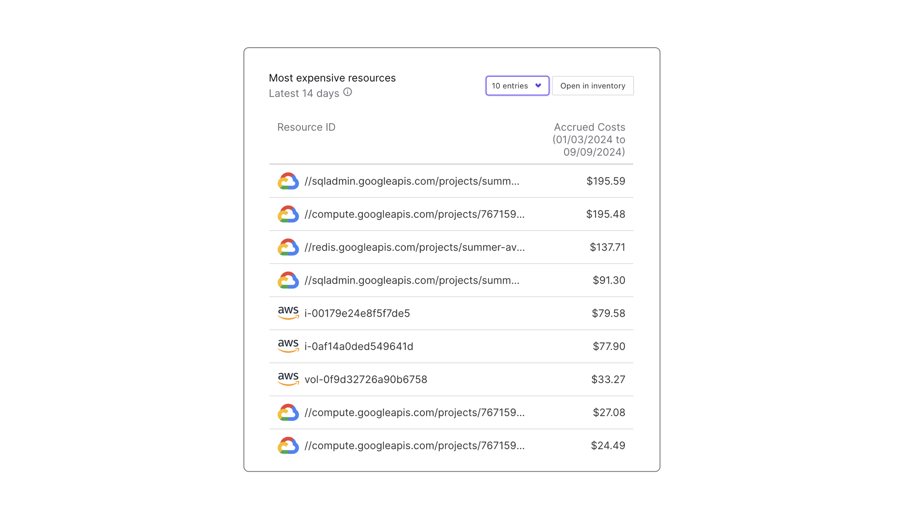

# Focus on Holori's app Homepage

Now that you have connected your first cloud accounts to Holori, let's take a look at what our hompeage has to offer.

If you haven't connected your cloud account yet, go to the integration category of the documentation and choose the provider you want to connect.

## Selected period

:::tip

Last week's costs or last year's costs are not the same. 
We've designed the Holori app to help you gain valuable insights. Selecting the right period is often the first key step to a successful analysis.

:::

The homepage is designed to summarize your cloud environment with easy to read elements. 
The key variable we need from you to display your data the way you like it is the reference period.
On the top righ corner of the page, click on the "Select period" or date button and choose your preferred timeframe.
To make things easier we also offer to select predefined timeframes such as 7 days, last month etc.

To keep things simple yet, we won't detail the "Views" options right away but will do it further on the "Filters & views" page of the documentation.

## Cloud costs and accounts overview

On the page you will notice that you have four main rectangles displaying key information about your connected accounts:
- The number of accounts connected to Holori
- The total cloud costs in USD for all your accounts connected
- The average daily cost
- The number of cloud assets accross all you accounts.

## Map of active cloud regions

On the world map you can see the active regions for all your conencted cloud acccounts. Clicking on a region will open a diagram with the corresponding resources. 
For example, if I select my UK - London region it will display on a diagram all my resources in the region regardless of the provider or accounts.
It is possible to filter this list on provider basis by selecting it on the top right corner. 
You can also expand the map by clicking on the icon next to the provider's choice on the top right corner of the map.

## Summary of the connected accounts

Next to the map of the active cloud region, on the right, you'll find a summary of the connected cloud accounts.
The displayed infomration inclu the accounts names, the number of assets per account and the month to date costs.

## Cost history

Under the active regions map and connected accounts summary you'll find your cloud cost history displayed as a bar chart.

:::info

Remember to select the period you want to visualize using the ***Select Period*** selector on the top right of the page.
In this example we selected a 6 month period.

:::

The displayed information represents the total monthly cloud costs for all your cloud accounts connected to Holori "Accrued costs".

By Hovering on top of a bar, more precise information is displayed regarding the cloud costs amount and a split per provider (if applicable).

## Cost breakdown

The cost breakdown at the bottom left of the homepage is a pie chart representing graphically which are the main services 
By Hovering on top of the pie chart, more precise information is displayed regarding the cloud costs amount and a split per provider (if applicable).

To ease readability, you can selecte how many entries you want to have displayed.

Again, the period displayed matches the one you selected on top of the page.

## List of most expensive resources

At the bottom right of the homepage is a list of your most expensive resources as you can see on the screenshot above.

:::warning

**AWS 14 days API limit:** AWS API limitations prevent us from showing the most expensive resources for the dates you selected. For other providers, these costs match the dates you selected.
We are actively working on a solution to solve this issue.

:::

It is possible to select how many entries you want to be displayed between 5 and 20.

By clicking on a resource, you are going to be redirected to a detailed view focusing on this resource. This will be covered in the "Inventory" part of this documentation.
The same applies to clikcing on "Open inventory" on top of the list of the most expensive resources, this will open the inventory page.

