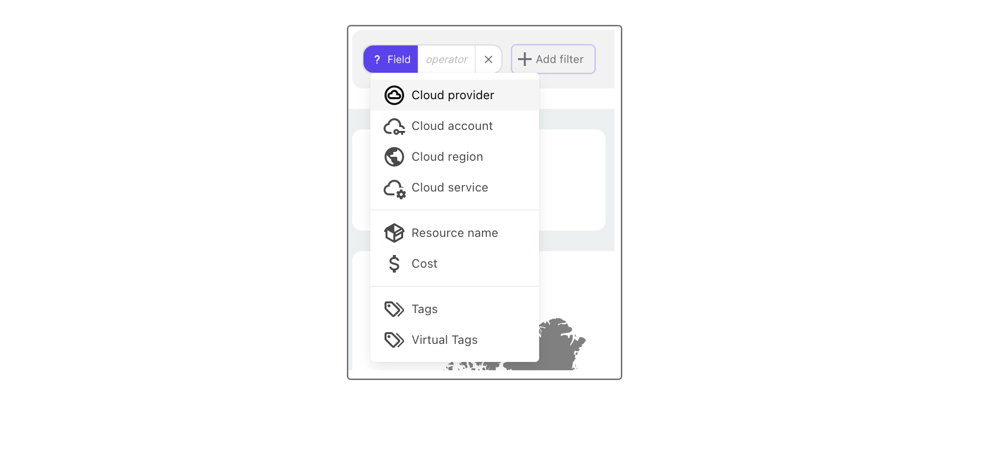
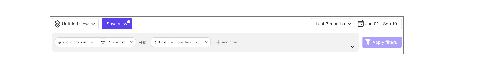
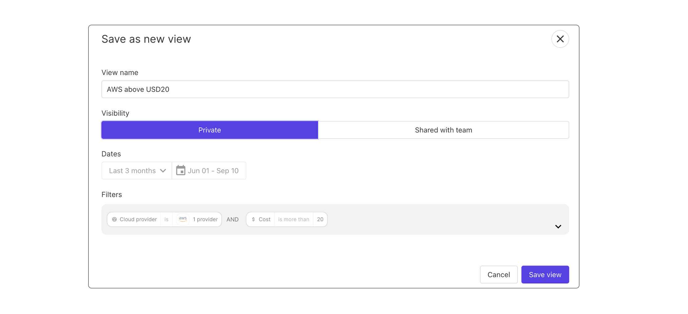

# Cost reports and filters

# Create cloud cost reports using filters and views

Creating useful cloud cost reports often comes down to the fine selection of the elements you need to track and combining them into an easy to read material.

## Manage filters and saved views

Accross the Homepage, Cost Dashboard and Inventory, a common Views/Filters element is located on top of the page.

Click on "+ Add filter":

Then, select the first filter from the list:

Then, define what you want to include as variable. 
For example, for a cloud provider you can speciffy if you only want to focus on one using "is" and selecting the one you want, or select all but one choosing "is not".
You can select multiple elements, for example cloud providers, by selecting multiple choices from the list.

The choice of course depends on the chosen category. If you select "cost" the choices will reflect what the options regarding a cost could be, for example a cost could be "more than", "less than", "equal to" etc.

Multiple filters can be cumulated.

Once your are satisfied with your filters choice, select "Apply filters" on the right.

You notice that the entire page is updated to reflect your filters choice.

## Save Your Filters

Once you are satistfied with the filters you created, select the "Save view" button on top of the page.

Give the view a name, select a visibility between "Private" or "Shared with team" and click on "Save".

## Saved views

Use the drop down menu next to the "Save filter" button to see a list of all your saved filters. Select any filter from to list to start using it.

Next to each saved view is a red delete icon.

