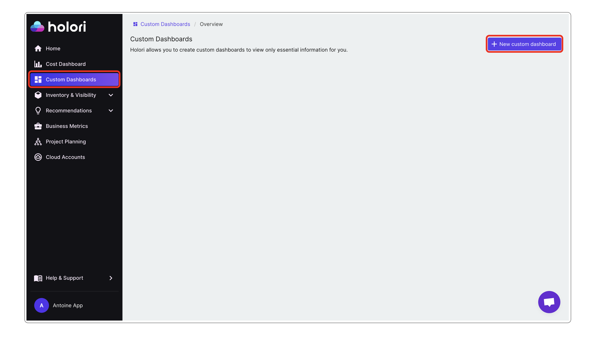
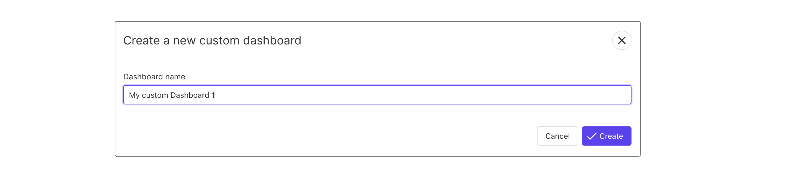
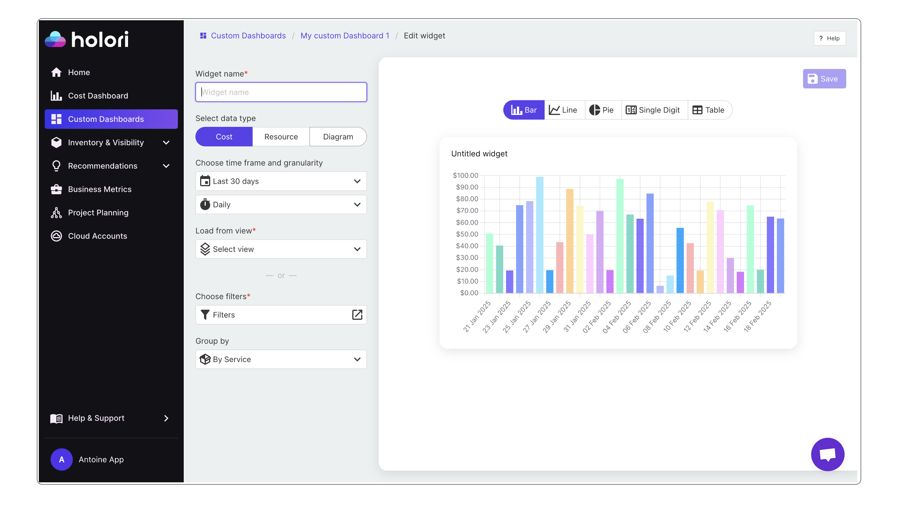
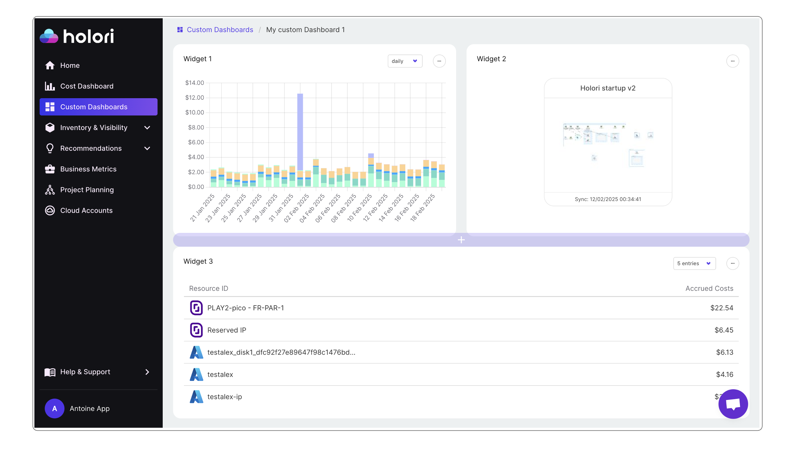

# Custom Dashboards

Custom dashboards can be used to personalize your Holori experience.
This pages is yours and can be built to have your favorite data available on a single dashboard.

The Custom Dashboards page is accessible using the left menu on the App. There, you'll find your dashboard(s) and on each dashboard the widget you created.
On the page you can add numerous widgets. These widgets can for example be costs summaries,diagrams thumbnails, costs evolution graphs...
It is possible to customize each widget to suit your needs.

## How to configure your custom dashboards?

To start, naviagate to the Custom Dashboards page and simply click on "+ New Custom Dashboard"

Give it a name.

You can then start adding widgets.

Three data types are available: "Cost", "Resource" and "Diagram".

For a "Cost" data type, you can then select on the right side of your screen the type of display you prefer between:
- Bar, line, pie, single digit and table.

For a "Resource" data type, you can then select on the right side of your screen the type of display you prefer between:
- Table or map

For a "Diagram" data type, you can simply select the account you want to have a diagram of.

Use the "+" sign on the right or at the bottom of your widgets to add more.

**More details will be covered in the videos at the bottom of the page.** 

It is possible to create multiple dashboard each containing multiple widgets.
For example, if you are a cloud consulting firm working with multiple customers, you could imagine building one custom dashboard per customer and on each dashboard use the same widget but with data specific to each customer.

To add multiple dashboards, navigate again to the "Custom Dashboard" tab on the left menu, the click on "+New Custom Dashboard" on the top right corner.

### Pin a custom dashboard to the menu

Once you've created your perfect custom dashboard, you can add it to the main Holori menu on the left of your screen for quick access.
This is done by clicking on the three dots on the top left corner of your custom dashboard and selecting "pin".
Reverse the operation and click "unpin" to remove it.

:::tip
Create a bookmark with your custom dashboard URL to use it as a landing page.
:::

### Delete a custom dashboard to the menu

This is done by clicking on the three dots on the top left corner of your custom dashbord and selecting "delete".

## Video examples

<iframe width="560" height="315" src="https://www.youtube.com/embed/N37zUABuKbo?si=g_-1XBNEYQ-i-LtN" title="YouTube video player" frameborder="0" allow="accelerometer; autoplay; clipboard-write; encrypted-media; gyroscope; picture-in-picture; web-share" referrerpolicy="strict-origin-when-cross-origin" allowfullscreen></iframe>
