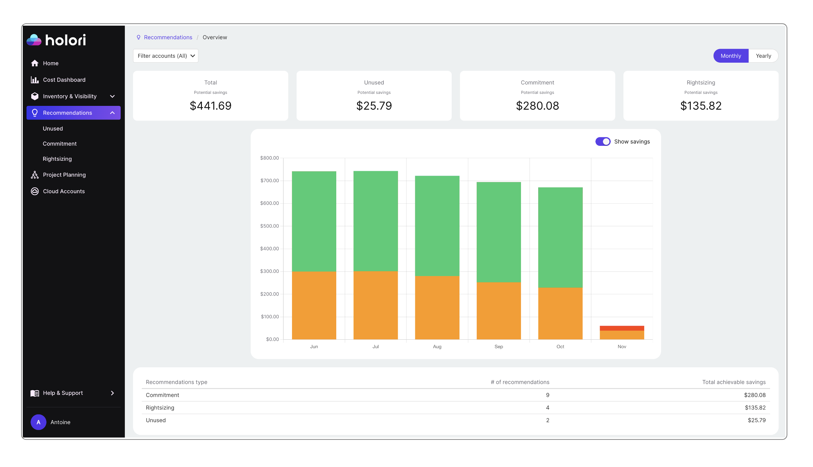
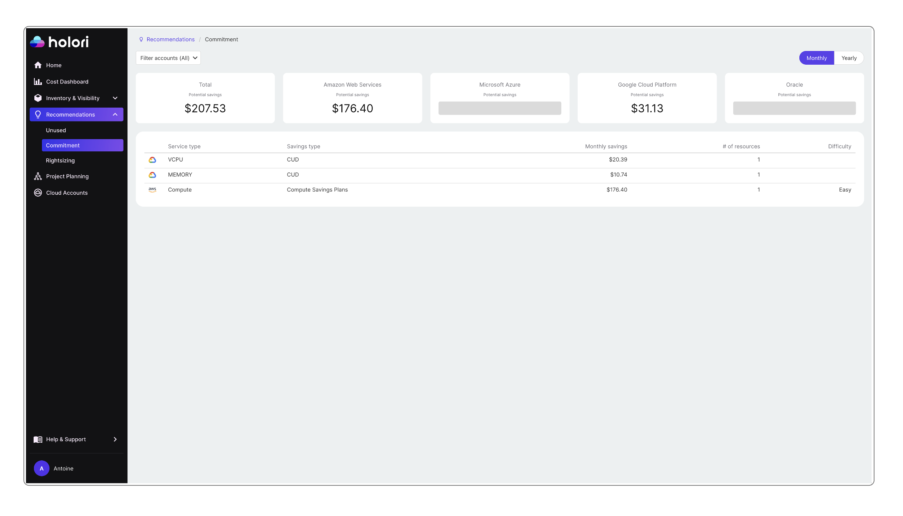
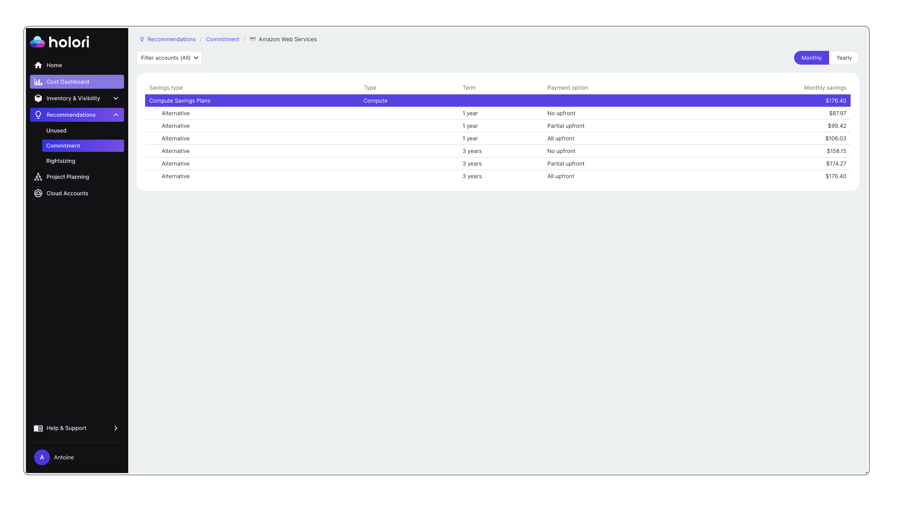
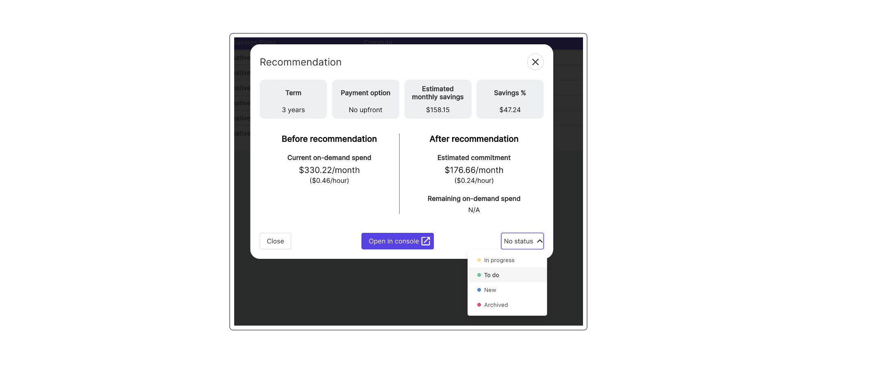
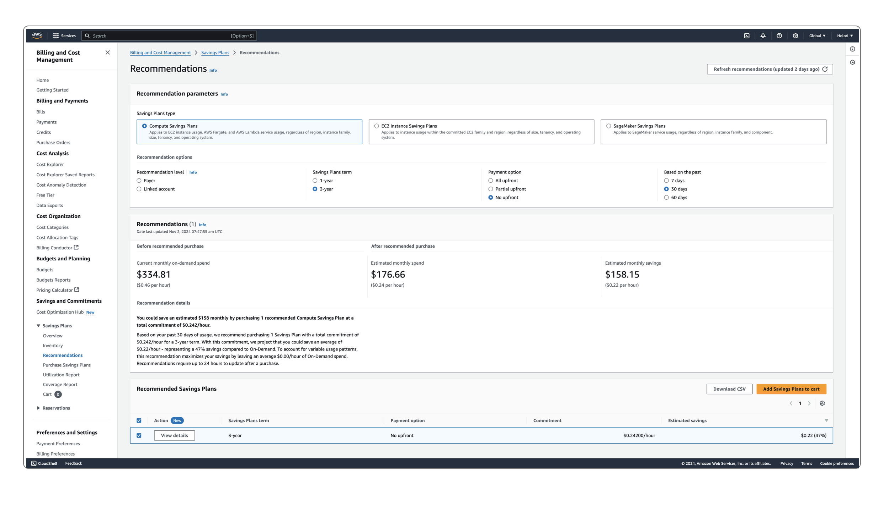
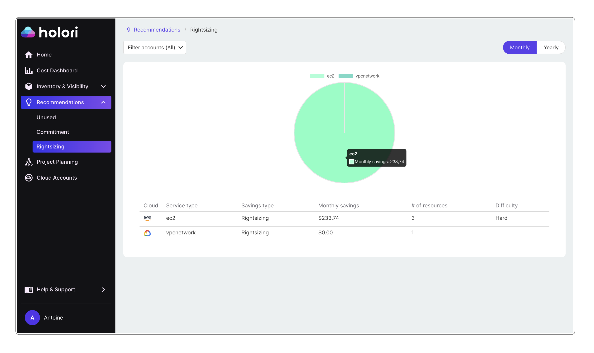
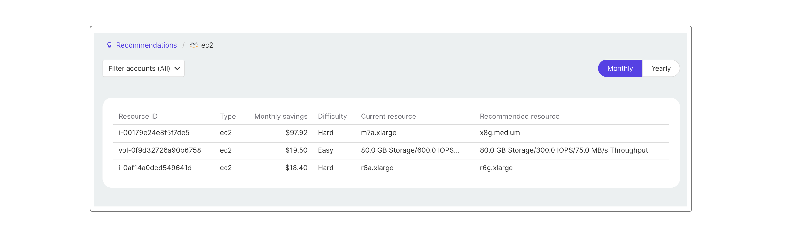
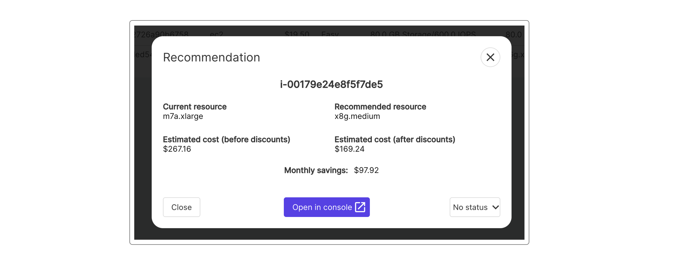
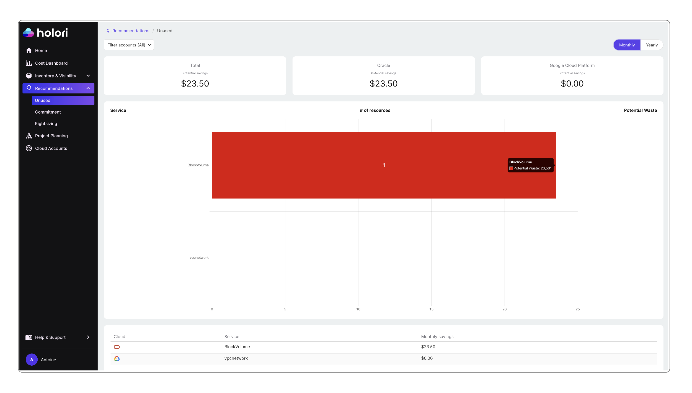

# Recommendations

Recommendations are accessible by clicking on recommendations on the left tab of Holori app.

These recommendations are retrived from the various cloud accounts you connected to Holori. At the moment we offer recommendations for AWS, GCP, Azure and OCI. Other providers will be added soon.

## Summary of the recommendations

When you click on **Recommendations** on the left menu your are presented with the following screen.

By default, all your accounts are selected. You can adjust this setting by clicking on **"Filter accounts"** on the top left corner.

A summary of key recommendations data is provided with the sum of potential savings for:
- **unused** resources
- **commitment** optimization
- **rightsizing** resources

:::tip

By clicking on one of the potential savings squares at the top of the screen, you are directly redirected to the corresponding category.

:::

A toggle at the top right corner of the bar chart allows you to view the summary on a monthly or yearly basis.

The bar chart summarizes your cloud costs accross the selected accounts over the selected period. When you hover on top of the bar chart, labels are displayed to show you the account(s) name and the potential savings.

At the bottom of the page you'll find a summary of the recommendation type, the number for each type as well as the total achievable savings.
If you click on a recommendation type, a detailed list per provider and service type is displayed. This is similar to opening the "Unused", "Commitment" or "Rightsizing" tabs.

## Commitment optimization

On the **commitment** tab you find a table that displays the potential savings. This is sorted by **service type**. For each service we display the **saving type**, the **estimated savings** and estimate the implementation **difficulty**.
On the example above for AWS, by clicking on **"Compute"**,  I'm redirected to a list of options. 

### Identify alternative purchase plans for my resources

These are the possible commitment plans avaible for this resource. 

By clicking on a commitment option, you are presented with details about it.
It gives you information about the commitment term, the payment option, estimated savings and savings in percentage compared to your actual plan.

When you are ready to implement the recommendation, click on **"Open in console"**. 
In our AWS example, we are redirected to AWS console where we can validate that it matches Holori's data. Next click on **"Add Savings Plans to cart"** to continue.

Once you are done, back on Holori App, at the bottom right corner of the recommendation popup you had displayed earlier, update the status.
Click on **"No status"** and select from the list.
This part is key to ensure an efficient tracking of the recommendations.

## Rightsizing resources

On the **Rightsizing** tab you can visualize the various services that could be rightsized to save costs.

The pie chart shows the split of rightsizing recommendations per service type compared to the sum of recommendations.
On the table below you'll find a list of services elible for rightsizing as well as an estimate of the savings and an indication about the implementation difficulty.

Click on a service type to display more details in a new page. For example here we select AWS EC2.

### Identify alternative resources

We are presented with a list of EC2 resources that could be righsized to save costs.
For each resource we can see the current resource type and the recommended resource to be used instead. The monthly savings are also displayed to evaluate the impact of the righsizing operation. 

To get more details on a recommendation, click on the resource ID

On the popup that is displayed, it shows details about the recommended righstizing action.
Once you are ready to implement it, click on **"Open in console**". This is similar to what was detailed in the previous section.

Don't forget to update the status at the bottom right of the popup once you have reviewed this recommendation.

## Identify and optimize Unused resources

Navigate to the **Unused** tab.

Here we display information about unused resources.
At the top of your screen you see a sum of the unused resources and the potential savings per provider.
The bar char provides a visual representation of it per service type.

Again, it is possible to customize the view by filtering by account and choosing a display on a monthly or yearly basis.

At the bottom of the page you find a table with the possible optimization per service.

By clicking on a service you are redirected to a detailed view about the matching individual resources.
Click on a resource to display more details.

