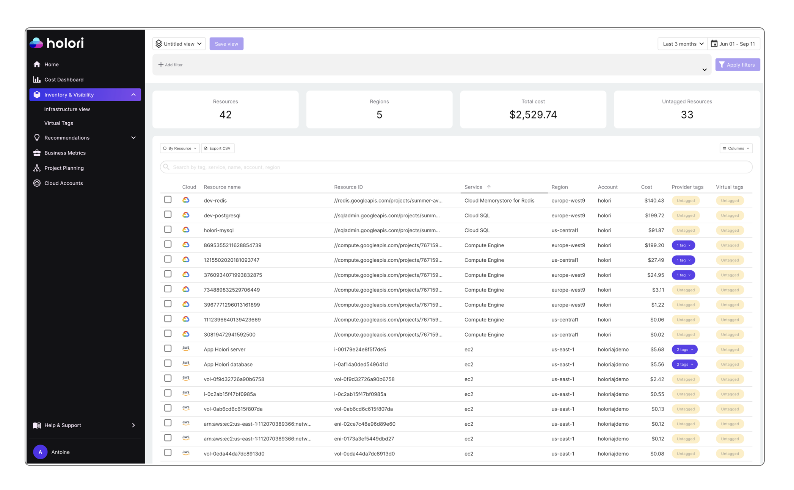
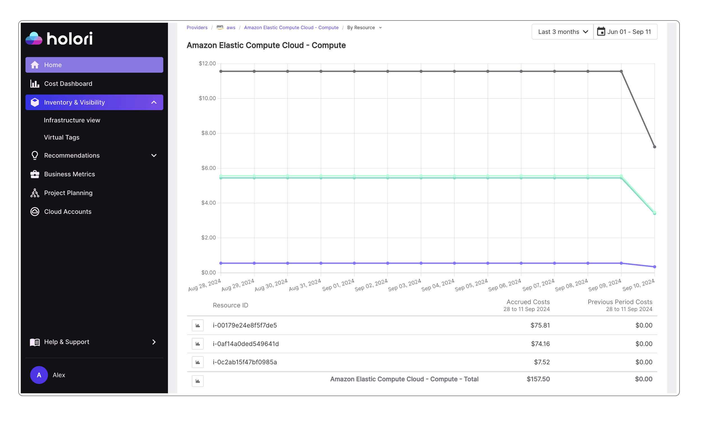
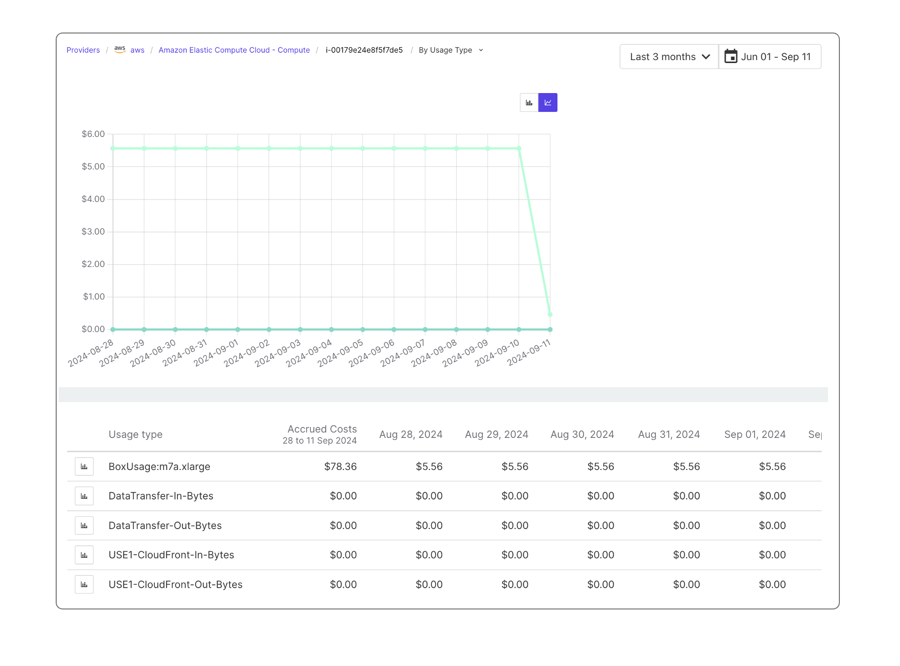

# Resource Inventory

The objective of the inventory is to get a detailed view, at a resource level, of the cost of the resource and its evolution.

:::tip

There are several ways of accessing your cloud resources inventory. You can open it from the "Inventory & Visibility" menu on the left of the screen and you can access it when navigating to a resource from the Homepage or Cost Dashboard.

:::

Once on the inventory page, and similarly to the Homepage or Cost Dashboard, it is possible to choose from the top right corner of the screen the period you wish to display.

To keep a consistent example, in the Dashboard we previously selected the "Amazon Elastic Compute Cloud" Service that represented an important part of our total cloud costs. By selecting the service it directly opened it in the inventory. This can be noticed looking at the access path on top of the graph. This is shown on the illustration below.

## The inventory page explained

:::tip

On the page, there is a graph and a table. Looking at the table you notice that there are only 3 resources. If you look closely at the graph you notice 3 lines. There is one line per resource plus another one that is the sum of all the resources on the table. 

:::

The goal is to be able to track the cost evolution of each resource over the selected analysis period.

Hovering on top of the lines displays the different values.

The table displays the values for each resource over the selected period.

Clicking on the icon next to the resource name of the table allows you to display this resource only on the graph. Multiple elements can be selected and dispalyed.

For more information about the diagram view, please refer to the "Infra Visibility" part of the documentation. 

## Resource cost details

Stating that a resource costs XY amount per month is sometimes not sufficient and you need to dig deeper into the specific costs behind.

By clicking on a resource from the inventory table, you access the highest level of detail we offer.
The usage types depend on multiple variables chosen by your cloud provider.
In our example below, you can notice that for the AWS EC2 instance the usage type includes the data transfer in addition to the instance running cost.

Here again, it is possible to choose only one or more elements to display on the graph by selecting it/them using the icon on the left of the grid. 
Please note that due to some limitations, data granularity can be limited to 14 days depending on the provider.

