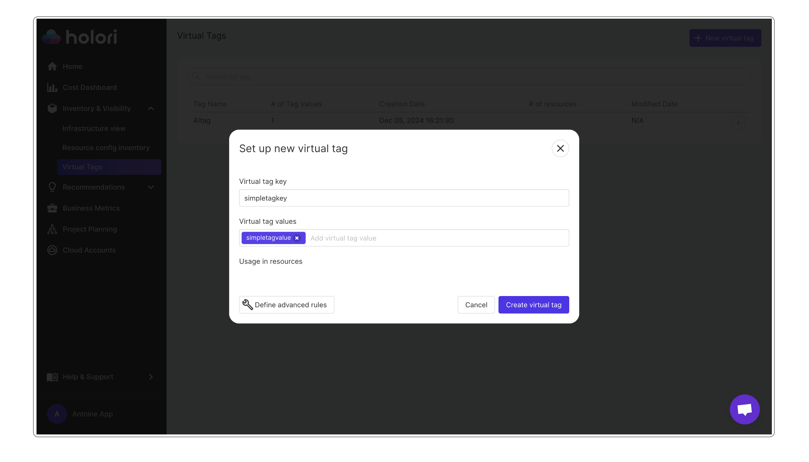
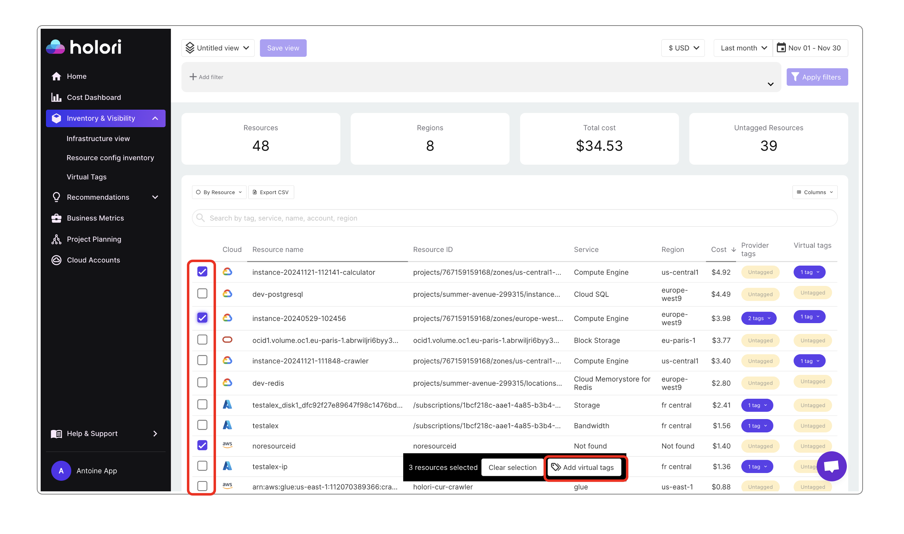
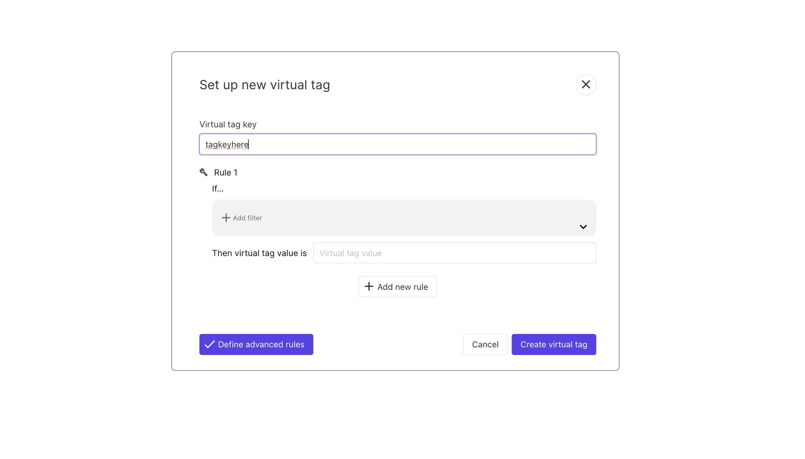
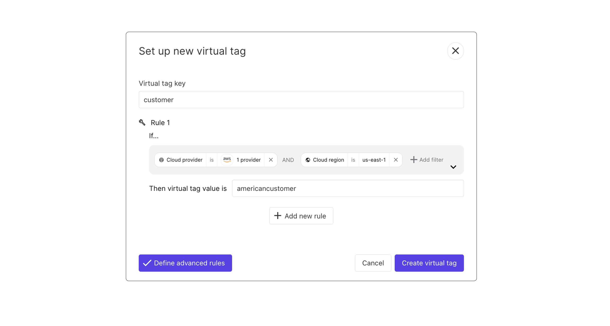
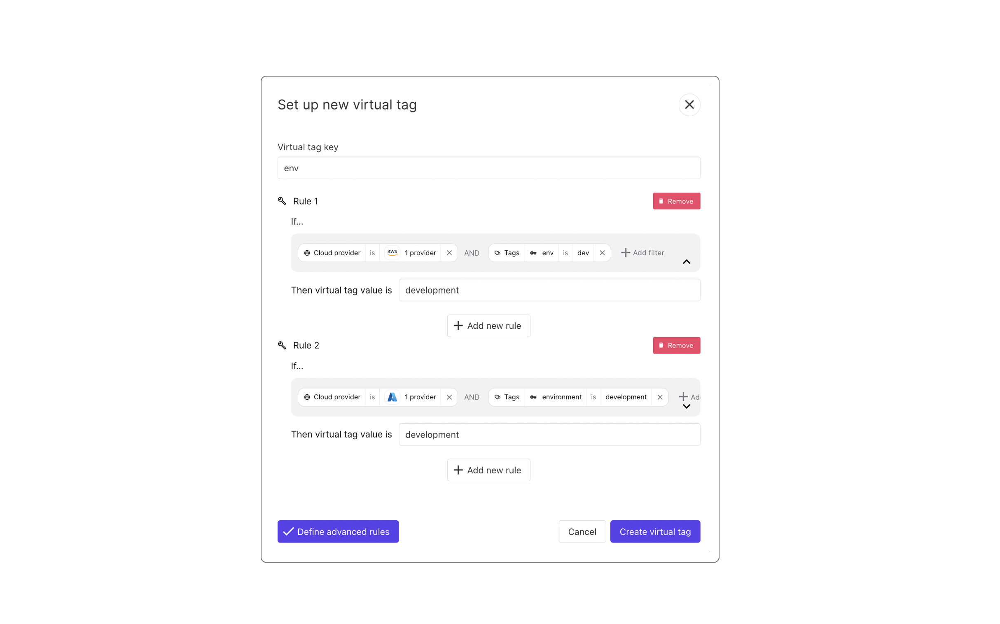

# Virtual Tags

Virtual tags ensure consistent tagging strategies accross all providers and accounts. Its is a key element to multicloud cost reports and analysis.

Holori virtual tags are generated right away, and don’t overwrite the ones from the providers. 

Virtual tags, as any other tags rely on a **tag key** and a **tag value**.

## Create Virtual Tags

On the left side menu, click on "Inventory & Visibility" to expand the sub-menu, then click on "Virtual Tags".

### Simple Virtual Tags

On the Virtual Tags page, click on "+ New Virtual Tag" on the top right corner.

On the popup that opens, you can enter a **virtual tag key** followed by **virtual tag values**.

To add the virtual tag to a resource, you need to go to the inventory page and select the resources you want. You can tag multiple resources at once.

### Advanced Virtual Tags

For advanced virtual tagging strategies, click on **"Define advanced rules"** in the virtual tag creation popup.

The advanced rules configuration lets you create automated rules so that you don’t need to manually select resources you want to tag. 
Of course, you need to input your virtual tag key and value but they will be applied based on the rules you have defined. 

### Virtual Tags advanced rules example

For example, you could say that you want all your AWS resources in North Virginia to have a specific virtual tag key & value : 

For example, I only want to harmonize tags across AWS & Azure. 
-	On AWS I have tagged my resource with the following tag: env: dev
-	But on Azure I have tagged with the following tag: environment: development

The goal of the virtual tag is to create a layer on top of the existing tag that will unify all these pre-existing provider tags. My rules here create a virtual tag that will harmonize provider tags across AWS & Azure: 
-	env: development

## Filtering explained

<iframe width="560" height="315" src="https://www.youtube.com/embed/BnLr985R-yw?si=F8vfFf16at_zCaEd" title="YouTube video player" frameborder="0" allow="accelerometer; autoplay; clipboard-write; encrypted-media; gyroscope; picture-in-picture; web-share" referrerpolicy="strict-origin-when-cross-origin" allowfullscreen></iframe>

For advanced virtual tagging strategies, click on **"Define advanced rules"**.

The advanced rules configuration is, in a way, relatively similar to the configuration of the views that you maybe experienced in Holori.

