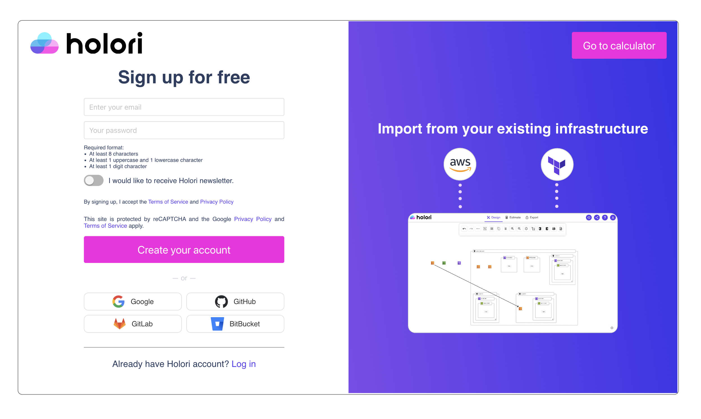
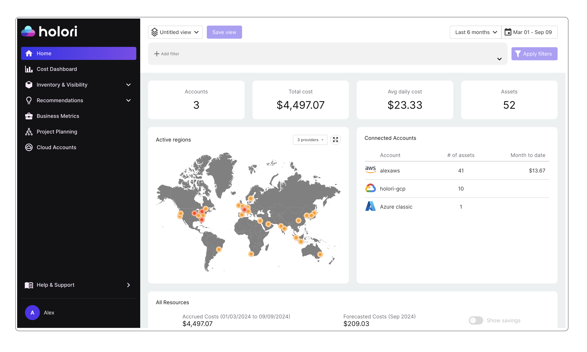
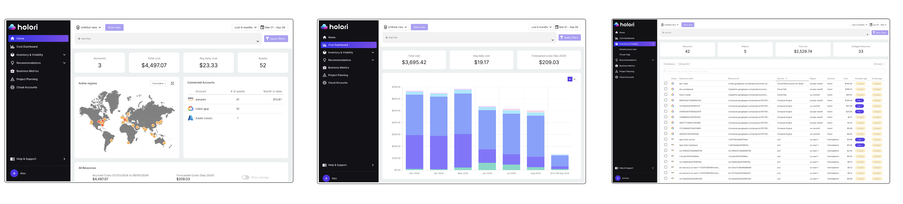

# Quick start

:::info

Discover the 3 key steps to start visualizing your cloud costs and infra in Holori App.
Please refer to the dedicated sections for more details about each software feature.

:::

## Step 1: Create account

Go to https://app.holori.com/ and click Sign up.

## Step 2: Connect provider account

Select the provider you wish to connect to Holori and follow the procedure.

:::info

For **cloud cost and infra visibility** the supported providers are **AWS,GCP and Azure**.

:::

import Tabs from '@theme/Tabs';
import TabItem from '@theme/TabItem';

<Tabs>
  <TabItem value="aws" label="AWS" default>
  AWS configuration: https://doc.holori.com/Integrations/connect-aws
    
  </TabItem>
  <TabItem value="gcp" label="GCP">
   GCP configuration: https://doc.holori.com/Integrations/connect-gcp
    
  </TabItem>
  <TabItem value="azure" label="Azure">
    Azure configuration: https://doc.holori.com/Integrations/connect-azure
    
  </TabItem>
</Tabs>

The import can sometimes take up to 30 minutes depending on your infra size. Have a coffee while your data is being imported.

## Step 3: Visualize your costs and infra

### Costs Visibility

After connecting your first cloud account, Holori will start building automatically your first cost dashbaords.

#### The main pages

- **Homepage** summarizes connected accounts information such as  your global cloud bill, number of assets and their locations, a cost breakdown between main products families and a list of most expensive resources

- **Cost Dashboard** focuses on your main cost drivers **by category**, category being a service type, a region...

- **Inventory** displays cost information **at the individual resource level**.

### Infra Visibility

Go to "Inventory & Visibility" on the left sidebar, then select "Infrastructure View".

The infra diagrams of the connected cloud accounts are displayed as thumbnails, click on the one you want to open.

:::info

The auto-sync frequency depends on your plan.

:::

### Neeed help? 

Use the chat on the App or Website and one of our experts will answer all your questions! 

