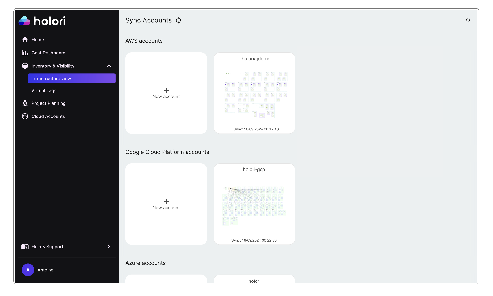
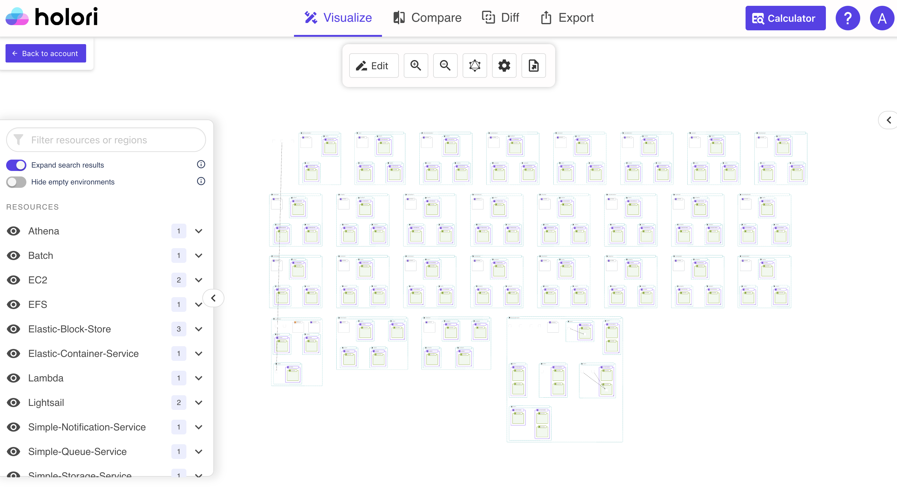
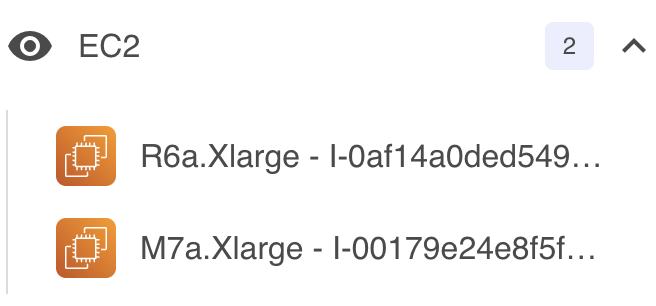
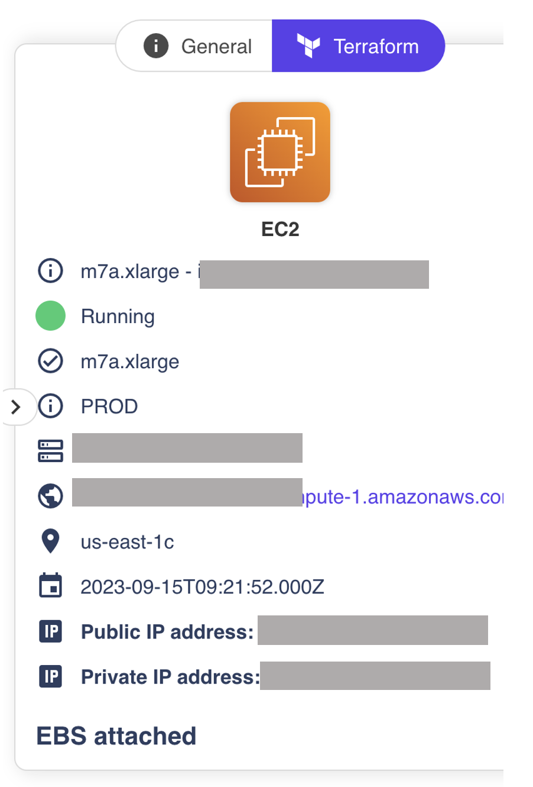
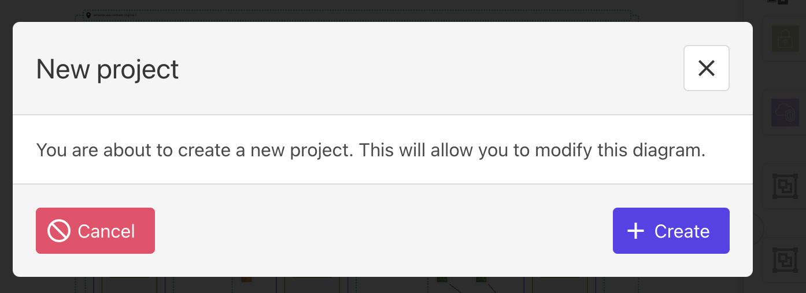
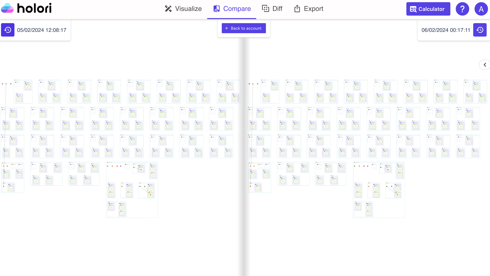
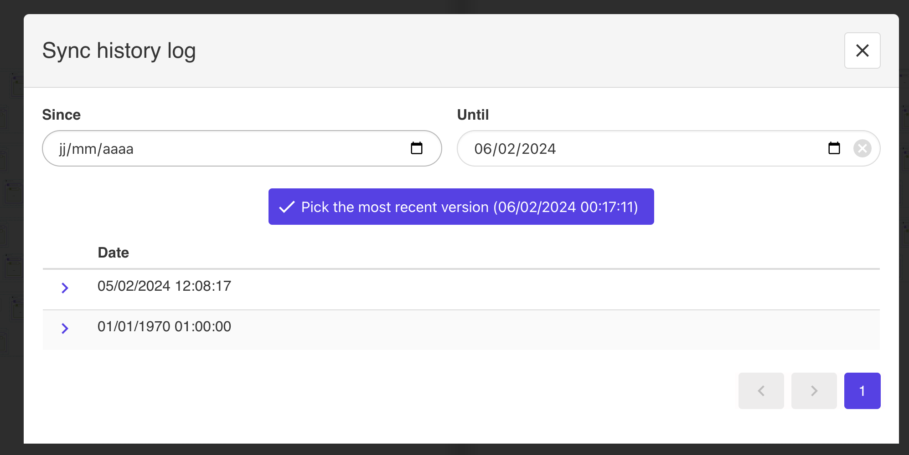
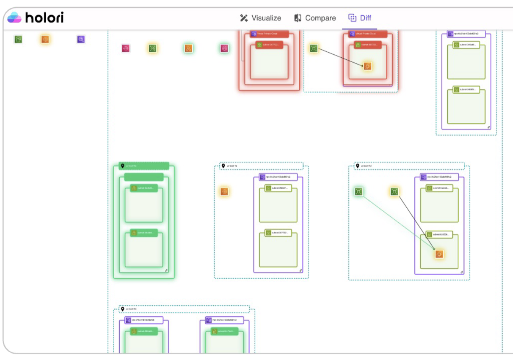

# Automated diagrams

<iframe width="560" height="315" src="https://www.youtube.com/embed/vcnYL0fZIlU?si=a3gjuoOiTrzJvGkw" title="YouTube video player" frameborder="0" allow="accelerometer; autoplay; clipboard-write; encrypted-media; gyroscope; picture-in-picture; web-share" referrerpolicy="strict-origin-when-cross-origin" allowfullscreen></iframe>
   
 
## Sync frequency and user's plan

By default any cloud account connected to Holori will be automatically synchronized. 

:::info

Holori can synchronize your cloud accounts for AWS, GCP and Azure.

:::

The sync frequency depends on the user's plan:

- Monthly sync for the free plan accounts
- Daily sync for the paid plan accounts

To connect your cloud account to Holori, please refer to the corresponding documentation section : https://doc.holori.com/Integrations/connect-aws

## View synchronized cloud accounts

Your synchronized cloud accounts are visible by navigating to **"Inventory & Visibility"** and **"Infrastructure view"** on the left navbar of the App.

For each account you can see a miniature of the provider logo or of the infra as well as the date and time of last sync.
Please note that pending the initial synch that will occur in the 24 hours following the connection of your cloud account to Holori, the miniature may be missing.

## Visualize a sync infra

To visualize a sync infra, simply click on it. From there a new window will open containing your diagram. As you notice, you land directly on the "visualize" tab.

At first, the diagram will probably seem a bit confusing with lots of resources created. This is due to the fact that AWS creates empty environments by default in numerous regions.

In order to improve readabilty there is a "hide empty environments" toggle on top of the left tab. By clicking on it, your infra will become much easiser to read. This is illustrated by the screenshot below.
Please note that you can also use the "rearrange diagram" button on the toolbar to automatically optimize the positioning of items on the grid.

On the left tab a list of products and regions is also available. By clicking on the eye icon next to each product, the corresponding resources will be hidden/displayed on the diagram.
The number next to each product indicates the number of corresponding resources in your infra.

By clicking on a product name you will expand the list and see the corresponding resource(s) in your infra. If you then select a resource, the diagram will also be adjusted to focus on it.

## Navigate on the grid

The diagram is initially locked to be read only. You can zoom in/out, select resources but can't move them around, delete them or add others. Keep reading to see how to edit the diagram.

When selecting an item on the grid, a panel will open on the right side of your screen. It displays a summary of your item's state (if available), its name, location, IPs...
If the item has any additional resources attached, they will also be listed, for example EBS attached to EC2 instances.

If you keep srolling down, you will see the Terraform variables of the selected product.

## Edit a diagram

To switch from the read only view to a diagram you can edit, please select "Edit" on the tool bar.

A pop-up will be displayed to confirm your wish to do so.

Editing a synchronized infra means creating a new project in Holori software. This new project is fully disconnectd from your real "live" infra, and can be considered as an editable snapshot of the infra as it waas when the last sync occured.
Once creatd this new project can be fully edited, new resources can be added, other deleted etc.

## Compare two versions

On the top of your screen select compare.

The compare tab is used to display side by side 2 different versions of your infra.
By default the latest sync is on the right, the previous one on the left.

It is possible to select any other previous sync to be displayed, to do so, click on the small clock icon on the left or right side of your screen.

## Diff diagram

On the top of your screen select diff.

The diagram will by default compare the lastest sync to the previous one.
A simple color code will help you identify the differences between versions.

- Green: resource added
- Red: resource deleted
- Yellow: resource modified

It is possible to select any other previous sync to be displayed, to do so, click on the small clock icon on the left or right side of your screen.

## Generate documentation 

By visiting the export tab, you will be able to see a documentation fo your infra that is automatically generated. This documentation, contains a 3D view of your diagram followed by a list of resources and then their corresponding Terraform variables.
You can export is as a pdf by clicking on "Print" on the bottom right corner of your screen.

