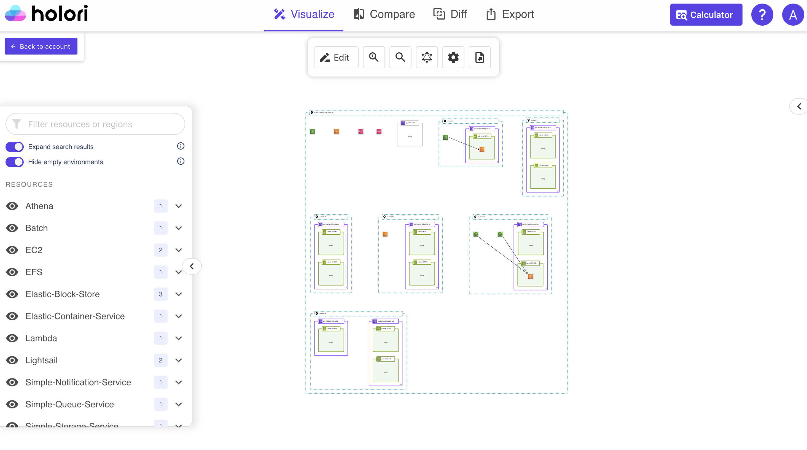

# Key features: Holori Infrastructure Visibility Solution

Visualize your AWS, GCP, Azure infrastructure with automatically generated diagram, discover all your assets and their configurations. Monitor and track changes in a graphical way.

## Automatically generate infra diagrams

:::info

Automated diagram generation and auto-sync are available for **AWS, GCP and Azure**.

:::

Connect your cloud account to Holori (cf. dedicated pages in the "Integrations" section).
Visualize your entire infra, understand how assets are connected, where they are localized and spot resources you might have forgotten about.

## Track resources configuration and evolution 

For each resource in the diagram, you can easily get access to their configuration by clicking on them. A tab will display an initial summary about the resource and a detailes information about the configuration is also available.

You can put two diagrams versions side by side to compare them (compare tab) or have them merged (diff diagram tab) to have the differences highlightes with an easy to read color code (green for new, yellow for modified, red for deleted).

## Automatically generate infra documentation

Get a pdf export of your infra containing a 3D diagram, a list of all your resources as well as their detailed configuration and a 2D diagram. This is perfect to keep track of your infra over time, meet your traceability and audits requirements.
