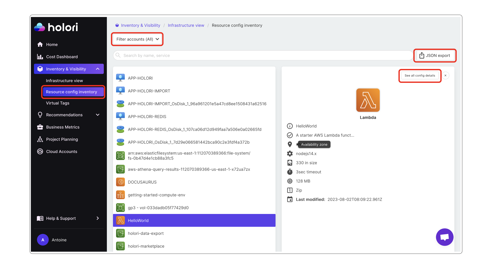

# Resource config inventory

Holori offers a comprehensive list of all your active resources accross all your connected accounts.

To open it, navigate to the "**Inventory & visibility**" tab and open "**Resource config inventory**".

On top of the page you can filter by account. By default all accounts are listed.

When clicking on a resource, a summary of key data is displayed on the right of your screen. To display even more details, click on "**See all config details**".

It is possible to extract a detailed list of all the resources and details by clicking on "**JSON export**" on top of the page.
