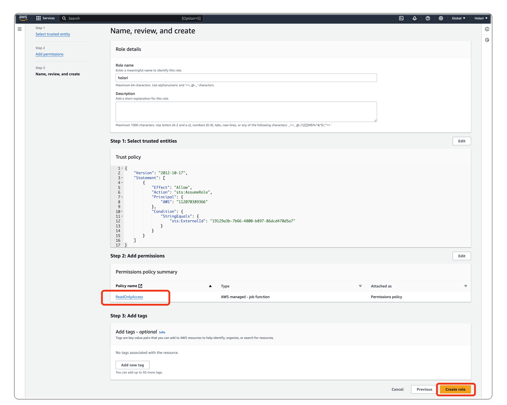
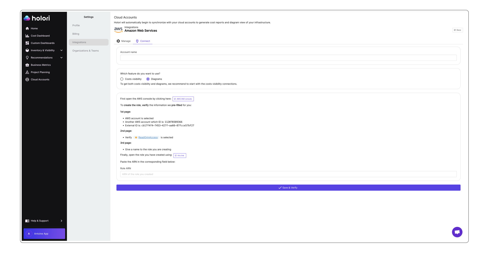

# Connect your AWS account - Diagrams only

To retrieve data and understand your infrastructure, Holori needs access to your AWS account. This procedure is made in full compliance with AWS's access rules. We will guide you step by step through this configuration process.

In Holori App, click on your username at the bottom left of the page, then select the "Integrations" tab and click on "+Connect now" under the AWS logo.

:::warning 

You must first define which feature you want to use between cost visibility and diagrams To get both costs visibility and diagrams, follow the procedure for costs visibility connection.

**The following procedure is for INFRA DIAGRAMS.** 
:::

### Video demo

<iframe width="560" height="315" src="https://www.youtube.com/embed/w1xzET59ufM?si=tAzzGvjSOlK-ybG7" title="YouTube video player" frameborder="0" allow="accelerometer; autoplay; clipboard-write; encrypted-media; gyroscope; picture-in-picture; web-share" referrerpolicy="strict-origin-when-cross-origin" allowfullscreen></iframe>

## Step by step procedure:

### Step 1: Create a cross account on the AWS console

1. On the AWS integration page, select the "**Diagrams**" option

2. Click on the "AWS IAM Console" link. A new tab will open redirecting you to the AWS console login page (or the role creation page directly if you are already logged in).

3. You will be redirected to the “create role page”on AWS. Holori will have already pre-filled information. All you need to do is to double check the fields.

The information are the following :

    Trusted entity type : AWS Account
    Account ID : 112070389366
    Checkbox for Require external ID: checked
    A unique external ID is auto generated and filled and should match the one from the Holori app
    Checkbox for MFA option: unchecked

The information follows AWS best practices and security recommendations.

4. Click next, 

### Step 2: Verify the new policy 

1. On the second page make sure that: "ReadOnlyAccess" permission is selected

2. Click next, 

### Step 3: Name and Create role

On the third and last page :

1. Give the name "holori" to this role

2. In “Step 2 : Add permissions” you can check once again the permissions and it should be : “ReadOnlyAccess”.

3. Now click on "Create role" at the bottom of the page.

Congratulations, your AWS role should now be created.

### Step 4: Add the cross account role to Holori app

1. Give a name to your provider account, this name will be used to identify it in Holori software.

2. Copy your ARN and come back to the Holori tab to paste it.

Once you have performed all the steps above, on Holori App, click Save at the bottom of AWS integration page.
Your account will be synchronized, it can take up to a few hours for the initial diagram to be generated.
