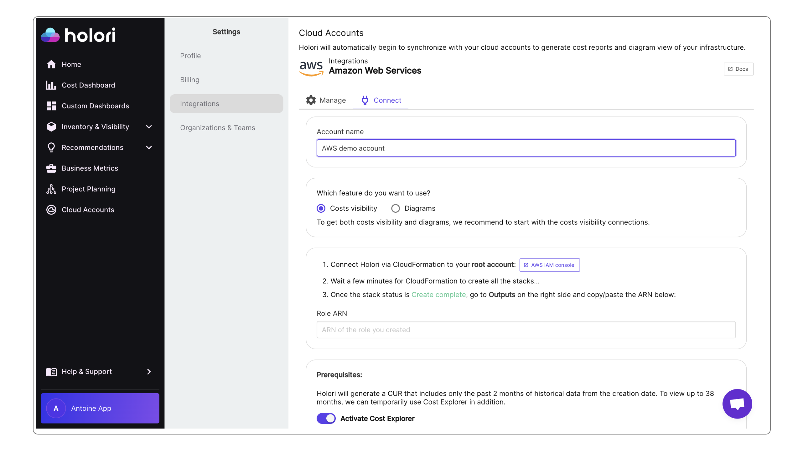
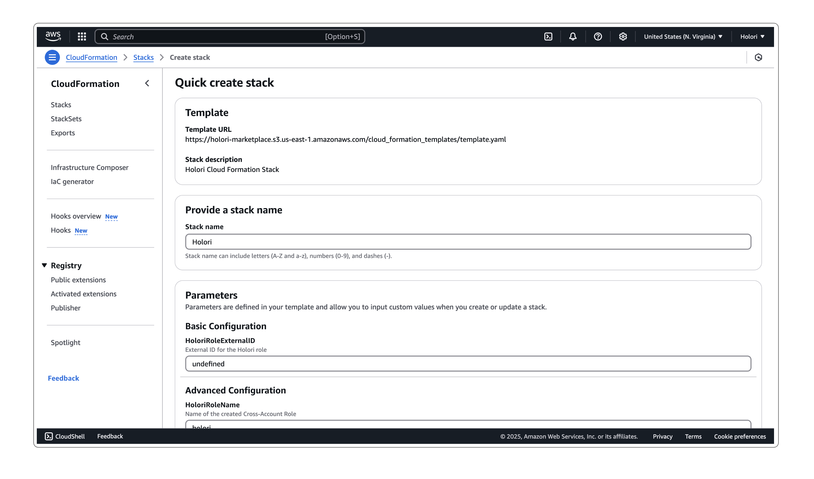
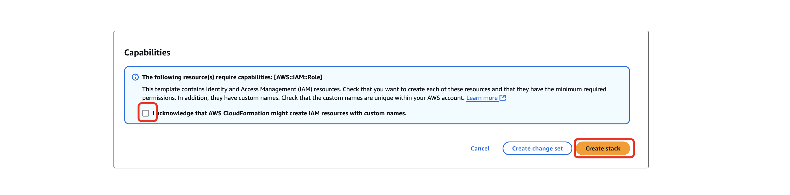
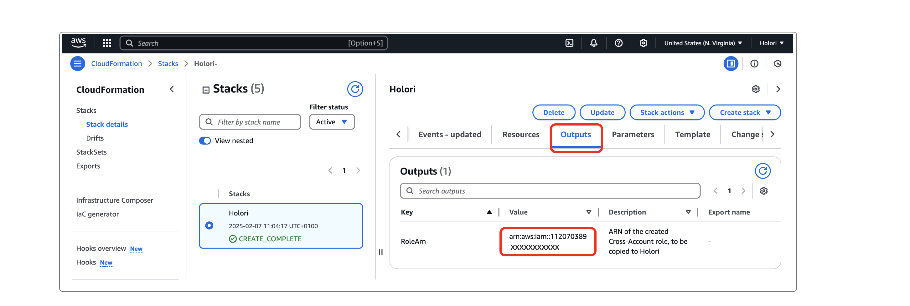
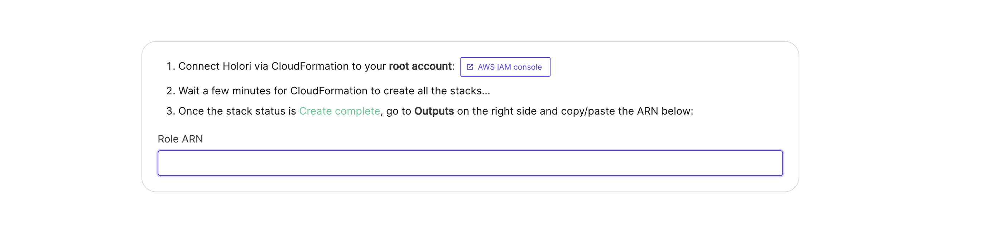
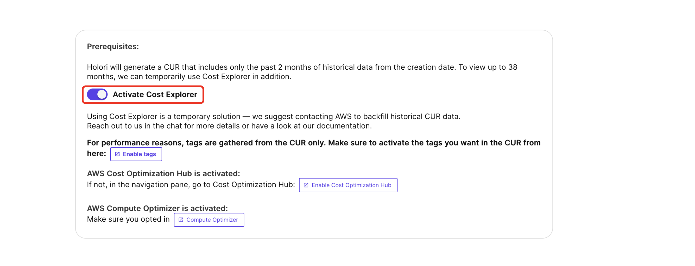

# Connect your AWS account - FinOps & Diagrams

To retrieve your billing info and understand your infrastructure, Holori needs access to your AWS account. This procedure is made in full compliance with AWS's access rules. We will guide you step by step through this configuration process.

In Holori App, click on your username at the bottom left of the page, then select the **"Integrations"** tab and click on **"+Connect now"** under the AWS logo.

:::warning
You must first define which feature you want to use between **cost visibility + diagrams** and **diagrams only**

**The following procedure is for COST VISIBILITY + DIAGRAMS.**
:::





### Video demo

<iframe width="560" height="315" src="https://www.youtube.com/embed/szwO4peaL_Q?si=0SVTUjdLVIZg7sjL" title="YouTube video player" frameborder="0" allow="accelerometer; autoplay; clipboard-write; encrypted-media; gyroscope; picture-in-picture; web-share" referrerpolicy="strict-origin-when-cross-origin" allowfullscreen></iframe>

## Step by step procedure:

### Step 1: Use CloudFormation

Connect Holori via CloudFormation to your root account. Use the link that is provided on Holori App / Integrations / AWS. 



In a few clicks, CloudFormation creates all the required permissions.

At the bottom of the AWS console page, ensure you check the last box before clicking on 'Create stack', then wait a few minutes.



### Step 2: Get the ARN

Once the stack status is **Create complete**, go to **Outputs** on the right side and **copy the ARN**.



Paste the ARN in the corresponding field on Holori App.




### Prerequisite 

Holori will generate a CUR that includes only the past 2 months of historical data from the creation date. To view up to 38 months, we can temporarily use Cost Explorer in addition.

A toggle on the account integration page allows you to activate or deactivate the Cost Explorer option.



Please note that using Cost Explorer is **a temporary solution** — we suggest contacting AWS to backfill historical CUR data.
Scroll down to get the request template to send to AWS.

### Step 3 : Enable cost retrieval from your AWS account

#### Cost Explorer 

[Enable Cost Explorer](https://console.aws.amazon.com/cost-management/home)
Then navigate to Cost Management preferences, and to the Cost Explorer tab. Make sure that the following configuration is selected: 
    - Enable Historical data **up to 38 months**
    - Resource level data **at daily granularity** (up to 14 days)


#### Cost Optimization Hub

AWS Cost Optimization Hub must be activated:
In the navigation panel, go to [Cost Optimization Hub](https://console.aws.amazon.com/cost-management/home)
For the detailed procedure, visit AWS documentation page [here](https://docs.aws.amazon.com/cost-management/latest/userguide/coh-getting-started.html#coh-enable).


#### AWS Compute Optimizer

[AWS Compute Optimizer](https://console.aws.amazon.com/cost-management/home) must be activated. .Make sure you opted in.


Once you have performed all the steps above, on Holori App,** click Save at the bottom of AWS integration page.**
Your account will be synchronized.

:::info 
The initial CUR generation by AWS takes 24 hours, please be patient and come back later once the data is made available and imported in Holori.
:::

### Request CUR Backfill Data Export

You can now create a [Support Case](https://support.console.aws.amazon.com/support/home#/case/create) requesting a backfill of your CUR reports with up to 36 months of historical data. 


**Case must be created from each of your Source Accounts (Typically Management/Payer Accounts).**

```js
Service: Billing
Category: Other Billing Questions
Subject: Backfill Data

Hello Dear Billing Team,
Please can you backfill the data in DataExport named `holori-cost-export` for last 36 months.
Thanks in advance,
```

You can also use following command in CloudShell to create this case via command line:

```js
aws support create-case \
	--subject "Backfill Data" \
	--service-code "billing" \
	--severity-code "normal" \
	--category-code "other-billing-questions" \
	--communication-body "
		Hello Dear Billing Team,
		Please can you backfill the data in DataExport named 'holori-cost-export' for last 36 months.
		Thanks in advance"
```


