# Connect your Azure account - Diagrams only

To retrieve data and understand your infrastructure, Holori needs access to your Azure account. This procedure is made in full compliance with Azure access rules. We will guide you step by step through this configuration process.

:::warning

You must first define which feature you want to use between cost visibility and diagrams To get both costs visibility and diagrams, follow the procedure for costs visibility connection.

The following procedure is for INFRA DIAGRAMS. 
:::


The following procedure will guide you through the required steps.


**Video tutorial to add an account via CLI:**

<iframe width="560" height="315" src="https://www.youtube.com/embed/7Mui0QwGsDA?si=G_8G6gF7pAbva1le" title="YouTube video player" frameborder="0" allow="accelerometer; autoplay; clipboard-write; encrypted-media; gyroscope; picture-in-picture; web-share" referrerpolicy="strict-origin-when-cross-origin" allowfullscreen></iframe>


**Video tutorial to add an account via Azure Portal:**

<iframe width="560" height="315" src="https://www.youtube.com/embed/YFjrctSOC2U?si=m9mp3PawkGmIBAKt" title="YouTube video player" frameborder="0" allow="accelerometer; autoplay; clipboard-write; encrypted-media; gyroscope; picture-in-picture; web-share" referrerpolicy="strict-origin-when-cross-origin" allowfullscreen></iframe>

## Add a new provider account on Holori

In Holori App, click on your username at the bottom left of the page, then select the ""Integrations" tab and click on "+Connect now" under the Azure logo.

You then have the choice between the "Cost + Diagram" or "Diagram only" procedure. Select **Diagram only**.

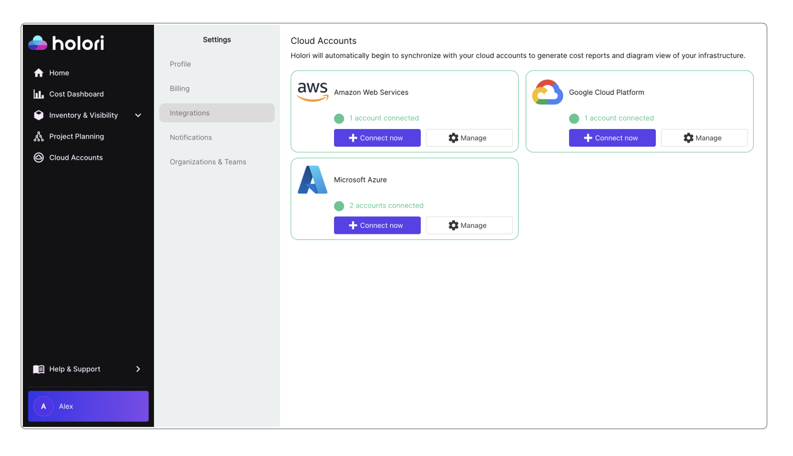

Give a name to this cloud account, this name will be used to identify the account on Holori.

:::tip

You can either connect your Azure account via CLI or via the Azure Portal.
Using the CLI option below allows you to connect multiple Subscriptions simultaneously by granting access at a Management Group level.

:::

## Option 1: Connect using Azure CLI

Ensure you have the rights to run commands using Azure CLI: https://learn.microsoft.com/en-us/cli/azure/?view=azure-cli-latest

### Step 1: Create an Azure Service Principal

Use the following command to create an Azure Service Principal:

```js
az ad sp create-for-rbac -n "holori"
```

The output should look like this:

```js
{
  "appId": "d3aagb1a-2663-4c74-b094-9d8f92f39zfe",
  "displayName": "holori",
  "password": "mP-4Q~Z738qQaByRoTsXsFdcnzRmr7YSc7aDub8I",
  "tenant": "ffcb75e6-17d1-408d-a318-f9765e62084f"
}
```

Copy the <code>appId</code>, <code>password</code> and <code>tenant</code>. Paste them into the corresponding field on Holori App.
Or paste the entire command output into the text field.


### Step 2: Grant Permissions to the Service Principal

You now need to grant permissions to the <code>appId</code> from the service principal you created previously. You can do it either for a **Subscription** or **Management Group**. 
Make sure to replace <code>SERVICE_PRINCIPAL_APP_ID</code> with the appId you saved previously.

In the command, replace <code>MANAGEMENT_GROUP_ID</code> (or <code>SUBSCRIPTION_ID</code>) with your management group ID (or subscription ID) depending on your choice.


import Tabs from '@theme/Tabs';
import TabItem from '@theme/TabItem';

<Tabs>
  <TabItem value="Management Group" label="Management Group" default>
    ```js
az role assignment create --assignee <SERVICE_PRINCIPAL_APP_ID> \
  --role Reader \
  --scope "/providers/Microsoft.Management/managementGroups/<MANAGEMENT_GROUP_ID>"
```
    
  </TabItem>
  <TabItem value="Subscription" label="Subscription">
    ```js
  az role assignment create --assignee <SERVICE_PRINCIPAL_APP_ID> \
  --role Reader \
  --scope "/subscriptions/<SUBSCRIPTION_ID>"
  ```
  </TabItem>
</Tabs>

Go back to Holori and click on "Save and verify" at the bottom of the page.


## Option 2: Connect using Azure Portal

### Step 1: Create an App for Holori on Azure

1- Open Azure Directory: https://portal.azure.com/#blade/Microsoft_AAD_IAM/ActiveDirectoryMenuBlade/RegisteredApps

2- Select "App registrations" on the left sidebar then click the "+ New registration" button.

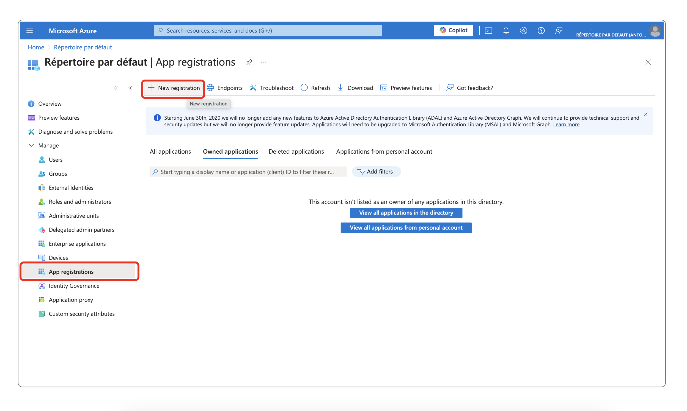

On the page that opens, enter the following

Name: holori

Supported account types: Accounts in this organizational directory only.

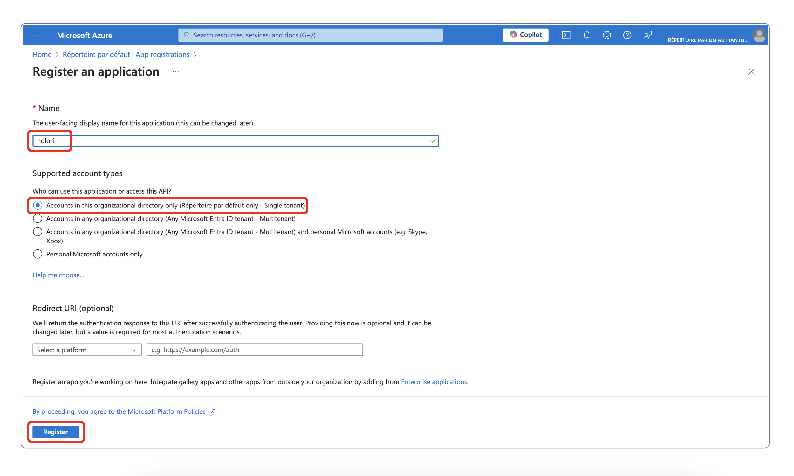

Then click on Register.
Copy the Application ID and Directory ID.

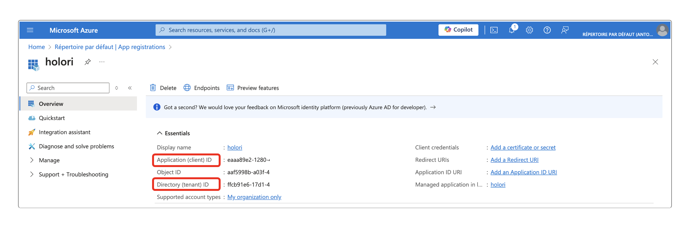


Paste them into Holori 

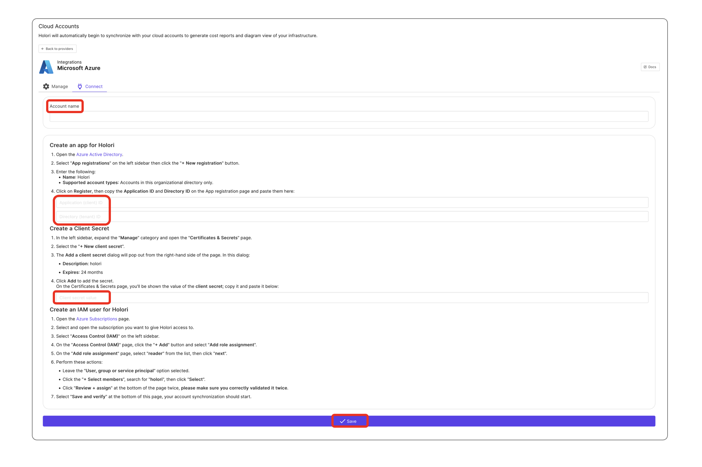


### Step 2: Create a Client Secret

1- In the Azure left sidebar, expand the "Manage" category and open the "Certificates & Secrets" page.

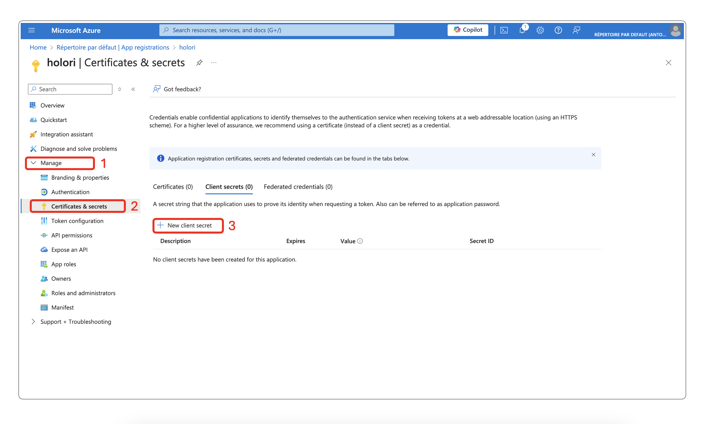

2- Select the "+ New client secret".

3- The Add a client secret dialog will pop out from the right-hand side of the page. In this dialog

Description: holori

Expires: 24 months

Click Add to add the secret.

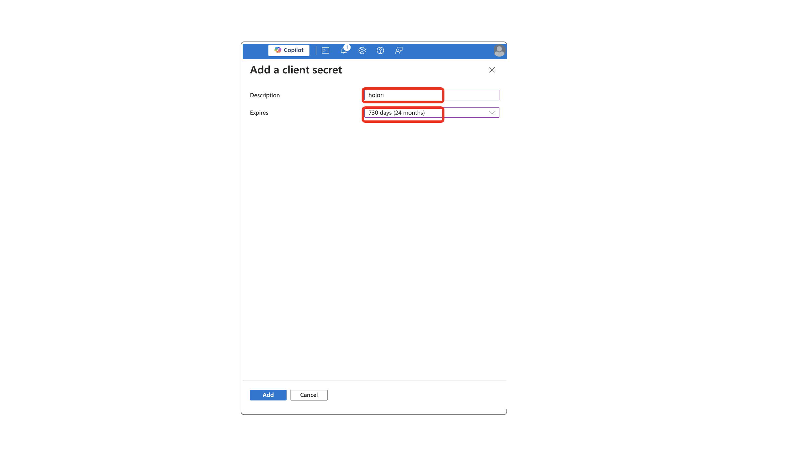

Copy the Value of the newly generated secret. Please make sure to copy the VALUE and NOT the Secret ID.

Paste it on Holori App.


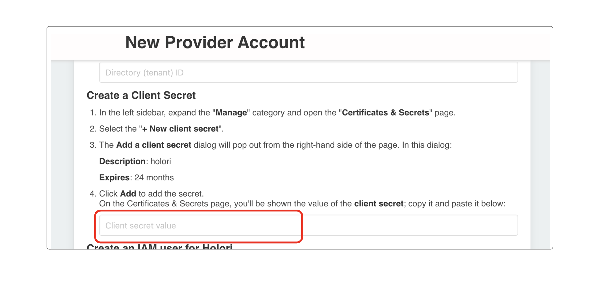

### Step 3: Create an IAM user for Holori

1- Open the Azure Subscriptions page. https://portal.azure.com/#blade/Microsoft_Azure_Billing/SubscriptionsBlade

2- Select and open the subscription you want to give Holori access to.

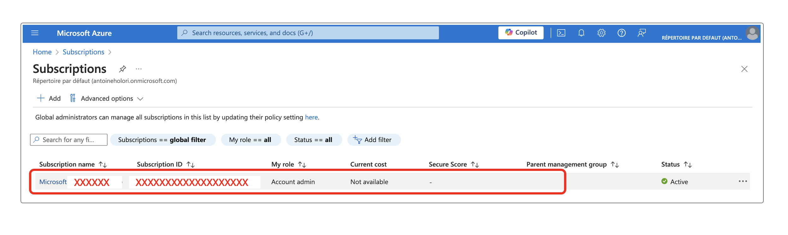

3- Select "Access Control (IAM)" on the left sidebar.

4- On the "Access Control (IAM)" page, click the "+ Add" button and select "Add role assignment".

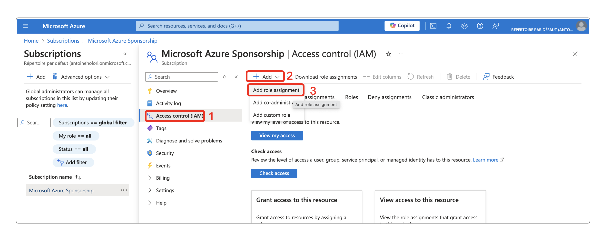

On the "Add role assignment" page, select "reader" from the list, then click "next".

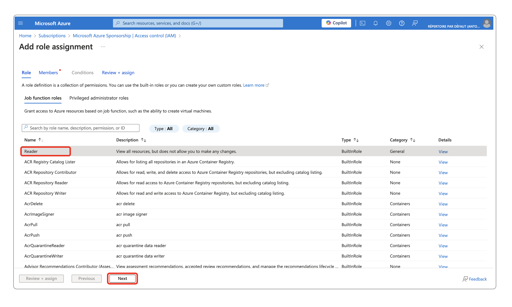

On the page that opens, perform these actions:
- Leave the "User, group or service principal" option selected.
- Click the "+ Select members", search for "holori", then click "Select".
- Click "Review + assign" at the bottom of the page twice, please make sure you correctly validated it twice.


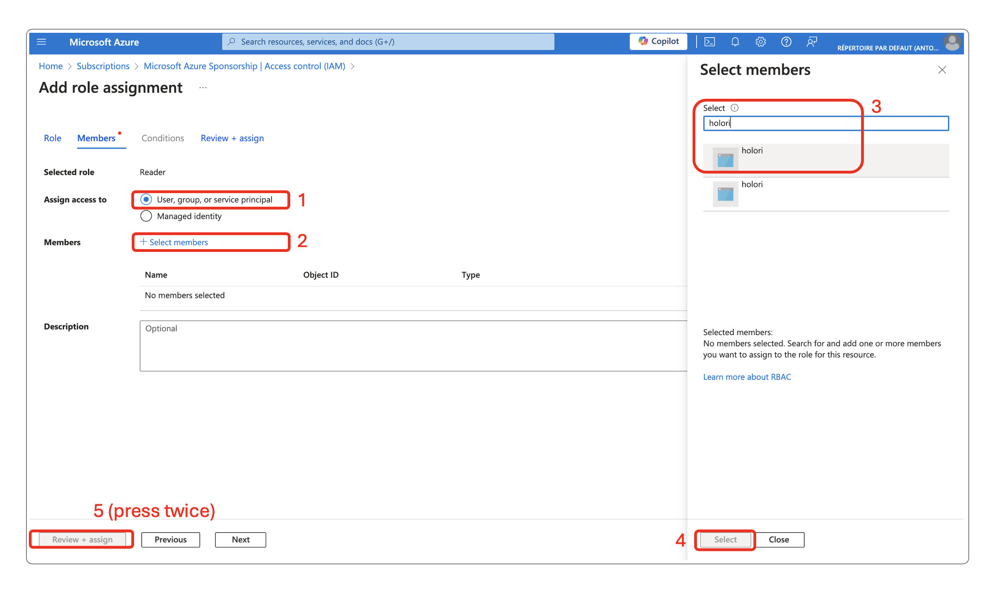

5- Back to Holori App to save

Once you have performed all the steps above, on Holori App, click **Save** at the bottom of Azure integration page. Your account will be synchronized in the following minutes. Go grab a coffee and start exploring your cost and infra.
