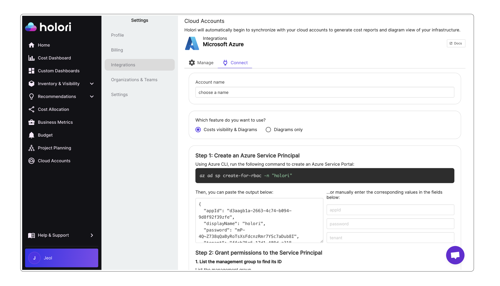
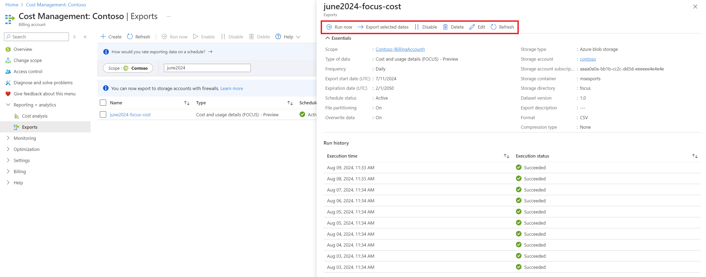

# Connect your Azure account to Holori - FinOps & Diagrams


To retrieve your billing info and understand your infrastructure, Holori needs access to your Azure account. This procedure is made in full compliance with Azure's access rules. We will guide you step by step through this configuration process.


<iframe width="560" height="315" src="https://www.youtube.com/embed/ZnkVxMIE_QA?si=ADMOQP54hlp_SCvF" title="YouTube video player" frameborder="0" allow="accelerometer; autoplay; clipboard-write; encrypted-media; gyroscope; picture-in-picture; web-share" referrerpolicy="strict-origin-when-cross-origin" allowfullscreen></iframe>


In Holori App, click on your username at the bottom left of the page, then select the "Integrations" tab and click on "+Connect now" under the Azure logo.

:::warning You must first define which feature you want to use between cost visibility + diagrams and diagrams only

The following procedure is for COST VISIBILITY + DIAGRAMS. 
:::


 


## Step 1: Create an Azure Service Principal

Use the following command to create an Azure Service Principal:

```js
az ad sp create-for-rbac -n "holori"
```

The output should look like this:

```js
{
  "appId": "d3aagb1a-2663-4c74-b094-9d8f92f39zfe",
  "displayName": "holori",
  "password": "mP-4Q~Z738qQaByRoTsXsFdcnzRmr7YSc7aDub8I",
  "tenant": "ffcb75e6-17d1-408d-a318-f9765e62084f"
}
```

Copy the <code>appId</code>, <code>password</code> and <code>tenant</code>. Paste them into the corresponding field on Holori App.
Or paste the entire command output into the text field.


## Step 2: Grant permissions to the Service Principal

### 1. List the management group to find its ID

```js
{
 az account management-group list
}
```

### 2. Give the role the permissions

You now need to grant permissions to the **appID** from the Service Principal you created previously.
It can be done either at a **Subscription** OR **Management Group** level.

In the commands below, make sure to replace **SERVICE_PRINCIPAL_APP_ID** with the **appID** you saved previously.
Then, replace **MANAGEMENT_GROUP_ID** (or **SUBSCRIPTION_ID**) with your **management group ID** (or **subscription ID**) depending on your choice.


import Tabs from '@theme/Tabs';
import TabItem from '@theme/TabItem';

<Tabs>
  <TabItem value="Management Group" label="Management Group" default>
    ```js
az role assignment create --assignee <SERVICE_PRINCIPAL_APP_ID> --role Reader --scope "/providers/Microsoft.Management/managementGroups/<MANAGEMENT_GROUP_ID>"
```
    
  </TabItem>
  <TabItem value="Subscription" label="Subscription">
    ```js
  az role assignment create --assignee <SERVICE_PRINCIPAL_APP_ID> --role Reader --scope "/subscriptions/<SUBSCRIPTION_ID>"
  ```
  </TabItem>
</Tabs>


## Step 3: Prepare the resource group to deploy into


```js
{
az group create --name holoriResourceGroup --location eastus
}
```

## Step 4: Run the deployment template

Download the Bicep file available on the account connection page. Launch Bicep deployment using the following command:

```js
{
az deployment group create --mode Complete --resource-group holoriResourceGroup --template-file /path/to/main.bicep --parameters postgresql_password="28bc6118-efd7-4b5d-b4d9-5b9634a45ac9"
}
```

## Step 5: Create the PostgreSQL database

Download the script available on the account connection page to initiate the PostgreSQL database. Run this command, then paste the output below:

```js
{
az deployment group show -g holoriResourceGroup -n main --query properties.outputs
}
```
Paste the output of the command in the corresponding field on Holori App.

Once this is done, below the field where you just copied your output, a new command should have been populated. Copy it and run it:

```js
{
# This field is populated once you've pasted your previous command output in the field above.
}
```

## Step 6: Create the FOCUS export in Azure portal

1. On Azure portal, navigate to "Cost Export" using the search bar

2. From the export tab, click on "+ Create"

3. Select "Cost and Usage (FOCUS)"

4. On the dataset tab, click on "+ Add Export", then on the right panel use these figures:
- Type of data: Cost and Usage details (FOCUS)
- Export name: holori
- Dataset version: 1.0r2
- Frequency: Daily export of month-to-date costs

5. Click on "Add"

6. Now enter "holori" for prefix for your export in the "export prefix" field

7. Select your newly created export name from the list below and click "Save" on the bottom right corner of the page, then "Next" at the bottom left

8. Fill in the following fields:
- **Storage type**: Use existing
- **Subscription**: Choose the subscription on which you ran the main.bicep file
- **Storage account**: The storage account where the data is to be exported --> This data is written on the holori connection page if the above steps were performed correctly, just copy paste it to your Azure console.
- **Container**: The container name where the export is stored --> This data is written on the holori connection page if the above steps were performed correctly, just copy paste it to your Azure console.
- **Directory**: The directory path where the focus is located 
- **Format**: Parquet
- **Compression**: Snappy
- **File partitioning**: Enable
- **Overwrite data**: Enable

:::info Some information are provided on Holori's App 

The Storage Account and Container information are written on the holori connection page if the above steps were performed correctly, just copy paste them to your Azure console.

:::

Once you have performed all the steps above, on Holori App, click **Save & Verify** at the bottom of Azure integration page. Your account will be synchronized.

## Request data backfill

By default, Azure cost export is limited to the last 12 months (it can be slighlty more or less depending on your account), but you can request a backfill to get more data.

Using the "Export selected dates" option on your console reruns an export for a historical date range instead of creating a new one-time export. You can extract up to 13 months of historical data in one-month chunks. 

 

**Procedure to backfill more data:**

- Go to your Azure console
- Open the Cost Management category then "**Exports**", you can also use the search bar to directly find cost exports
- Select the export you want to expand by clicking on its name
- On the tab that opens, on top, select "**Export selected dates**"
- Give a start and end date, you can only select a maximum duration of one month each time
- Click on "**Execute**"

You must now perform this for each additional month you wish to add to your initial cost export.
