# Connect your GCP account

To retrieve your billing info and understand your infrastructure, Holori needs to be granted an access to your GCP account.
This procedure is made in full compliance with GCP's access rules, please refer to their corresponding documentation using the link at the bottom of the page.
We will guide you step by step through this configuration process.

The procedure is diffferent is you want to visualize your GCP cost data or build GCP diagrams.
If you wan to do both, please follow both procedures.

## Feature: Cost Visibility

### Step 1: Create a dedicated project

:::warning
Warning: Before enabling Cloud Billing data exports, you must create a project to store the data.
If you have multiple Cloud Billing accounts, you must enable Cloud Billing exports, individually for each account. 
:::

:::tip
We strongly recommend that you create a dedicated project to store all Cloud Billing data, rather than using an existing project. 
:::

To create a project, do the following:
- First, open the GCP console: https://console.cloud.google.com/iam-admin/iam
- On GCP console select your Organization name with the drop-down menu. On the top right of the popup click on "New Project".
- Give a project name, select the organization it belongs to and click on "Create".

### Step 2: Create a BigQuery Dataset

1. Go to the BigQuery console and make sure that the dedicated project you just created to store your billing data is selected: https://console.cloud.google.com/bigquery
2. Next to the Project ID, click the View actions menu (the 3 dots one above another) and then click on **"Create dataset"**. The Create dataset panel opens.
 
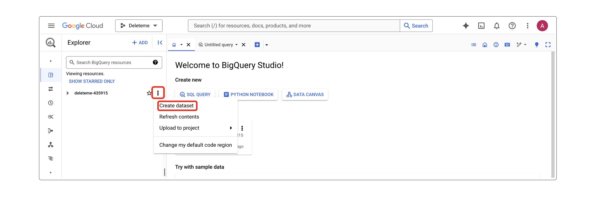

  - Enter the following Dataset ID: **"all_billing_data"**
  - Select a **Data location**. The Data location specifies the multi-region or region where your data is stored
  - Ensure that the **Enable table expiration** option is **unchecked**
  - In the Advanced options section, ensure that the selected Encryption setting is **Google-managed encryption key**
  - To save, click **Create dataset**

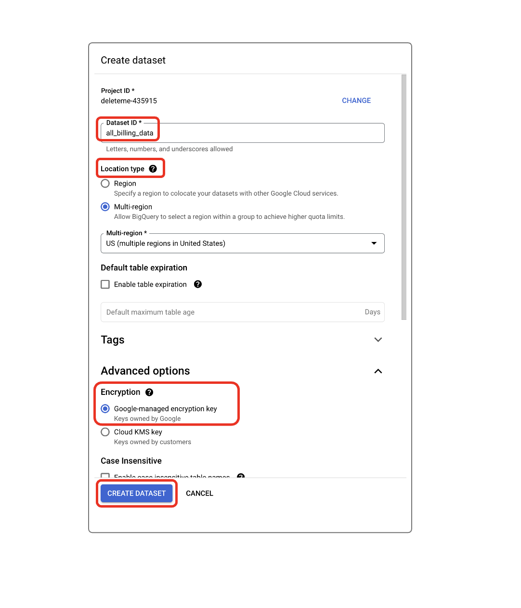

:::info 
If you already have a BigQuery export setup with a Dataset ID different from “all_billing_data”, please reach out to us and share your Dataset ID. 
:::

### Step 3: Enable Cloud Billing export to the BigQuery dataset

1. In the Google Cloud console go to the Billing export page and verify that your billing data storage project is correctly selected: https://console.cloud.google.com/billing/export
2. For the **"Standard usage cost"** and **"Detailed usage cost"**, click on **"Enable"** if not already done.

:::warning

It can take up to 48 hours to have the export operational and data available in Holori.
:::

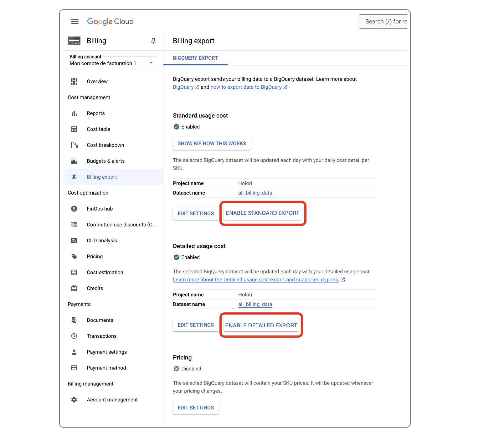

### Step 4: Enable the BigQuery Data Transfer Service API

1. On GCP Console, go to the API page: https://console.cloud.google.com/apis/api/bigquerydatatransfer.googleapis.com/metrics 
2. On the top left of the page, select the project you created to store your billing data
3. On top of the BigQuery Data Transfer Service API page, click "Enable"
 
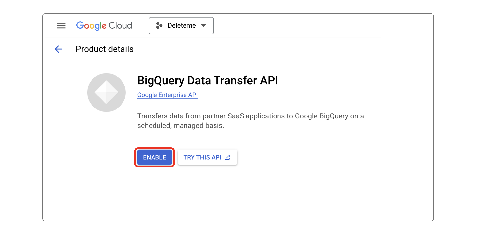

### Step 5: Create a service account and JSON key
1- Log in to your GCP console and make sure that you open the project you created to store your billing data.

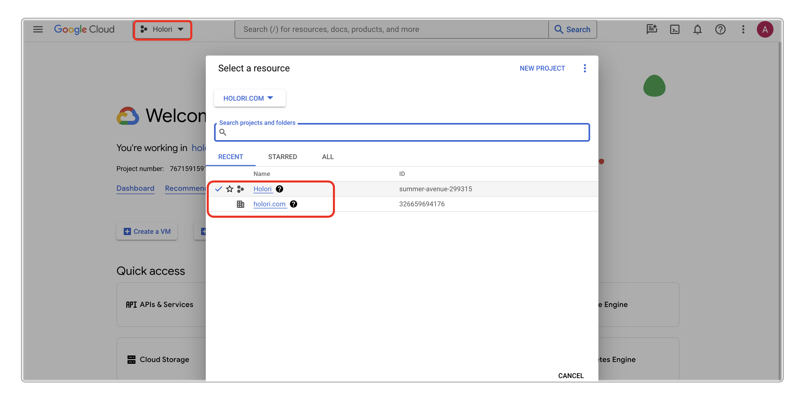

2- Create a service account:

  - To create a service account, select "IAM" then "Service Accounts" in the left panel.

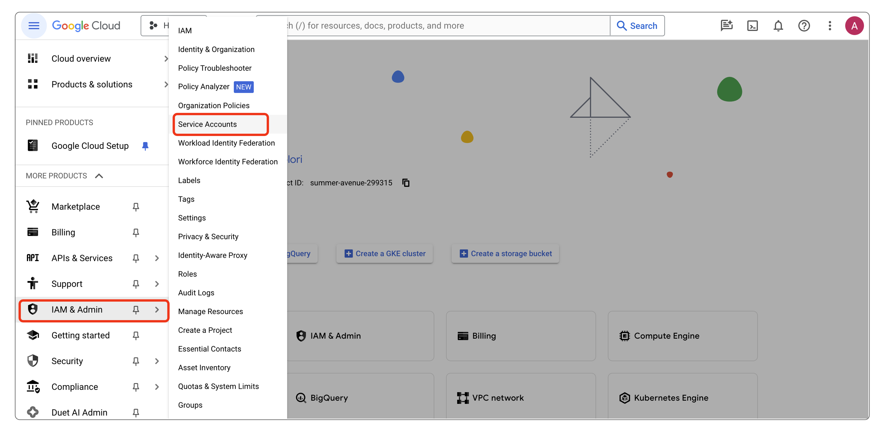

  - On the left panel, select "Service Accounts", then on top of the page select "+ Create Service Account"

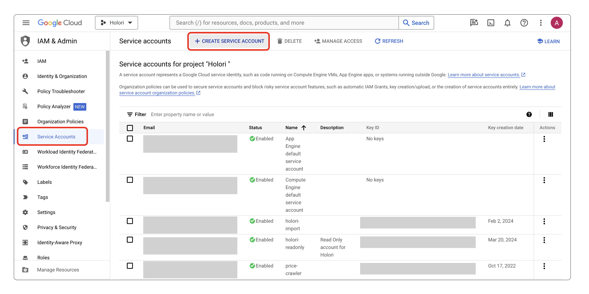

  - Give your account a name, an ID and a description (optional)

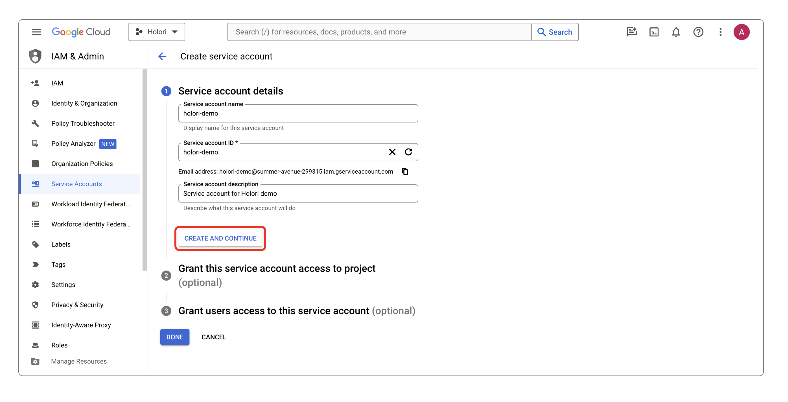

  - Select "Create and continue"

3- Grant a read-only access right to your acount:

  - You should now have reached the "Grant this service account access to project" part.

  - Click on "Select a role", then scroll to "Project" and select "Viewer" on the panel opening on the right.

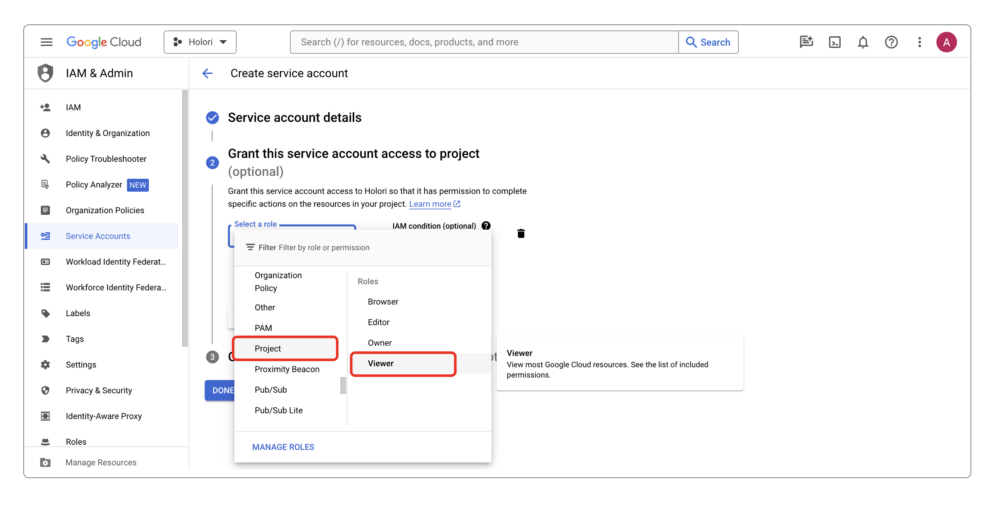

4- Once back on the "Service Accounts" page, open the service account you just created

5- To create a JSON key:

  - Open the "Key" section, "Add key" and "Create new key"

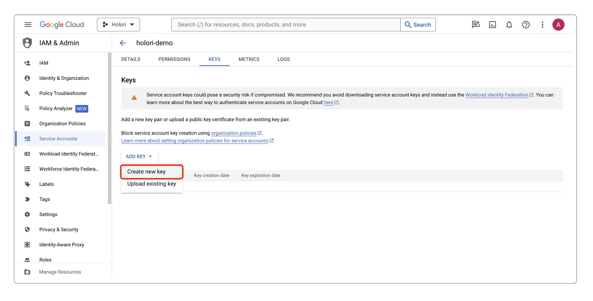

  - Create a JSON key

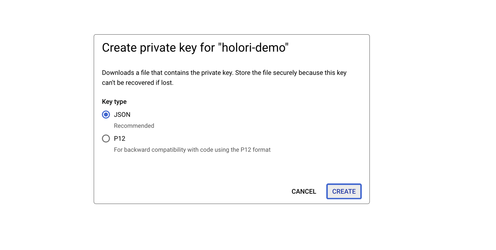

- Download the JSON key

6- To add your GCP service account to Holori: 

- In Holori App, click on your username at the bottom left of the page, then select the **"Integrations"** tab and click on **"+Connect now"** under the GCP logo, then select the cost visibility toggle.

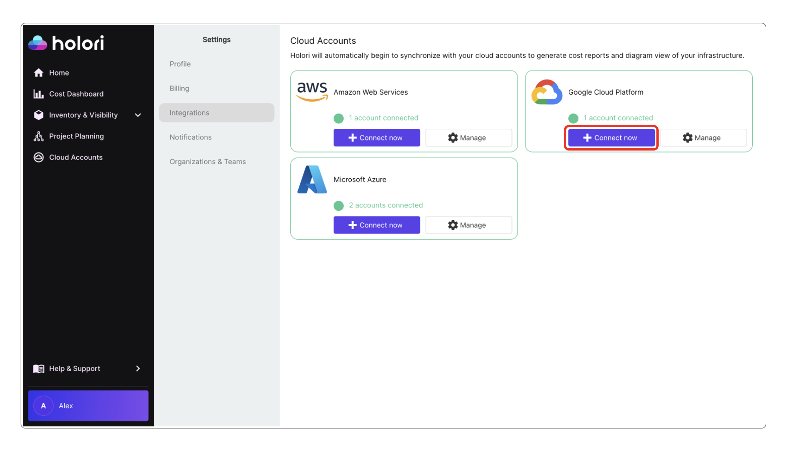

- Then upload your JSON file by clicking on "Pick the key file"

### Step 6: configure the right permissions

To setup the export, you’ll need to have some permissions.

**At project level where the export will be located:**
- bigquery.transfers.update
- bigquery.datasets.update
- resourcemanager.projects.update
- billing.resourceCosts.get

**At organisation level:**
- recommender.resources.export

**At billing account level:**
- billing.accounts.getSpendingInformation

To do so, you can create custom roles including those permissions, but this combination of predefined roles will give you all required permissions:

**At project level:**
- Project Owner/Editor/Viewer
- BigQuery Admin

**At organisation level:**
- Recommendations Exporter

**At billing account level:**
- Billing Account Administrator/Costs Manager/Viewer

#### Create a dataset to store the permissions 

From the BigQuery console, select the same project you set up the billing export for and create a new dataset, named ‘recommendations_export’

#### Create a data transfer for recommendations

From the GCP console Recommendations dashboard, access the BigQuery Export menu and select the same destination project as the one you used for the billing export.
Fill transfer display name and frequency according to your preferences.

#### Schedule backfill and wait for data

Finally, you can schedule a backfill. Data should be available in 48 hours maximum.
For more information, visit GCP documentation: https://cloud.google.com/recommender/docs/bq-export/export-recommendations-to-bq

Once you have performed the steps listed above, click on **"Save and verify"** at the bottom of the page.

## Feature: GCP diagrams 

### Create a new Service Account 

1- Log in to your GCP console and make sure that you open the project you want Holori to have access to.

2- Create a service account:

  - To create a service account, select "IAM" then "Service Accounts" in the left panel.

  - On the left panel, select "Service Accounts", then on top of the page select "+ Create Service Account"

  - Give your account a name, an ID and a description (optional)

  - Select "Create and continue"

3- Grant a read-only access right to your acount:

  - You should now have reached the "Grant this service account access to project" part.

  - Click on "Select a role", then scroll to "Project" and select "Viewer" on the panel opening on the right.

4- Once back on the "Service Accounts" page, open the service account you just created

5- To create a JSON key:

  - Open the "Key" section, "Add key" and "Create new key"

  - Create a JSON key

- Download the JSON key

6- To add your GCP service account to Holori: 

- In Holori App, click on your username at the bottom left of the page, then select the **"Integrations"** tab and click on **"+Connect now"** under the GCP logo.

  
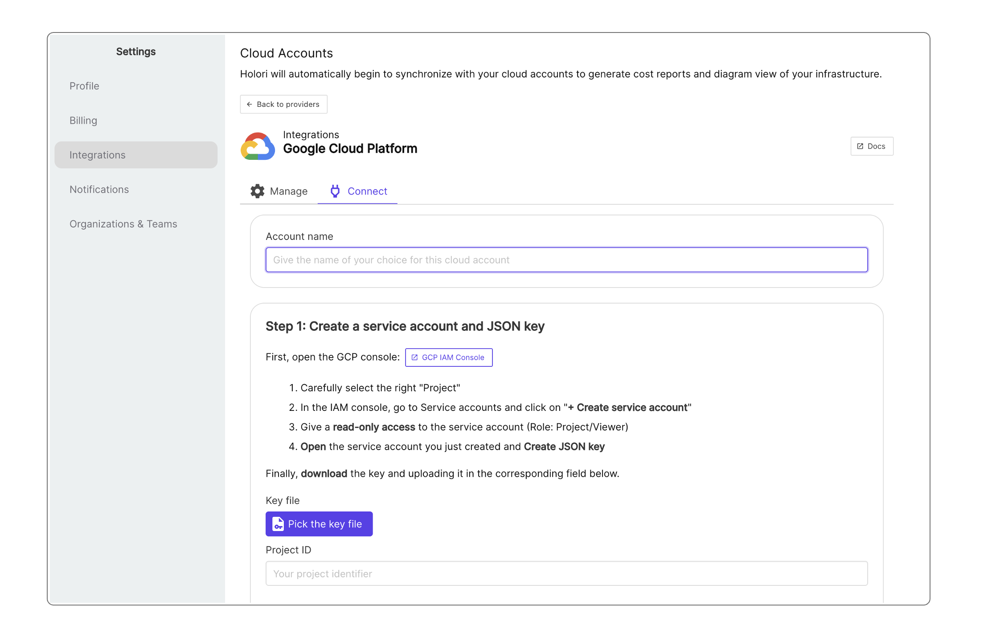

- Then upload your JSON file by clicking on "Pick the key file"

Click on "Save and verify" at the bottom of the page.
Please note that generating your first diagram can take a few hours.

If you want to generate diagrams for multiple accounts, you'll need to redo this procedure for each one of them.

## Troubleshooting

### Permissions 

Some options can be unavailable on your account depending on your permissions.
Make sure that the following permission is enabled on your organization's root account:

- "**Billing Account Costs Manager**": to enable it, ensure you are on your root account (using the top left drop down menu), hten navigate to IAM. For your user name, navigate to activate the permission.
- "**BigQuery Admin**": to enable if needed in addition to Billing Account Costs Manager.

### Some links to GCP documentation

Here is the link to GCP's official documentation regarding the creation of a service account:
https://cloud.google.com/iam/docs/service-accounts-create

And for setting up the Big Query Data export:
https://cloud.google.com/billing/docs/how-to/export-data-bigquery-setup#api
