# Connect your OCI account

Holori offers a an OCI Finops solution to help you track and optimize Oracle Cloud costs.

<iframe width="560" height="315" src="https://www.youtube.com/embed/jaCnF65rNq8?si=9Aru2fDwEjFjCZ5e" title="YouTube video player" frameborder="0" allow="accelerometer; autoplay; clipboard-write; encrypted-media; gyroscope; picture-in-picture; web-share" referrerpolicy="strict-origin-when-cross-origin" allowfullscreen></iframe>

To retrieve your cost data, Holori needs to be granted an access to your OCI/Oracle Cloud account.
The following procedure will guide you through the required steps.

In Holori App, click on your username at the bottom left of the page, then select the **""Integrations"** tab and click on **"+Connect now"** under the OCI logo.

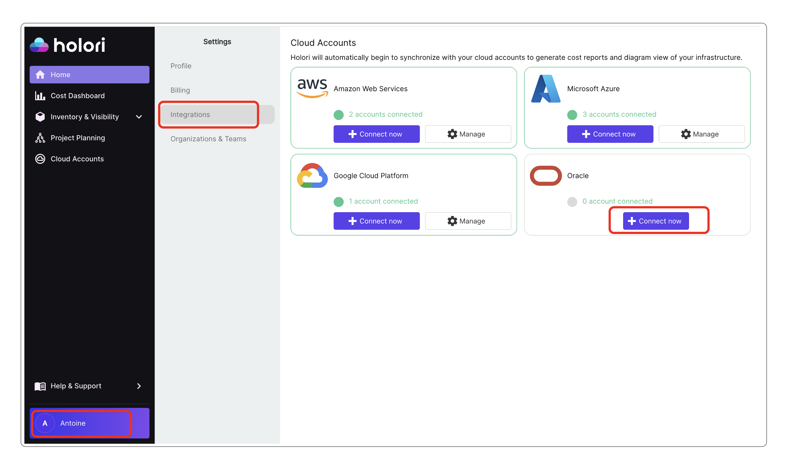

## Step 1: Create a dedicated group for Holori

- On your OCI console navigate to: Identity / Domains / Default domain / Groups
- Click on **"Create group"**
- Give your new group the name **"holori"**
- Click on **"Create"** at the bottom of the page

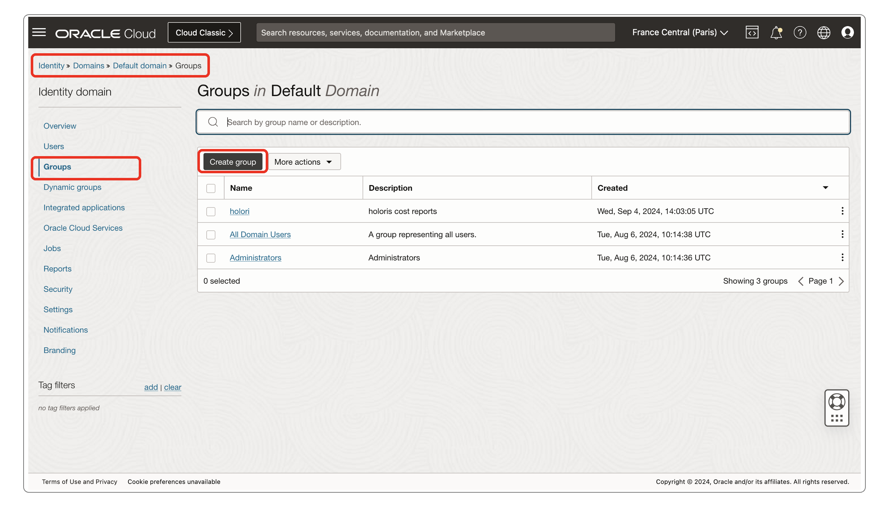

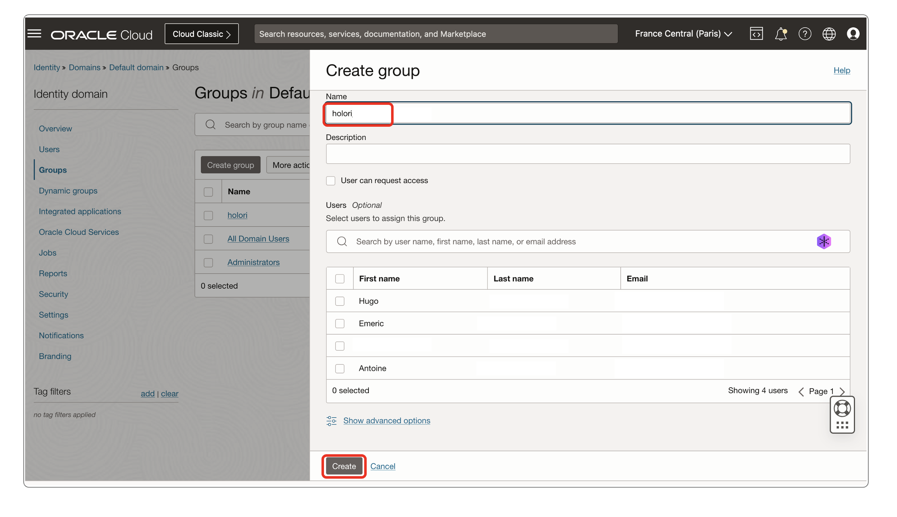

## Step 2: Create a dedicated user and attach it to your group

- On your console again, navigate to: Identity / Domains / Default domain / Users
- Click on **"Create user"**
- For the user last name you can for example enter **"holori"**
- For the email address use yours or another address of your choice
- Check the box: "Use the email address as the username"
- In the **"Groups"** section below, assign the user to the **"holori'** group you previously created
- Click on **"Create"** at the bottom of the page

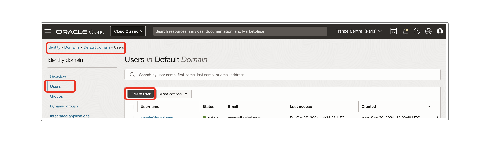

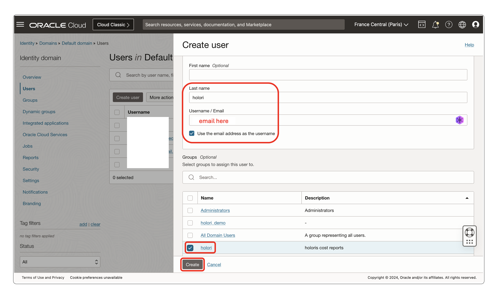

## Step 3: Create a policy

- On the console once more, navigate to "Policies" or use this link: https://cloud.oracle.com/identity/domains/policies
- Click on **"Create Policy"**
  
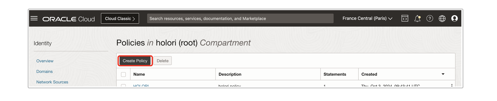

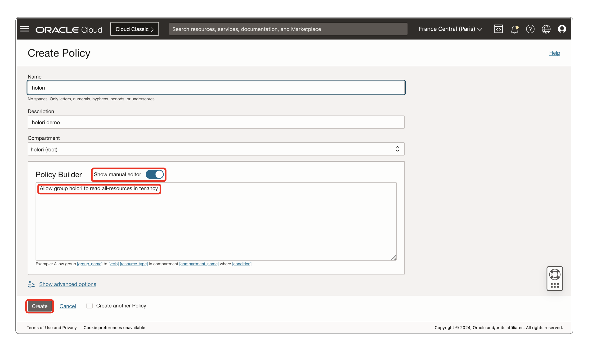
  
- Give it the name **"holori"**
- Enter the description of your choice
- In the **"Policy builder"** area, **switch on** the **"Show manual editor"** toggle
- In the text field enter this text: **"Allow group holori to read all-resources in tenancy"** without the quotes
- Click on **"Create"** at the bottom of the page

## Step 4: Add key

- Go back to the user your previously created. On your console, navigate to: Identity / Domains / Default domain / Users
- Select the user you previously created. Note: it is likely listed using the email address you provided earlier
- On the left menu, click on **"API Keys"** then **"Add API key**"

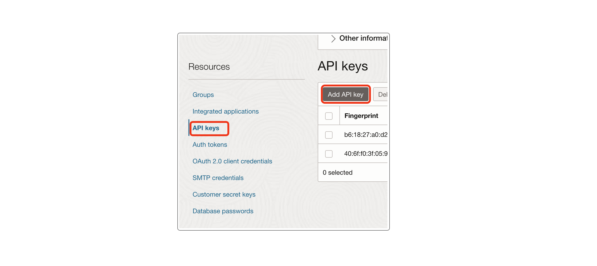

- On the next page, make sure that **"Generate API key pair"** is selected

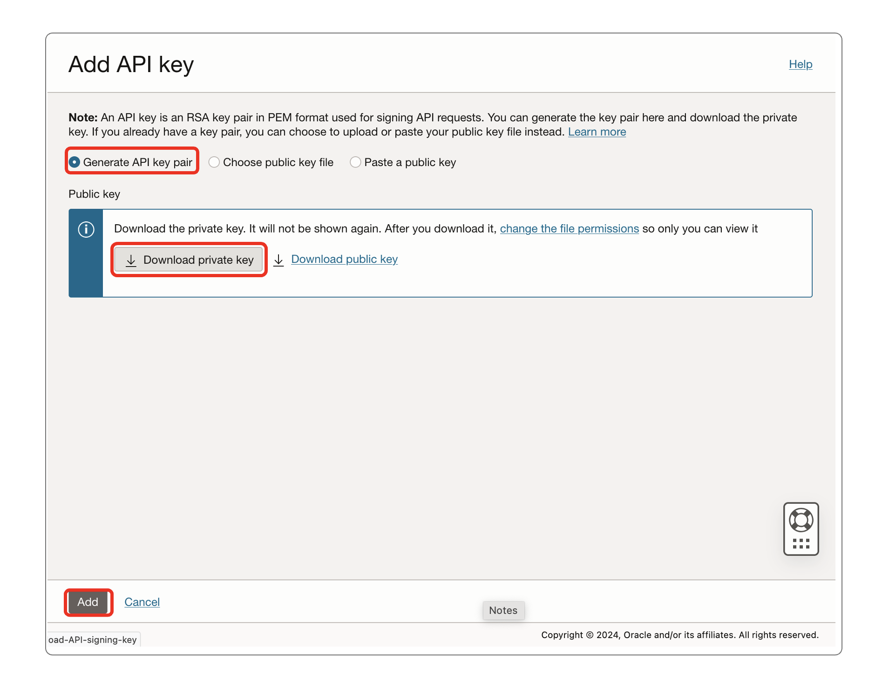

- Download the **Private Key**
- Click **"Add"** at the bottom of the page
- Once clicking on "Add" a **"Configuration file preview"** pop up appears

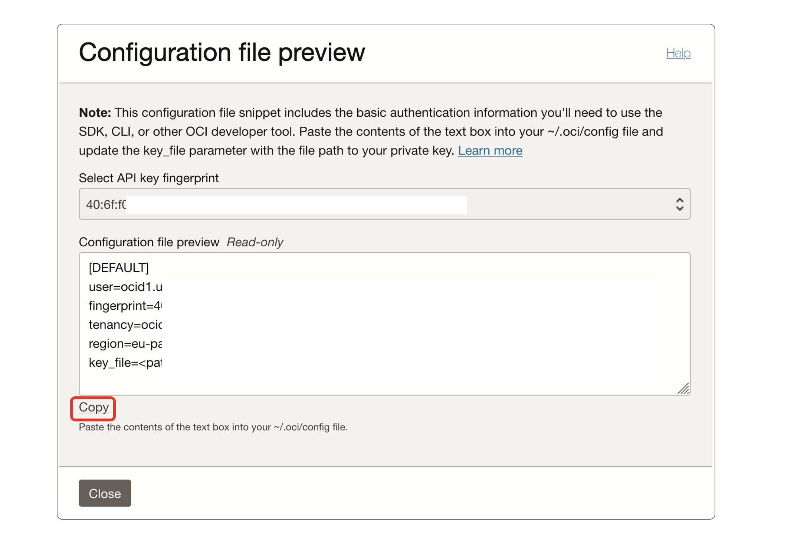

- Copy the text from the field at the bottom using the **"Copy"** button. You'll need to paste it to Holori in the next step

## Step 5: Upload your key file to Holori

Back on Holori / integration / OCI page:
- Paste the text you previously copied from OCI console in the text box
- Upload the private key file you just downloaded using the upload button

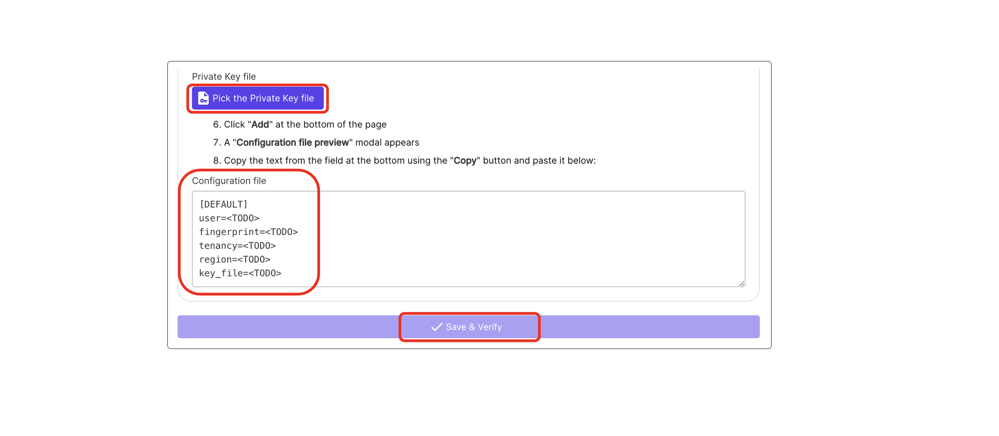

Then click on **"Save and verify"** at the bottom of the page

Congratulations your OCI account should now be connected to Holori. You are ready to optimize Oracle cloud costs!
Your cost data will soon be visible in Holori dashboards

:::info

Holori currently only offers OCI cost visibility. Infra visibility (cloud diagrams) is not yet avaible for Oracle.
If you are really impatient to get this feature, email us at support(at)holori(dot)com and we'll update you on the expected release date.

:::

  
