# Connect your OVHcloud account

To retrieve your cost data, Holori needs to be granted an access to your OVHcloud cloud account. The following procedure will guide you through the required steps.

## Video in English

<iframe width="560" height="315" src="https://www.youtube.com/embed/9bQQuuXT3Do?si=_Wf2MRJh8874pbpT" title="YouTube video player" frameborder="0" allow="accelerometer; autoplay; clipboard-write; encrypted-media; gyroscope; picture-in-picture; web-share" referrerpolicy="strict-origin-when-cross-origin" allowfullscreen></iframe>

## Video in French

<iframe width="560" height="315" src="https://www.youtube.com/embed/4qXR5O37ZF0?si=Tce6eY3hgW06ImQ1" title="YouTube video player" frameborder="0" allow="accelerometer; autoplay; clipboard-write; encrypted-media; gyroscope; picture-in-picture; web-share" referrerpolicy="strict-origin-when-cross-origin" allowfullscreen></iframe>

In Holori App, click on your username at the bottom left of the page, then select the "**Integrations**" tab and click on "**+Connect now**" under the OVHcloud logo.

## Step 1 - Select your project 

- Connect to your OVH console, then on the top menu bar, select "**Public cloud**".

 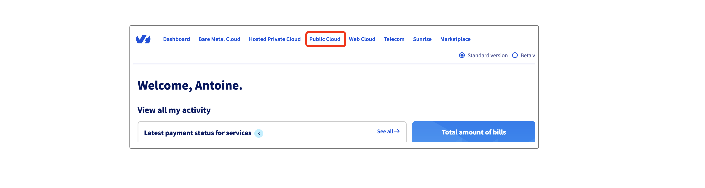
 

- Now make sure that the project you wish to connect is selected. If not, on the left menu click on the arrow pointing to the right.

 

 
- Then, select your project (here mine is named Holori).

 

 
## Step 2 - Create a bucket

- On the left menu, select "**Object storage**"  and then "**Create an object container**".

 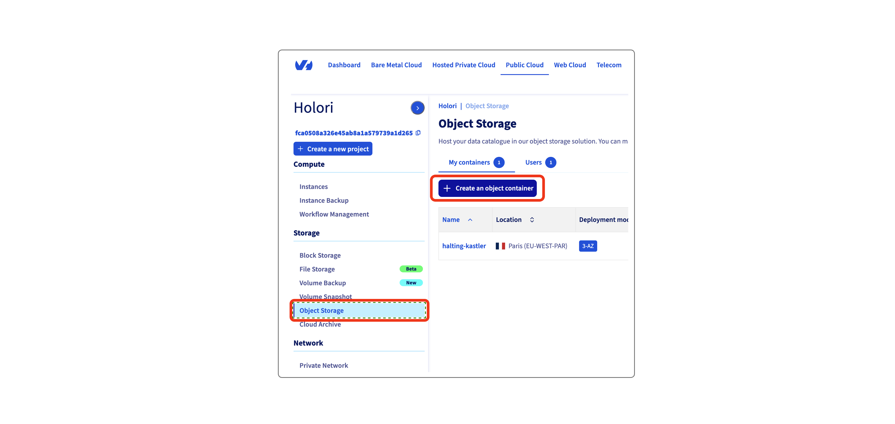

 
- On the page that opens, fill in the bucket creation details. Modify the bucket name and region if you want.
Then leave the other options as they are defined by default. 

- Under **User** click on "**Create new user**", name it "**holori**", then validate and wait for the task to complete.
Your user information is then displayed. Save them, then click on "**Close**".

 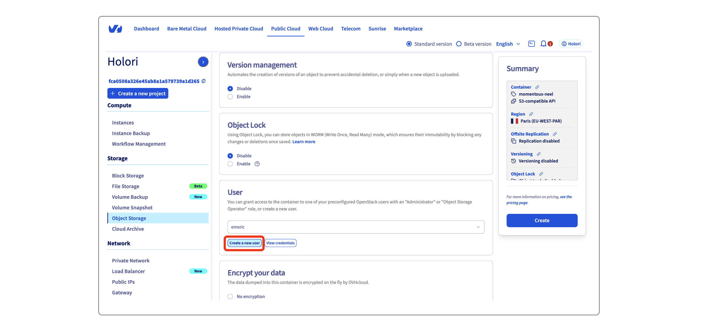

- Still under user, use the drop-down to select the newly created user "**holori**".

- Verify the details and click "**Create**".

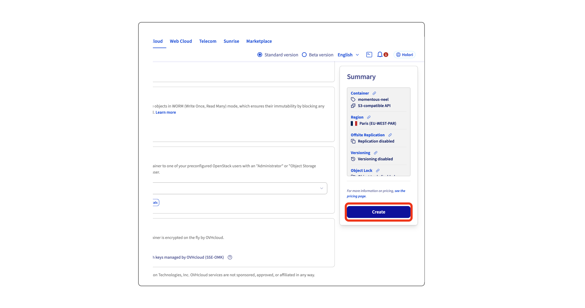

- A page with details about your bucket is displayed, open the "**General information**" tab to have a summary of the information.
- Copy and paste to Holori App the following information: bucket name, endpoint URL, access key, secret key.

## Step 3 - Create a PostgreSQL server

- Navigate to database using the menu on the left of your screen, then click on "**Create your managed database**"

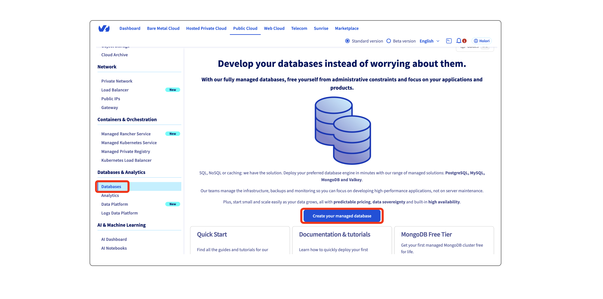

- Select **PostgreSQL** and **version 18**, modify the name if you want.

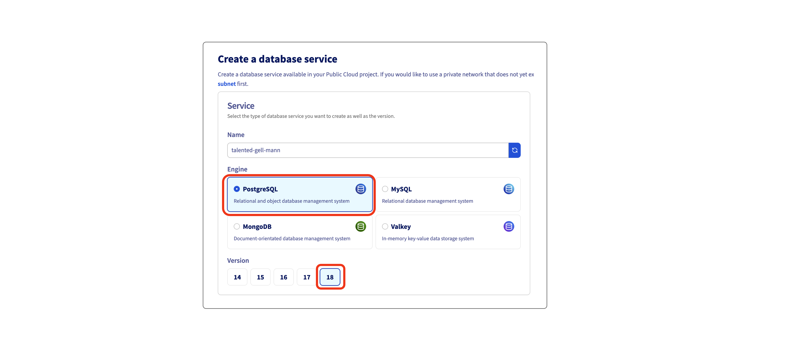

- Select your preferred region, then the "**Essential**" plan (please note that not all regions offer the "essentia"l plan.) and the first instance type tier.

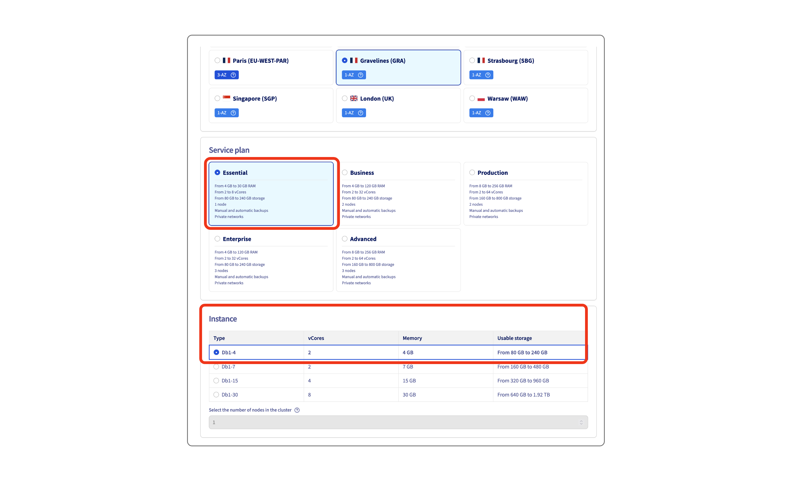

- In the network options part, enter the IPs allowed to connect to the database and add the rule

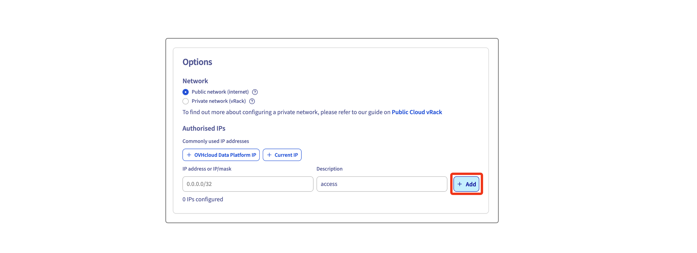

- Review the details and create the database by clicking on "**Order**" on the right of your screen. 

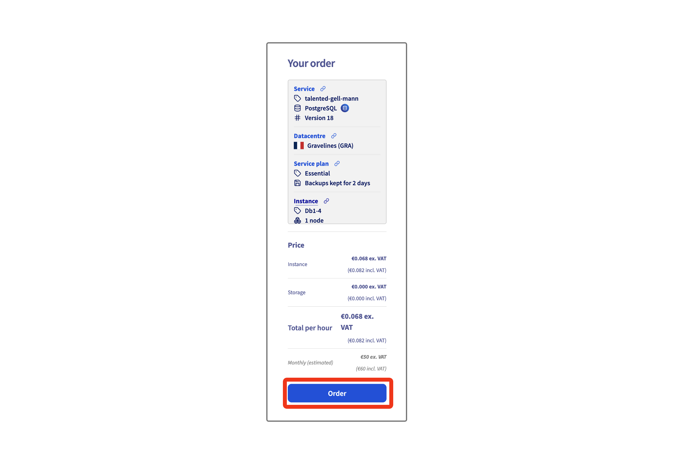

- Wait for the DB to be prepared, copy and paste into Holori app the host name, also provide your username.
- Back on OVH console, copy and download the certificate. You can then paste the content if the file in the dedicatd field at the bottom of the page in Holori app.

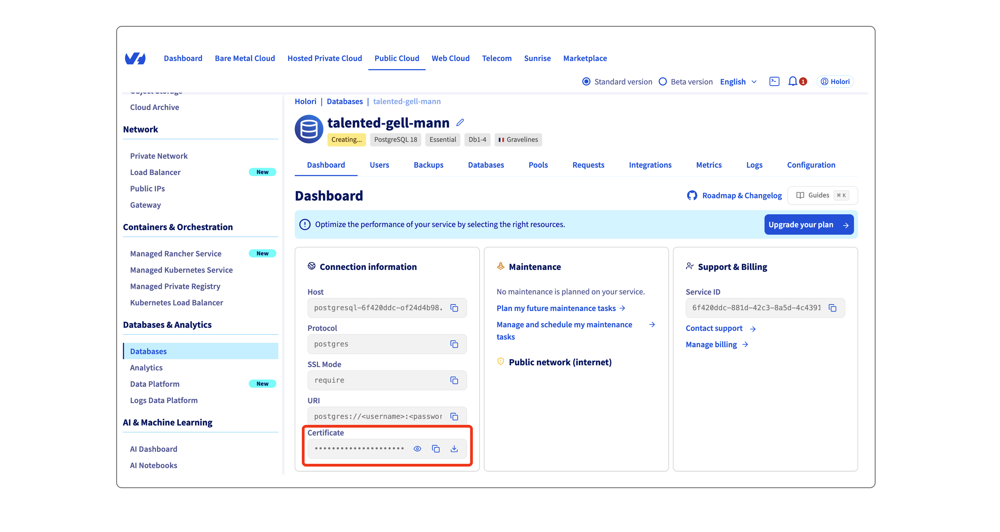

- Navigate to the "**Users**" tab once the database is created (it won't work until the DB is available).

- On the right, click on the 3 dots and "**Reset password**", confirm.

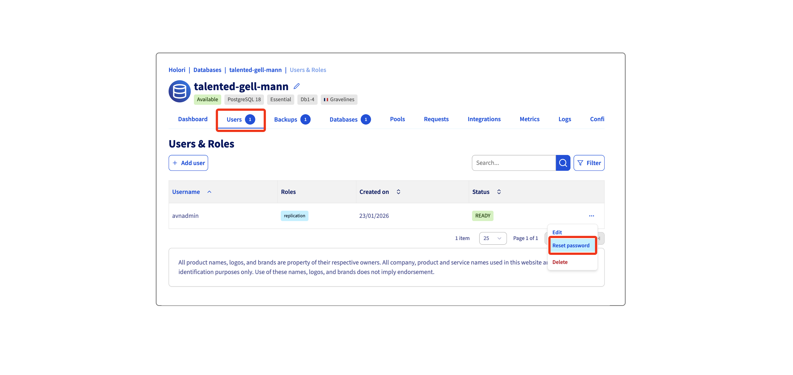

- Copy the user password generated and paste it in Holori App

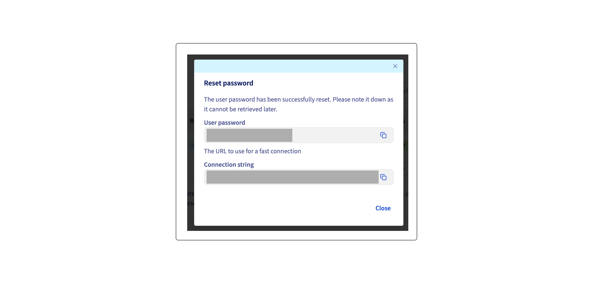

Once you have performed all those steps, click on "Save & verify" at the bottom of the page.

## Export your cost data monthly

OVHcloud focus is export is still in beta on their end. Therefore, it requires a manual export of the data to the database on a monthly basis.

**Step 1**: Use **OVH Focus extractor** to export your billing data as csv. https://finops.labs.ovh.net/ 

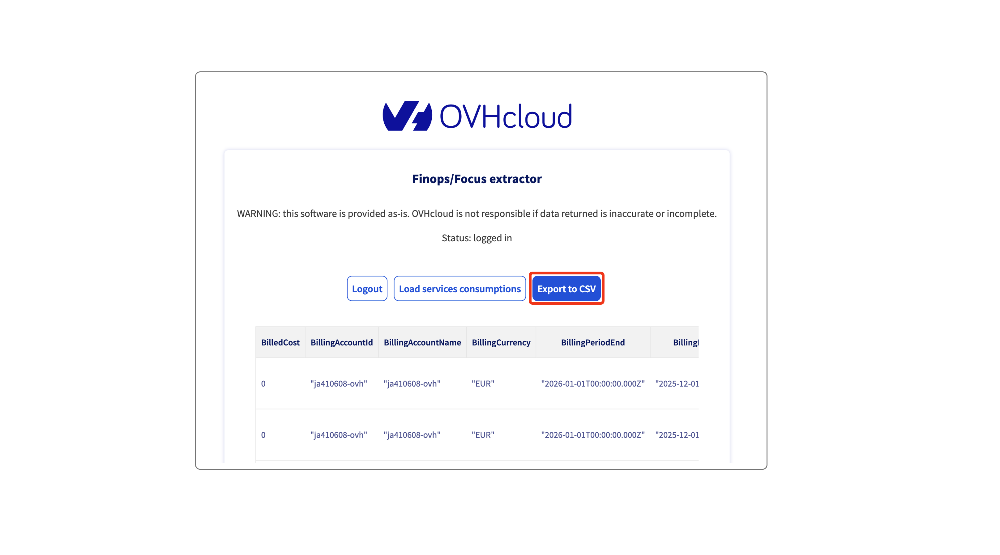

**Step 2**: On your console, navigate to Public Cloud / Object Storage / The Object Storage you created for Holori 

Open the "**Objects**" tab and click on "**Add objects**". 

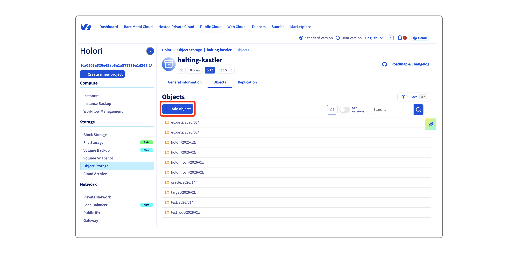

The prefix **must follow this structure**: "exports/year/month". For example "exports/2026/01". Please make sure that exports is **plural**.

Select "**Standard**" as storage class and upload the csv file you downloaded previously, then click on "**Import**".

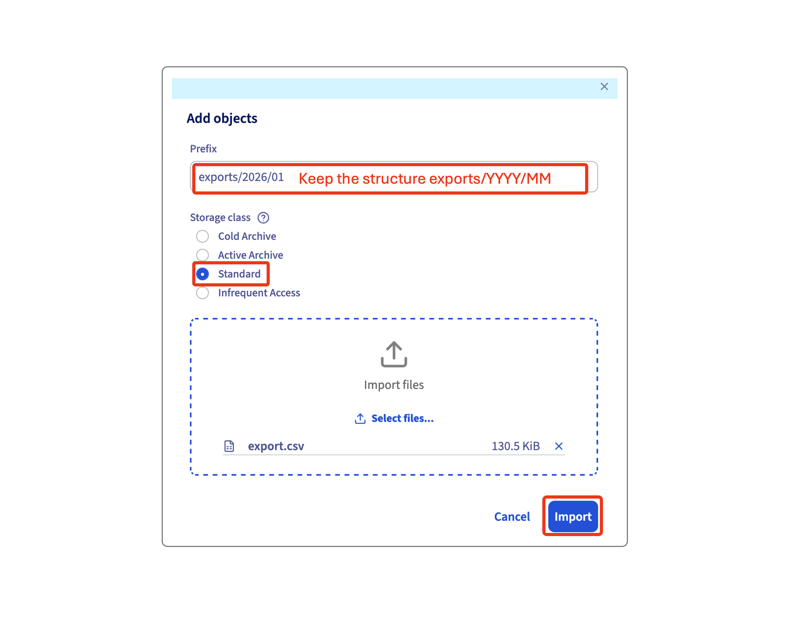

It is expected that OVHcloud will release an upgraded version of their Focus cost export that will remove this mandatory manual input. Our procedure will then be updated accordingly.

### Monthly data export procedure in video (English and French)

**English Version** 

<iframe width="560" height="315" src="https://www.youtube.com/embed/Vy9qXN7DSYE?si=8ESuEOI786inS_Io" title="YouTube video player" frameborder="0" allow="accelerometer; autoplay; clipboard-write; encrypted-media; gyroscope; picture-in-picture; web-share" referrerpolicy="strict-origin-when-cross-origin" allowfullscreen></iframe>

**French Version** 

<iframe width="560" height="315" src="https://www.youtube.com/embed/wrBBcFDH8DA?si=gOdxTVtpte7JfRgi" title="YouTube video player" frameborder="0" allow="accelerometer; autoplay; clipboard-write; encrypted-media; gyroscope; picture-in-picture; web-share" referrerpolicy="strict-origin-when-cross-origin" allowfullscreen></iframe>
