# Connect your Scaleway account

<iframe width="560" height="315" src="https://www.youtube.com/embed/7rTfQTCWqQ0?si=uEb70HPbOs_VAnNU" title="YouTube video player" frameborder="0" allow="accelerometer; autoplay; clipboard-write; encrypted-media; gyroscope; picture-in-picture; web-share" referrerpolicy="strict-origin-when-cross-origin" allowfullscreen></iframe>


🇫🇷 You prefer the French version of the video? It's here: https://youtu.be/hnCkt6gCbKU?si=NMfFjAdkdg8XZf5B


# Steps to connect your Scaleway account to Holori

Holori offers a **Scaleway Finops solution** to help you track and optimize Scaleway cloud costs.

To retrieve your cost data, Holori needs to be granted an access to your Scaleway cloud account.
The following procedure will guide you through the required steps.

:::tip

You can either connect your Scaleway account via CLI or via the Scaleway Portal. At the moment, only the option 1, via the console, is available.

:::

In Holori App, click on your username at the bottom left of the page, then select the **""Integrations"** tab and click on **"+Connect now"** under the Scaleway logo.

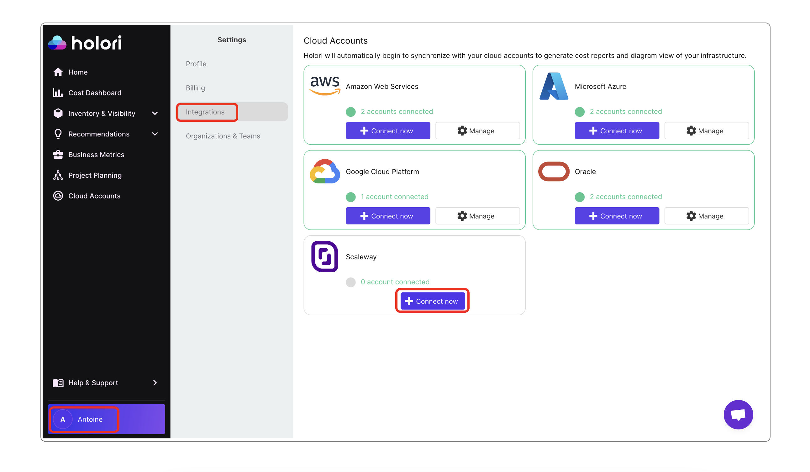

## Option 1: Connect your account using Scaleway console

### Step 1: Create an IAM Application

- From your Organization Dashboard, click on "**Manage Identity and Access with IAM**". Then click on the **"Application"** tab.
Alternatively, directly navigate to the Application tab using this link: https://console.scaleway.com/iam/applications

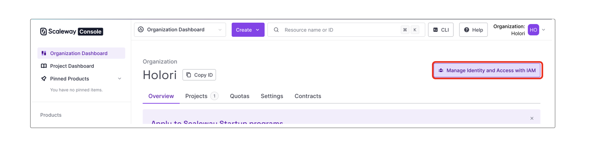

- Click on **"+ Create Application"**.

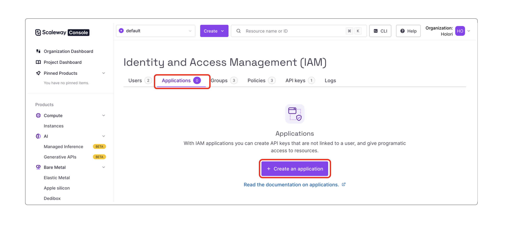

- Fill in the required information, choose a name, for example **"holori"** in the example below.

- Click on **"Create Application"** at the bottom of the page.

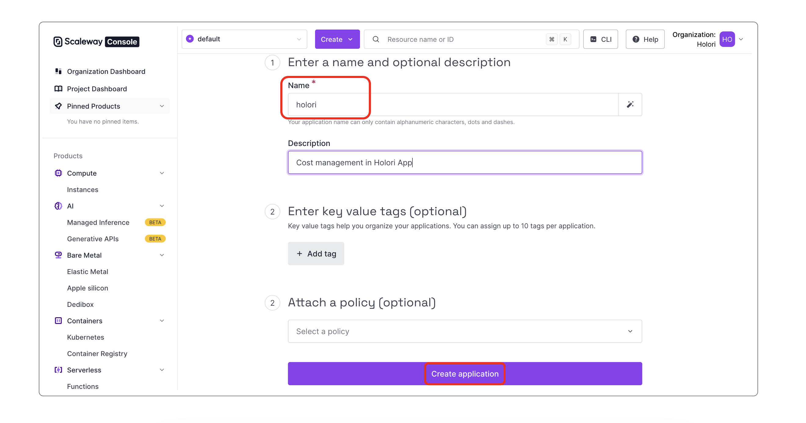


### Step 2: Grant the Application access to the API

- Go back to the **"Identity and Access Management (IAM)"** page and open the **API keys tab**.
Alternatively use this link: https://console.scaleway.com/iam/api-keys

- Click on **"Generate API key"**

 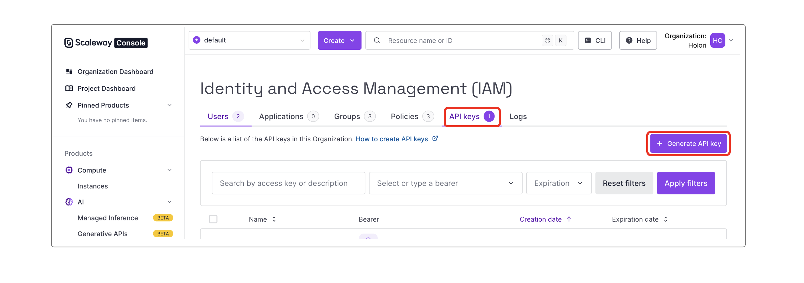

- Select **"An application"** as the key bearer, and then pick the one you just created (holori in our example), leave default settings as shown:

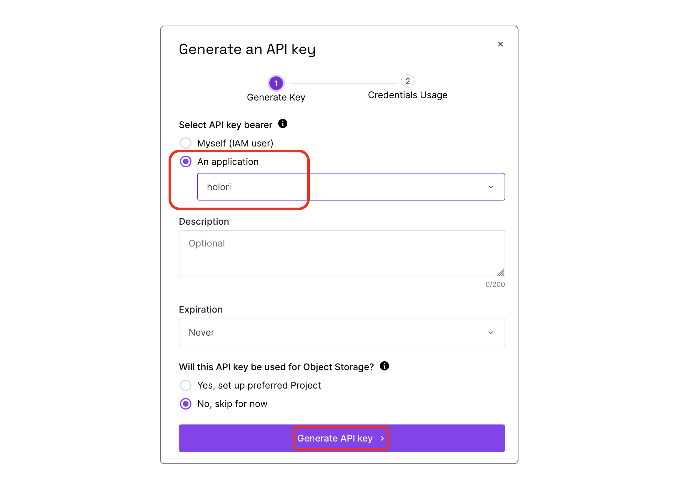

- Copy and paste the **access key id** and **secret key** in Holori App.


### Step 3: Grant read-only permission on cost and usage to the application

- Go back to the **"Identity and Access Management (IAM)"** page and open the **Policies** tab.
Alternatively, use this link: https://console.scaleway.com/iam/policies

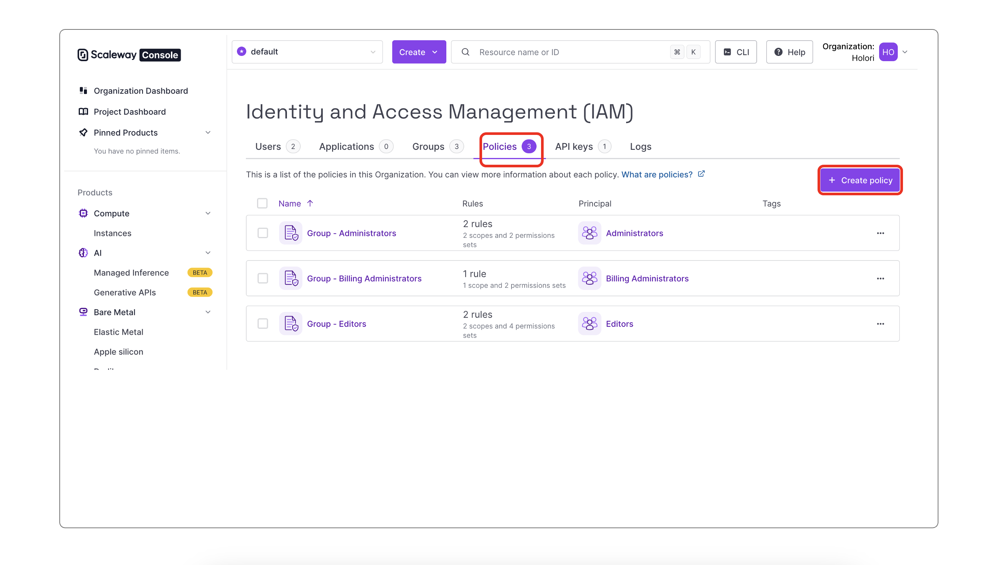

- Click on **"+ Create Policy"**

- Give the policy a name, a description (optional) and tags (optional). Select an Application as the target, and pick the one you created just before (holori in our example).

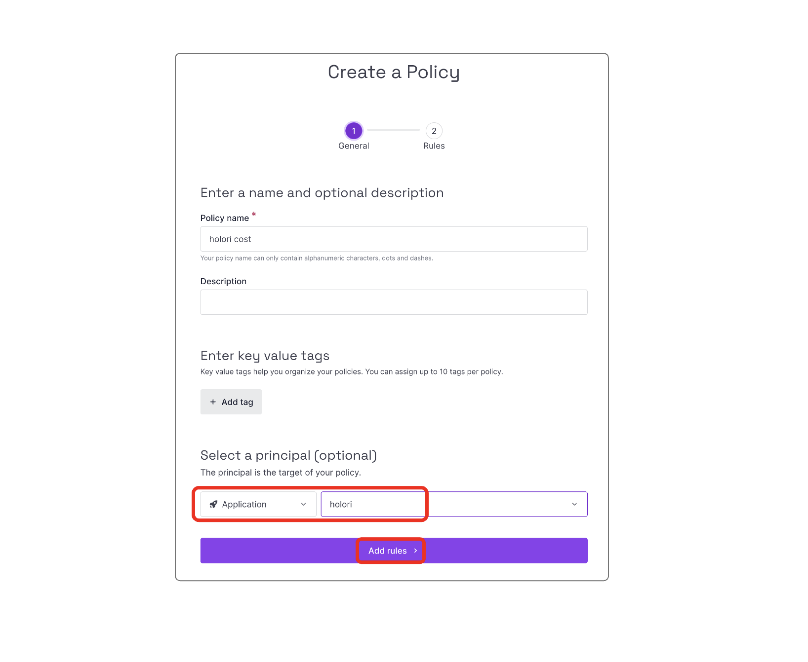

- Click on **"Add rules"**.

- On the following page, select **"Access to Organization features"** as the scope and validate.

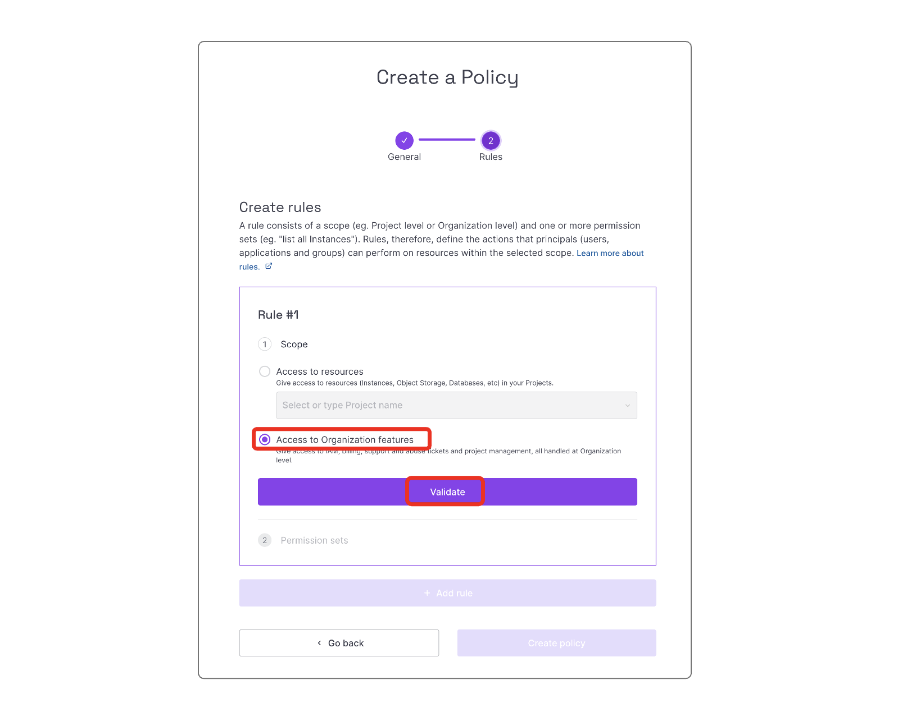

- On the next page, select **"BillingReadOnly"** permission sets from the Billing category, and **validate**.

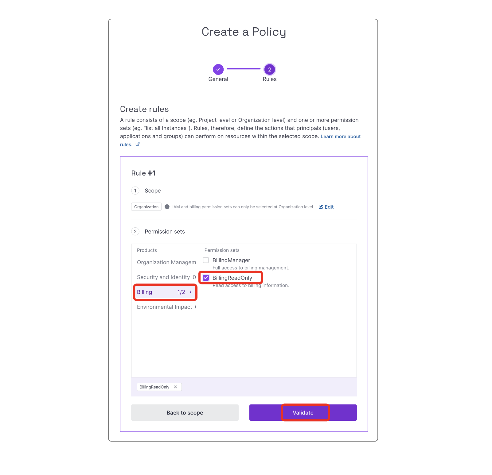


- Then click on **"+Add Rule"**

 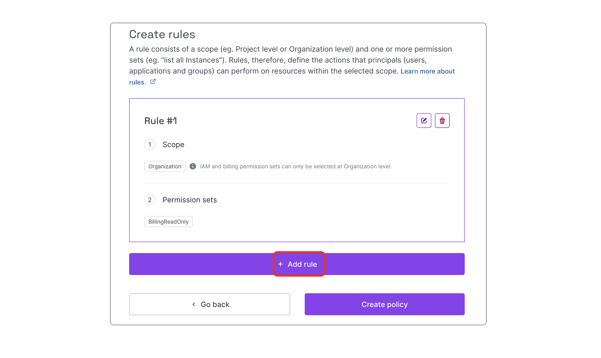

 - Select the **"Organization"** category then **"ProjectReadOnly"** and **validate**.

 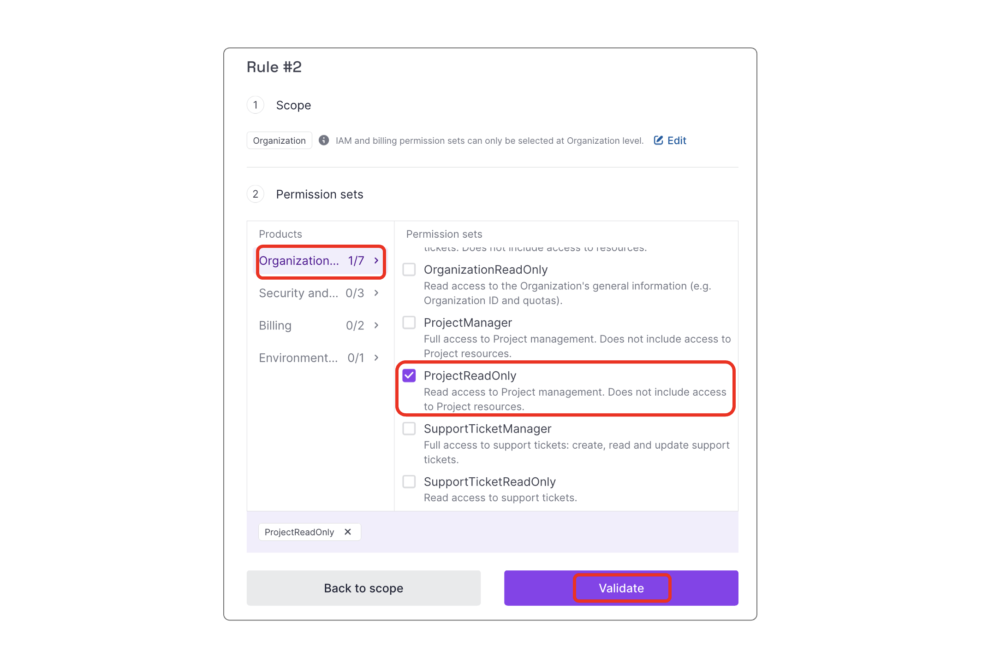  

 - You should now see your 2 rules, click on **"Create policy"**

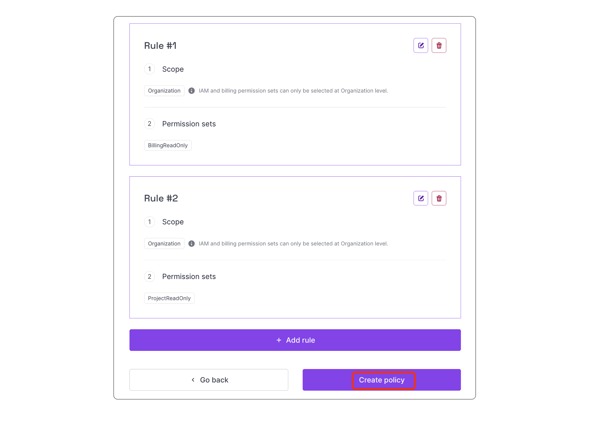


### Step 4: Get the Organization and Project ID

- Go back to your organization's Dashboard, open the **"Projet"** tab.
  Alternatively, use this link: https://console.scaleway.com/organization/projects
  
- Back on the organization dashboard, copy the **"organization id"** and the **"default project id"**. Paste them into Holori app.

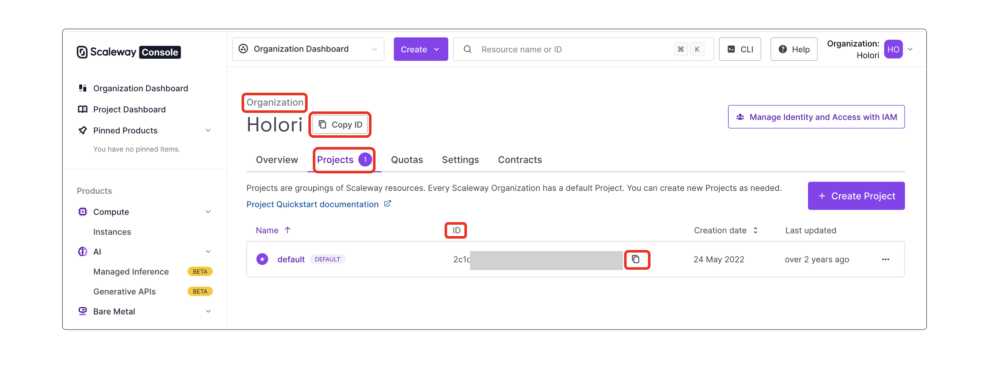


## Option 2: Connect your account using CLI (not yet available)

:::warning

The connection via CLI will soon be available. It is not possible to use it at the moment.

:::

### Prerequisite

You need to have already set your CLI up. If not done already, refer to this guide. https://www.scaleway.com/en/docs/developer-tools/scaleway-cli/quickstart/

### Get the Organization and Project ID

- On your organization's Dashboard, open the **"Projet"** tab.
  Alternatively, use this link: https://console.scaleway.com/organization/projects
  
Copy the **"organization id"** and the **"default project id"**. Paste them into Holori app.


### Create an IAM Application

```js
scw iam application create name=holori organization-id=ORGANIZATION_ID
```

- Copy the ID of the newly created application and save it for later.

### Grant the Application access to the API

```js
scw iam api-key create application-id=APPLICATION_ID
```

- Copy and paste secret key and access key to Holori App


### Grant Read Only Permission on cost and usage to the Application

```js
scw iam policy create name=holori  application-id=APPLICATION_ID rules.0.permission-set-names.0=BillingReadOnly rules.0.organization-id=ORGANIZATION ID organization-id=ORGANIZATION_ID
```


