# Diagramming software overview

To create a diagram from scratch, navigate to the **"Project planning"** tab on the left of Holori app. Then click on **"+ New Project"** 

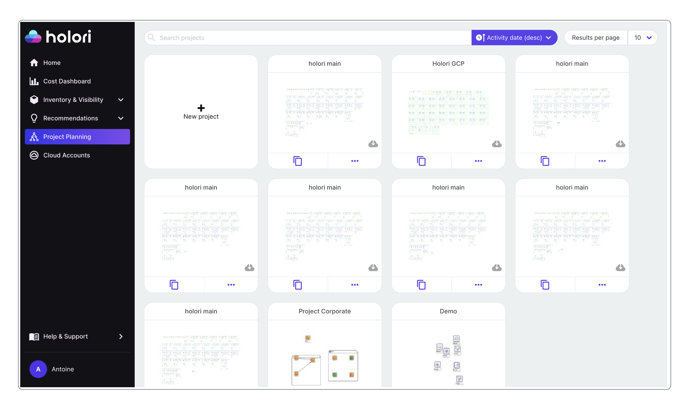

:::info

To generate diagrams from your cloud accounts, please refer to this page: https://doc.holori.com/Infra%20Visibility/auto-sync

:::

The central place of the diagramming software is the grid where you will place your icons, create group and display the connections and relations between elements. All around the grid various tabs, columns and bars can be used to create, modify or customize content. Let's see how to use each element.

## Design tab

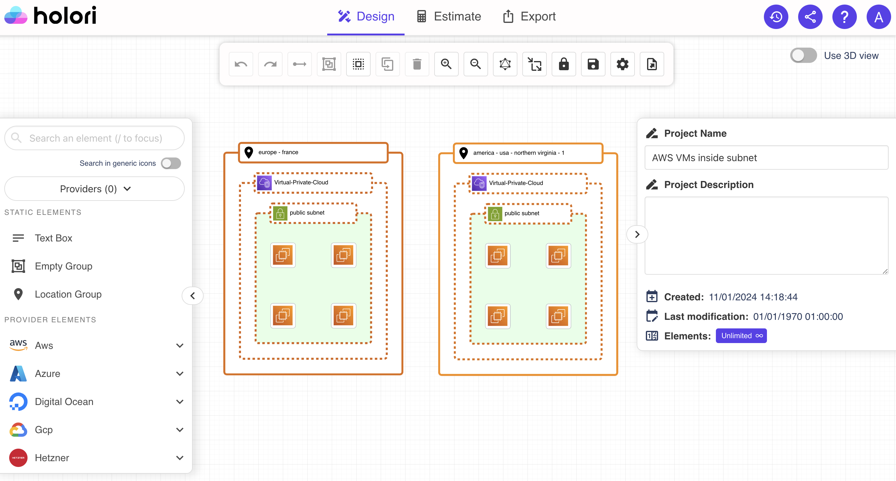

### Left column - cloud providers icons

On the left column you can scroll through the cloud providers and their products' categories to find the product icon you need for your architecture diagram.

- For each provider you can expand the list and see the different products families and products. 
 
- By expending the provider name you can see the icons of the corresponding products.

- To select an icon drag and drop it on the grid. 

The screenshot below show the selection process of and AWS EC2 (compute) instance.

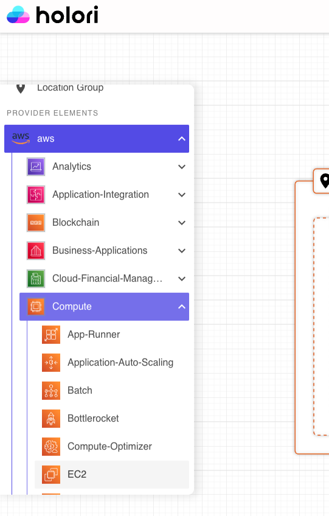 

If you already know the name of the product you wish to add to your diagram, you can also enter its name directly in the "search an element" search box that is on top of the product categories.

If you want to see products from one specific provider only, then you can choose a specific provider from the dropdown menu just under the search box. 

### Right column - project details

The project details can be found on the column on the right side of your screen.

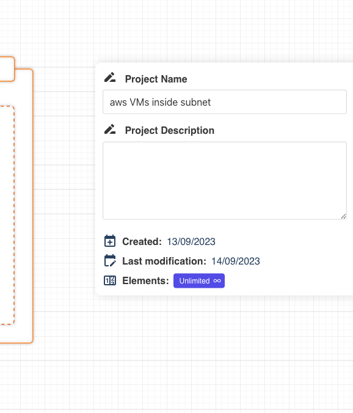 

Here you can read and modifiy the project name and add a custom description.

Please note that if the column on the right doesn't show the project details, it could be that you selected an element on the grid. Pease make sure that no element is selected in order to interact with the project details.

### 3D view

Use the toggle on the top right corner of the screen to convert your 2D diagram to a 3D diagram.

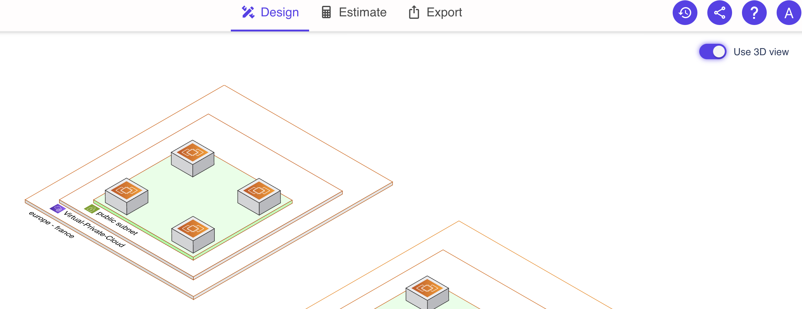 

### Top tool bar

The top tool bar is used to interact with the grid.

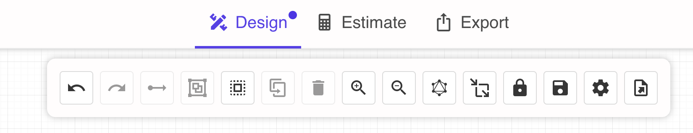

- **undo button** is be used to undo the last action.

- **redo button** is used to cancel the undo action mentionned above.

- **create an edge**  is used to draw an arrow between two elements. An element must be selected to start drawing an arrow.

- **create a group** is used to create a group from the selected icon(s).

- **select all** is used to select all the icons on the grid.

- **duplicate the selection** is used to duplicate one or multiple icons selected on the grid.

- **delete the selection** is used to delete the icons selected on the grid.

- **zoom in and zoom out** are used to adjust the zoom level on the page. You can also adjust by scrolling.

- **rearrange diagram** triggers an automatic rearrangement diagram that will optimize the positionning of the icons on the grid.

- **resize mode for groups** when selected, moving on the grid an icon that is already attached to a group will expand the group size. When unselected, moving an icon out of a group will de-attach it.

- **save button** is used to save your project. An autosave option is also available.

- **export button** to export the diagram as a picture. Several formats are available such as PNG, SVG, JPG... 

  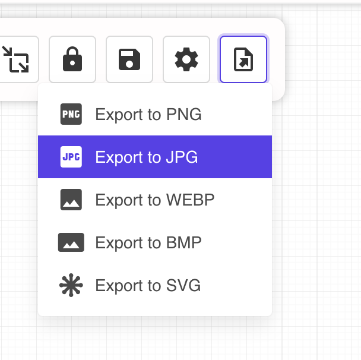
   

## Additional visual settings

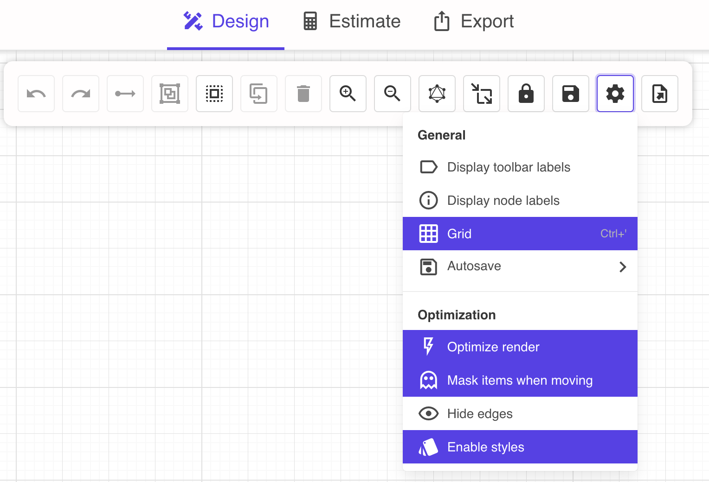 

A gear icon is also located on the toolbar. By clicking on it additional options will pop up.

- **display toolbar labels** expands the buttons on the top bar by adding a text description next to the icon.

- **display node labels** the name of each resource is written under the corresponding icon on the diagram.

- **grid** to hide or display the background grid.

- **Autosave** allows you to select the autosave frequency: every 30 sec, 1 minute, 5 minutes or disable the autosave.

- **optimize render** hides the icons on the grid when zooming in or out in order to optimize your computer's performance.
  
- **mask items when moving** hides the icons on the grid when you are moving the grid in order to optimize your computer's performance.

- **hide edges** to hide or display all the edges from the diagram, this is particularly useful for large infra.

- **enable styles** to display only the diagram basic information and outline. This is useful for performance purposes on large infra.

### Show/hide side panels
A toggle is positonned on both left and right side bars to hides or displays the corresponding side bars.

### Icon tool bar

When you click on an icon, some buttons appear on its right handside. 

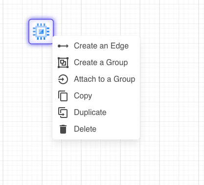 

- create an edge/arrow to another icon
- create a group containing the chosen icon
- copy an icon, this must be followed by a paste action triggered by clicking right on the grid
- duplicate an icon
- delete an icon

### Right column - when an icon is selected

When selecting an icon, the default colum on the right side of the screen is replaced by another where you can specify information about the product you wish to configure. 
You can then define information for each resource such as Bandwidth, CPU, GPU RAM, Disk, and so on.

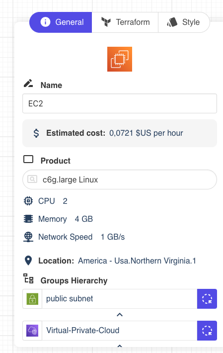 

This column is itself divided in three tabs.

The first tab allows you to define a name for your resource/icon, get an estimate of its cost (when available), add a description.

The second tab (when applicable) contains a list of Terraform variables for your resource. It can be prefiled if you created the diagram with a Terraform import or provider import. Otherwise you can enter the data manually.

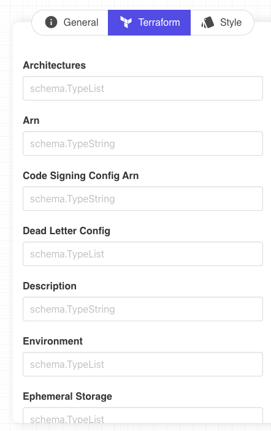 

The last tab is used to configure the style of your element.
You can easily edit the border style, color, width and background color for a group.
By clicking on the lock on the right side, the configuration is reset to default.
Please note that the color selection tool might differ depending on your web browser and OS.

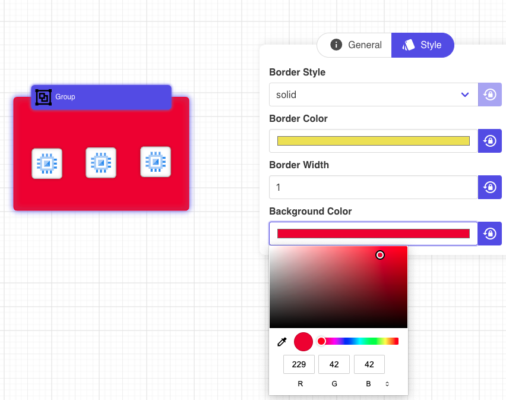 

### Use arrows / lines

Arrows or lines are important to link elements.
As mentionned above to draw an arrow, select an element an right clik or use the "create edge" button on the top tool bar. Then click on the destination point.

You can play with the layout of the arrow as well as its positionning. To do so, click on the arrow/line and look at the right panel and "General" tab.

Here you are able to define the location of the attach point for the arrow 

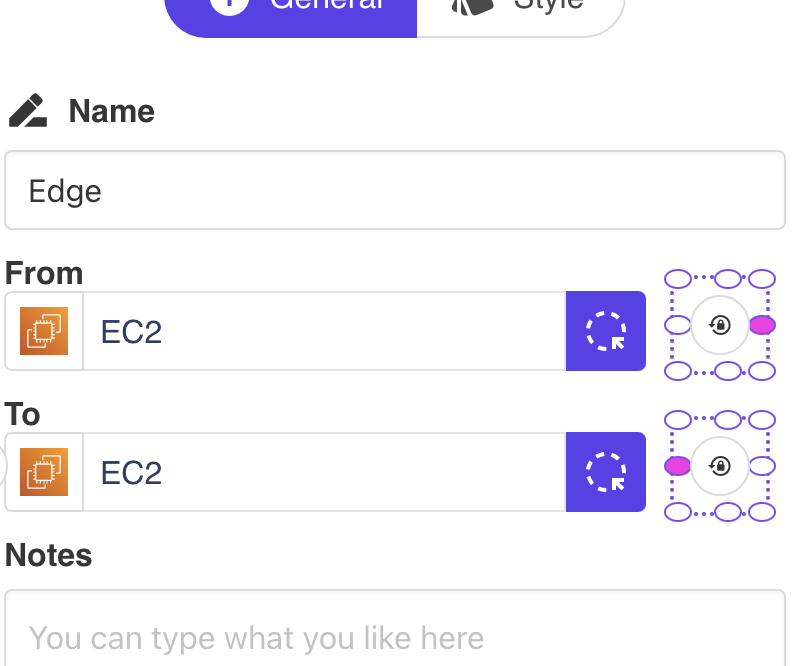 

In the "Style" tab, yo ucan define the style of the line: 
- linear is the shortest route
- smooth makes the arrow fluid and flexible
- ortho brings 90 degrees angles

Feel free to customize the style based on your diagram or preferences.

You can also define the line style between solid, dashed or doted as well as the color of the line.

It is morevoer possible to cusotmize the line by giving it a direction (one direction by default), making it bi-directional, or even removing the arrows to only keep a simple line.

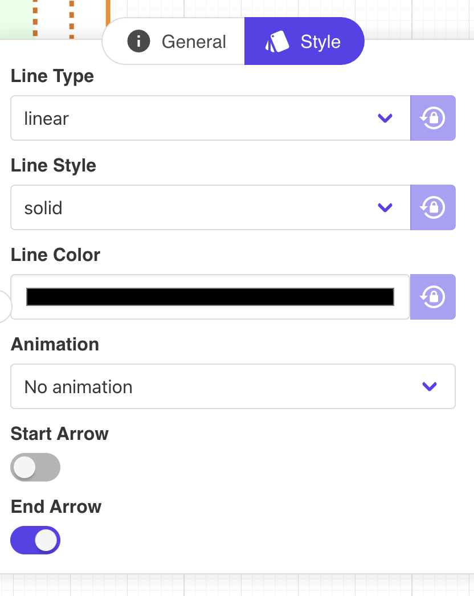 

You can also animate your edges with multiple options such as a moving circle, a dashed edge...

## Estimate tab

The estimate tab provides an overview of the costs of your infrastructure per provider and per type of product.
Please note that this feature is currently in beta and will be improved gradually. 

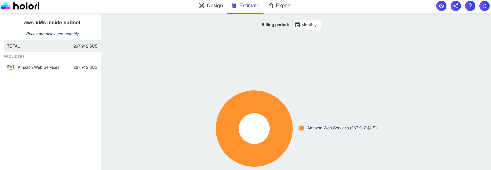 

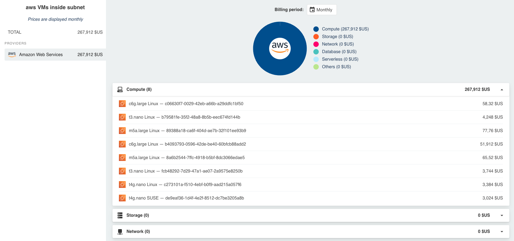 

Currently covering the main services of selected providers, it allows you to estimate the cost of your infra by product category (compute, storage...).
By selecting the provider(s) listed on the left side you can open more details.

Please note that if your diagram is multicloud, the costs associated with each provider will be listed here.

## Export tab

- Documentation:
  The software builds a comprehensive report of your infrastructure that you can then print or export as a PDF.
  The documentation is made of a thumbnail of your infra, then a full page overview followed by the list of elements in your diagram.

  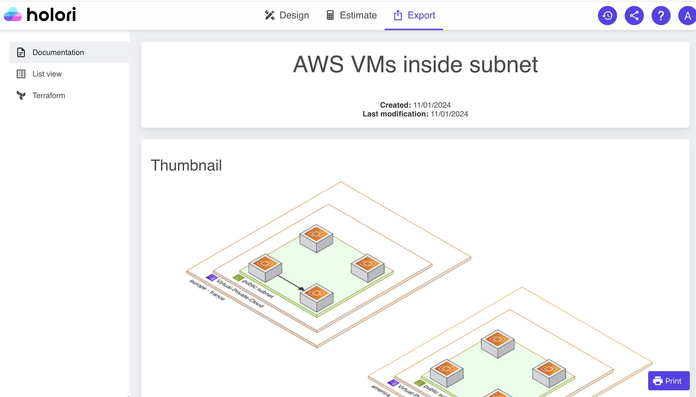

