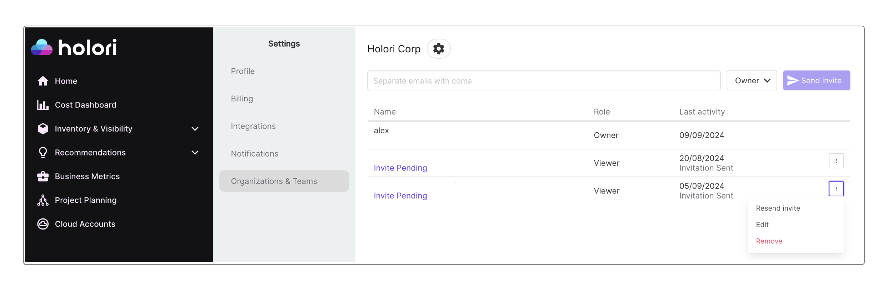

# Teams Management

To create or mange your teams, click on you user name at to bottom left corner, then navigate to the "Organizations and Teams" tab 

There you can invite other people to your organization. To add people enter their email address, if there are multiple people, enter multiple addresses separated by comas.

When inviting people to your ogranization you can grant them one of three possible roles:
 - Owner: they have full access to billing, views and team management
 - Editor: they have full access to billing and views but can't manage teams
 - Viewer: they can see billing, recommendations but won't be able to modify elements or create views

On this tab you also find a list of your current team members, their role, last activity date and a possibility to resend and invite, edit or remove the user by clicking on the 3 dots.

## Organizations

The organization is at the core oh Holori software. 
By default, when you create an account on the app, a new organization is created just for you. In this organization you can start conencting cloud accounts and also inviting people.

## Invitations to join an organization

When you invite someone to join your organization there are two possible scenario.
 1- The person you invite **doesn't have an Holori account yet**
 The person receives an email, and if they accept the invitation they directly join your organization/team.

 2- The person you invite **already has an Holori account** and is part of an organization
 When you invite someone who is already part of an organization (its own or part of another organization), the person receives the invite per email and must either accept or decline the invite.
 By accepting an invite to join an organization, this person will be automatically removed from its previous one and will loose acccess to the data previously available.

 ## Organizations and invoicing

 Please note that each organization has at least one owner, the owner is in charge of managing the payment of Holori software and has access to Stripe portal.
 
